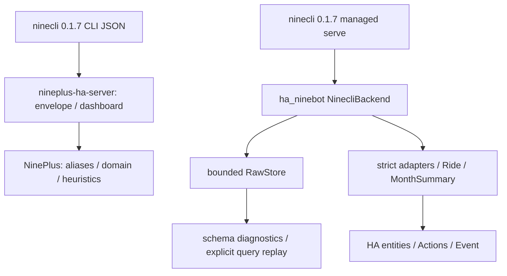

# NinePlus 生态源码审阅与 ha_ninebot 原始数据解析应用方案

审阅日期：2026-10-05。性质：独立专项源码审阅与后续设计，**不是实现记录，也不是新的车辆采集报告**。
本次只修改文档/证据索引，不修改集成代码、依赖、实体、生产 HA 或发布版本。
不研究 SwiftUI/Widget 布局；仅追踪其数据获取、解析、缓存、计算与控制结果处理。

## 1. 结论、基线与证据规则

**保留 ninecli backend，当前缺口主要是数据证据、元数据和边界表达，并非缺少一个新的 transport。**
ha_ninebot b24 已有 RawStore、Ride、严格 trail parser、月汇总、历史 Actions、骑行 Event、Image、GPS、SMS、按需轮询和多电池身份处理。
不能把旧开发方案的“未来阶段”重新列为全部未实现。
NinePlus 提供了较广的候选字段清单与缓存思路，但部分归一化会混淆物理量；nineplus-ha-server 能确认命令调用与透传行为，不能证明其 mock 的轨迹结构是真实云响应。

| 对象 | 审阅 ref / commit | 范围与限制 |
|---|---|---|
| ha_ninebot | main `9ba20bcadea1ea0500d9c080e60a48adc35e2387`，2.0.0b24 | 当前实现权威基线；最低 HA 2026.1.0，ninecli 精确 pin 0.1.7 |
| JieFuHe/NinePlus | main `6e93ac55e5ccfcc2d909706f5acf765cbbb7120e` | ServerClient、Models、SharedStore、ViewModel、CoordinateTransform、后台/Intent 数据路径、手机录制数据来源 |
| JieFuHe/NinePlus | nine-proxy `af33e9f2ff6fff099676001745b61670dc300c30` | ProxyClient、旧 Models/Store、dual-mode 认证及派生计算；完整分支历史 |
| wuchiawuchi/nineplus-ha-server | main `bf0b668c90709e6601eab4510503029b8ed1b6e0` | 全部 server.py、测试、安装/升级脚本、Docker/Compose、workflow、依赖和历史 |
| kxn/ninebot-recon | `a46124d6290179554e1688c01384a7f4116ac96a` | API、crypto、fetch_trips、完整逆向报告及 recon 取证目录；不是成熟生产 SDK |
| 自有样本 | [metadata](../tests/fixtures/ninecli/0.1.7/metadata.json)、[字段清单](evidence/v2x-current-field-usage.json) | 录制脱敏业务结构与合成替换分开；不能用合成 GPS/日期证明坐标系或真实出行规律 |

2026-10-05 重新访问 [ninecli PyPI](https://pypi.org/project/ninecli/)；页面展示 0.1.7。
两参考服务与当前产品均使用该版本。本次不改变 pin，不将其他分支的 candidate schema 当成版本升级依据。

证据标签与优先级如下；“源码确认”只确认程序怎样处理，不自动确认字段物理含义。

| 顺序 | 标签 | 可以证明什么 |
|---|---|---|
| 1 | F：自有录制 fixture / 既有采集元数据 | 实际出现的路径、类型、数值关系；脱敏替换不证明原位置/日序列 |
| 2 | R：recon 有反汇编、GDB/假服务器等支撑 | 特定 0.1.7 二进制的显示/请求契约；不等于真实云端全车型验证 |
| 3 | S：nineplus-ha-server 源码/离线 mock | 命令组合、包装、透传、stub；mock 不能升级为真实字段证据 |
| 4 | N：NinePlus main/proxy parser | 候选 alias 与作者的 best-effort 行为；没有对应 fixture 则仍是候选 |
| 5 | V：字段名或经验推断 | 待验证，不进入正式物理 parser |
| 补充 | U：维护者明确确认；O：HA 官方 API | Wh/W 本项目单位依据；HA 表示规范，不能替代九号协议证据 |

既有私有充电归档另做纯只读、无原值导出的结构/关系核验，记录见[本次证据](evidence/nineplus-source-review.json)；不是新采集。

当前后续规则仍以 [b24 精简契约](v2x-实体精简与额定参数迁移.md)、
[全面适配](v2x-全面数据适配与连续开发.md)、[当前开发索引](长期开发索引与归档规则.md)为准。
较早文档中的默认禁用、未知 Wh/W、SOC 累计估算、旧控制门禁是历史基线，不覆盖 b24。

## 2. 可追溯源码入口与阅读范围

以下链接固定 commit，避免 main 更新后研究依据漂移。

- NinePlus main：[ServerClient](https://github.com/JieFuHe/NinePlus/blob/6e93ac55e5ccfcc2d909706f5acf765cbbb7120e/mini-ninebot/Shared/NinebotServerClient.swift)、[Models](https://github.com/JieFuHe/NinePlus/blob/6e93ac55e5ccfcc2d909706f5acf765cbbb7120e/mini-ninebot/Shared/NinebotModels.swift)、[SharedStore](https://github.com/JieFuHe/NinePlus/blob/6e93ac55e5ccfcc2d909706f5acf765cbbb7120e/mini-ninebot/Shared/NinebotSharedStore.swift)、[ViewModel](https://github.com/JieFuHe/NinePlus/blob/6e93ac55e5ccfcc2d909706f5acf765cbbb7120e/mini-ninebot/mini-ninebot/App/NinebotViewModel.swift)、[CoordinateTransform](https://github.com/JieFuHe/NinePlus/blob/6e93ac55e5ccfcc2d909706f5acf765cbbb7120e/mini-ninebot/Shared/NinebotCoordinateTransform.swift)。
- nine-proxy：[ProxyClient](https://github.com/JieFuHe/NinePlus/blob/af33e9f2ff6fff099676001745b61670dc300c30/mini-ninebot/Shared/NinebotProxyClient.swift)、[Models](https://github.com/JieFuHe/NinePlus/blob/af33e9f2ff6fff099676001745b61670dc300c30/mini-ninebot/Shared/NinebotModels.swift)。
- 服务端：[server.py](https://github.com/wuchiawuchi/nineplus-ha-server/blob/bf0b668c90709e6601eab4510503029b8ed1b6e0/server.py)、[tests](https://github.com/wuchiawuchi/nineplus-ha-server/blob/bf0b668c90709e6601eab4510503029b8ed1b6e0/tests/test_server.py)、[Dockerfile](https://github.com/wuchiawuchi/nineplus-ha-server/blob/bf0b668c90709e6601eab4510503029b8ed1b6e0/Dockerfile)。
- recon：[完整报告](https://github.com/kxn/ninebot-recon/blob/a46124d6290179554e1688c01384a7f4116ac96a/docs/reverse-engineering-full-report.md)、[fetch_trips](https://github.com/kxn/ninebot-recon/blob/a46124d6290179554e1688c01384a7f4116ac96a/fetch_trips.py)、[API](https://github.com/kxn/ninebot-recon/blob/a46124d6290179554e1688c01384a7f4116ac96a/ninebot_api.py)。

主审阅完整阅读上述数据层文件；用全树搜索向下追踪 BackgroundTaskManager、WidgetProvider/ControlIntents、AppIntents、Settings 的 raw 导出、RecordingView 中独立 recorder 类。
这些补充文件只用于确认数据来源、查询频率、缓存与控制回读，不分析视觉设计。
服务端所有运行、部署、测试文件均已阅读；未运行安装脚本、Docker、登录或真实控制。

## 3. NinePlus 的架构演进：不能假装是一条连续提交链

`git merge-base main nine-proxy` 无共同祖先：两条公开历史有独立 root。
可以通过代码差异说明演进方向，不能声称 server-only 是从 proxy 分支直接合并得到。

| 分支/提交 | 已由历史确认 | 数据层影响 |
|---|---|---|
| proxy `1e058ab` → `a120cc2` → `af33e9f`，2026-07-06/07 | 初始项目、增加电池遥测、后续同步 | proxy/platform 双模式；密码/SMS/refresh 路由都存在；本地行程推算仍活跃 |
| main `002c473`，2026-07-11 | 独立发布 server-only | 用平台账号/session 登录；移除直接 ninecli 认证 UI 路径，不代表 ninecli 没有 SMS |
| main `6e93ac5`，2026-07-13 | Align app estimates with server contract | 续航/充电预测主要采用 server prediction；改善 dashboard 失败判断；仍遗留经验充电 fallback/部分私有计算 helper |

main 的真实读取路径：GET vehicles → 每车 dashboard；可接受预归一化 `state` 或原始 `status` + `battery`。
dashboard 不可用时降级到 status/battery/travel/prediction。status 与 battery 失败不能再被全部 `try?` 吞掉，但单车错误可能使整次 fetchDashboard 抛错，缺乏 HA 的 per-group partial failure。
每次刷新还可能从 `authDate` 逐月读到当前月并累加“totalMileage”，没有明确 TTL/预算。
这表示“绑定以来已查月份里程”，不是官方 odometer，也不保证历史完整。

| 对象 | 保存/解释的内容 | 风险 |
|---|---|---|
| VehicleInfo | SN/name/model/image + raw profile；另读取 VIN、authDate | 个人资料 raw 可落 UserDefaults；绑定时间格式缺少真实样本 |
| VehicleState | SOC/BMS/范围/锁电充/位置/月/最近 ride/daily + raw status/battery/travel | 同一字段可在多个 wrapper 中猜；只取第一 battery object |
| RideRecord | id、start/end、mileage、energy、used、durationMinutes、单一 speed、raw | speed 最高/平均混合；id fallback 不一定稳定 |
| RideDetail | 请求 SN/ride ID、fetchedAt、整份 JSON、根对象 parsedRecord | 不保证嵌套解包；缺字段 detail 也可生成 Record，替代列表时可能抹掉已知值 |
| InterfaceTrackPoint | 云端候选坐标、speedKmh、auxiliaryValue | 辅助值没有区分 heading 与距离；无可靠 timestamp |
| RecordedRide / RideTrackPoint | iPhone CLLocation/CoreMotion 的时间、速度、加速度、精度 | **手机现场录制，不是 ninecli cloud 数据**；不能当新增云端字段 |
| ServerPrediction | range/charging、版本/来源/样本/置信指标、batteryChemistry | 平台自定义 contract，不是官方九号 raw JSON |

## 4. NinePlus parser 行为与完整候选 alias 清单

下表顺序代表实际 fallback 优先级。除“F 字段”列之外，所有别名都是 **N 候选**，尚无当前真实 fixture 支撑；支持 camelCase 不等于上游曾返回过它。
`detail_id` 不在 NinePlus rideRecord 的正式 ID 候选中；它走原 ride id 请求 detail。当前 HA 的 legacy `id/detail_id` 是独立兼容契约，不能混合猜。

| 目标/位置 | NinePlus 候选（按源码顺序，重复项省略） | 当前 F 字段/处置 |
|---|---|---|
| 车辆 SN | wnumber, sn | vehicles.wnumber；status.sn 是归属检查，不作公开 schema 值 |
| name | device_name, deviceName, ble_name | device_name/ble_name → DeviceInfo |
| model | vehicle_name_en, vehicle_name, model, vehicleModel；vehicle_type 辅助 | vehicle_name_en/vehicle_name/vehicle_type；不是 alias 互换身份 |
| VIN | vin, VIN, vehicle_vin, vehicleVin, car_vin, carVin | vin 出现；个人/车辆唯一资料，不新增 sensor，raw 保留前主动删除 |
| 绑定时间 | auth_date, authDate, bind_time, bindTime, created_at, createdAt | auth_date 出现但脱敏文本，格式未确认；不当历史扫描起点 |
| 图片/light | v6_light_img_url, v6LightImgUrl, light_img_url, lightImgUrl, img_url, imgUrl, img, image_url, imageUrl | v6_light_img_url/img_url；已有标准 Image |
| dark | v6_dark_img_url, v6DarkImgUrl, dark_img_url, darkImgUrl | v6_dark_img_url；不因 App 深浅模式建两个实体 |
| status wrapper | status, vehicle_status, vehicleStatus, data（最多两层） | 当前业务根对象；任意 data 不默认解包 |
| battery wrapper | battery, batteryInfo, battery_info, data | 根对象；不让嵌套电池覆盖车辆 SOC |
| status 内 BMS | battery, batteryInfo, battery_info, bms, bmsInfo, bms_info | 当前证据不足，候选不启用 |
| battery list / main | battery_list, batteryList, batteries；battery_main, batteryMain | battery_list、battery_main；HA 不只取第一包 |
| status vehicle wrapper | vehicle, vehicleInfo, vehicle_info | 候选，仅用于图片 fallback |
| SOC | dump_energy, dumpEnergy, electricity, battery_percent, batteryPercent | dump_energy；electricity 在不同 battery 层有不同值，不能机械等价 |
| voltage | battery_voltage, batteryVoltage, battery_vol, batteryVol, batt_voltage, battVoltage, bat_voltage, batVoltage, bms_voltage, bmsVoltage, bms_volt, bmsVolt, voltage, volt | battery_list[].bms_volt，直接 V |
| temperature | battery_temperature, batteryTemperature, battery_temp, batteryTemp, batt_temperature, battTemperature, batt_temp, battTemp, bat_temperature, batTemperature, bat_temp, batTemp, bms_temperature, bmsTemperature, bms_temp, bmsTemp, temperature, temp | battery_list[].bat_temp，直接 °C |
| cycles | bms_cycle, bmsCycle, cycle, cycles | bms_cycle；HA 还检查 have_bms_cycle_support，N 未检查 |
| charging power | charging_power, chargingPower, charge_power, chargePower | charging_power；W 来自 U，不来自命名猜测 |
| range main | estimate_mileage, estimateMileage, precise_estimate_mileage, preciseEstimateMileage | HA precise > estimated > AI；proxy 是 precise 优先，main 变为 estimate 优先 |
| AI range | ai_estimate_mileage, aiEstimateMileage, ai_estimated_mileage, aiEstimatedMileage | ai_estimate_mileage；仍保留各原量，b24 只显示统一续航 |
| charging | charging, chargingState | charging；N 数字“非1”都 false，HA 未知编码不默认为 false |
| power | pwr, powerStatus | pwr |
| lock | loc.lock，随后 lock_status, lockStatus | HA 保留已验证编码优先级；binary LOCK 的 on=unlocked，不能复制 N 的 UI 名称 |
| remaining | remain_charge_time, remainChargeTime, remainingChargeTime | 真实充电样本为空，N 假设数值分钟，HA 不猜单位 |
| location | loc.lat/lon；locationInfo.lat/lon；locationDesc, desc | loc.lat/lon；其它位置描述是候选且涉及地址隐私 |
| total | total_mileage, totalMileage, total_mileages（status）；total_mileage, totalMileage（travel） | total_mileage 有 null；月总不是 odometer |
| month | month；total_mileages, monthMileage；ec, monthEnergy；used_electricity, usedElectricity | month/total_mileages/ec 已使用；used 保留未知 |
| ride ID | travel_id, travelId, ride_id, rideId, record_id, recordId, id | travel_id 是已确认 detail 入参；仅 id 不自动等价 |
| ride start | start_time, startTime, begin_time, beginTime, stime, date, day, create_time, createTime | start_time；N **不接受 start_time_format** |
| ride end | end_time, endTime, stop_time, stopTime, etime, finish_time, finishTime | end_time；N **不接受 end_time_format**，HA 有明确 CST fallback |
| distance | mileages, mileage, distance, rideMileage | mileages km；generic distance 的单位未知 |
| energy | ec, energy, electricity, consume | ec Wh(U)；electricity 不认作同单位能量 |
| used | used_electricity, usedElectricity, usedElectric, useElectricity | used_electricity；不认定百分比/Wh |
| speed | speed, avg_speed, avgSpeed, average_speed, averageSpeed | speed 与 avg_speed 都出现，但语义独立；此合并禁止迁移 |
| duration 明示 min | durationMinutes, duration_min, durationMin | 没有 F，待版本 fixture |
| duration 明示 s | duration_seconds, durationSeconds, ride_seconds, riding_seconds | 没有 F；当前 duration 秒已确认 |
| duration 模糊 | duration, ride_time, rideTime, riding_time, ridingTime, use_time, useTime, cost_time, costTime | duration，禁止 >300 自动当秒、小值当分钟 |
| travelPage | month, list, page, page_size/pageSize, total, has_more/hasMore | 本样本没有真实上游分页 contract，不能拿 N defaults 声称完整 |
| history mileage fallback | total_mileages, totalMileage, monthMileage, mileage；否则 daily 求和 | 有 daily 候选不代表总里程可相加成为里程表 |

### 4.1 轨迹候选与取点行为

| 层级 | 全部候选 / 行为 | 证据与决策 |
|---|---|---|
| 全树 candidate keys | trial, trail, trace, track, tracks, track_list, trackList, trajectory, trajectory_list, trajectoryList, points, point_list, pointList, gps, gps_list, gpsList, location_list, locationList, coordinate_list, coordinateList | N 递归搜任意 JSON，选可解析且点数>1的最长结果；不是 endpoint schema |
| 对象容器再拆 | trial, trail, trace, track, tracks, points, list, data, gps, locations, coordinates | 某个无关图表 list 可能胜过正式 trail；只允许 debug candidate 报告，不作生产轨迹 |
| 点 latitude | lat, latitude, y, gcj_lat, gcjLat, wgs_lat, wgsLat | 只有本项目 string col2 得到 F/R 支撑；y、不同 CRS alias 禁止静默同义 |
| 点 longitude | lon, lng, longitude, x, gcj_lng, gcjLng, gcj_lon, gcjLon, wgs_lng, wgsLng, wgs_lon, wgsLon | string col1 为 longitude；GCJ/WGS 不能忽略来源标签 |
| 点嵌套 | location, loc, coordinate, coordinates, point, gps | 未验证对象 shape；不能任意递归覆盖 |
| speed | speed, spd, speed_kmh, speedKmh, velocity, v | N 默认 km/h，限制0–160；当前第三列只保留 raw，单位待验证 |
| 辅助 | direction, bearing, heading, course, angle, aux, auxiliary | N 一律 auxiliaryValue；第四列真实是 distFromPrev 标签，不能认作 heading |
| 数组点 | compactMap 数字后 first/second；first绝对值>90、second<=90则 lon-first，否则 lat-first；third speed / fourth auxiliary | 非数字项被删除会移动列；两数均<=90时没有可靠次序；拒绝用于严格 parser |
| 字符串 | 先尝试 JSON；否则按分号/竖线/换行分点，逗号/空白/tab 分列 | 值得借鉴格式分层，必须 exact schema +固定列数+不移位；不是全部已证实 |
| 去重 | 转换后坐标四舍五入6位，仅连续相同坐标去重 | 会丢静止时不同速度/时间/距离样本；原数据保留，不在 domain 删除 |

`NinebotRideTrackPoint.date/speed/accelerationG/horizontalAccuracy` 来自手机 recorder；
`interfaceTrackPoints` 才来自云端 detail。两者名称相似不等于同一协议。
客户端轨迹点并未确认 timestamp、altitude、distance 单位；heading 仅作为候选辅助值。

### 4.2 归一化风险

| 实现 | NinePlus 实际规则 | HA 处理方向 |
|---|---|---|
| 电压 | >1000 除1000；否则 >120 除10 | 只认 bms_volt 已证实 V；高电压车型不能误除10 |
| 温度 | abs>120 除10 | 当前 bat_temp °C；超范围缺报/issue，不自动缩放 |
| status 坐标 | 直接合法则用；否则依次 /1e6、/1e7、/1e5，取首个合法 | 合法范围不证明比例正确；未知格式留 raw；轨迹点 parser 本身没有此缩放 |
| 中国坐标 | 范围内按 WGS→GCJ 转换，包括带 gcj_* 名称的候选 | 可能二次偏移；HA 保持 coordinate_system=unknown，不转换 |
| 时间 | ride 先尝试8/12/14位中国日期，随后秒/毫秒阈值及多格式；serverDate 无时区文本优先 UTC | 按 endpoint/version 契约转换 aware UTC；authDate 仅 epoch helper，14位文本可能被误解毫秒 |
| duration | 尽量贴近 end-start；无参考时 >300当秒，否则当分钟；冒号先转分钟 | duration_seconds 值若为冒号文本会再 /60；不同物理量不能靠接近度选协议 |
| boolean/number | JSONValue 可把 bool 转数字、数字截断 Int | 正式物理字段拒绝 bool、NaN/Inf、非整数ID；opaque ID 不经 Double 防精度损失 |

### 4.3 prediction contract 的全部数据字段（N，不是九号 raw schema）

下表属于 NinePlus ServerClient 的平台响应解析。所有 camelCase 也是客户端容错候选；
本次服务端 prediction 返回空对象，故没有任何实际模型结果可交叉证明。

| 对象 | 字段及别名 | 含义/HA处置 |
|---|---|---|
| prediction root | model_version/modelVersion；updated_at/updatedAt；battery_percent/batteryPercent | 模型版本、计算时间、输入SOC；H/I或未来Action，不是官方遥测freshness |
| battery_chemistry/batteryChemistry | configured；effective；source；nominal_voltage/nominalVoltage；capacity_wh/capacityWh；capacity_ah/capacityAh | 用户选择/实际采用/依据、额定规格；与当前V/Ah额定参数可比较，不当SOH |
| range | estimated_range_km/estimatedRangeKm；local_range_km/localRangeKm；official_range_km/officialRangeKm；source | 平台最终/本地/官方范围及来源；不能当九号新增三个端点 |
| range | km_per_percent/kmPerPercent；estimated_full_range_km/estimatedFullRangeKm；total_used_percent/totalUsedPercent | 人为模型参数；used_percent假设未验证，H/待设计 |
| range、charging共有 | sample_count/sampleCount；measured_sample_count/measuredSampleCount；accuracy_percent/accuracyPercent；confidence_percent/confidencePercent；accuracy_source/accuracySource；ready | 分清训练样本、实测误差、置信来源和ready；未校准不能称准确率 |
| charging | is_charging/isCharging；remaining_minutes/remainingMinutes；estimated_full_at/estimatedFullAt | 预测状态、剩余分钟、预期完成；不覆盖缺报的官方remain字段 |
| charging | fast_minutes_per_percent/fastMinutesPerPercent；taper_minutes_per_percent/taperMinutesPerPercent | 平台/经验分段速率；不能迁移固定4/7常量 |
| charging | estimated_speed_kmh/estimatedSpeedKmh | N用作充电带来的续航增长速率，不是车辆行驶速度；不得建普通SPEED实体 |

proxy的活跃推算用km/used值、14日衰减等经验筛选，并生成0.35–0.96的经验accuracy分数；
main最终提交将主要estimated range/accuracy来源移到serverPrediction，却没有证明平台预测如何训练。
因此吸收数据来源表达，不迁移经验算法或声称官方“预测准确率”。

## 5. nineplus-ha-server：实际 ninecli 适配器

当前已删除 HA REST adapter，`2c7f446` 的历史明确移除旧代码；名字中的 ha 不代表当前运行依赖 HA。
`.env.example` 残留 HA_URL/HA_TOKEN/NINEPLUS_BACKEND，当前 Settings 不使用这些旧变量。
Docker 固定 `ninecli==0.1.7`，Python3.12 Alpine、非root用户、/data/ninebot 持久卷、19009端口；没有额外 requirements 文件。
workflow 在 amd64/arm64 build 前跑 unittest；不证明所有 wheel、真实云/HTTP contract 都已验收。
Compose 镜像 latest 与 pip 的精确 pin 是不同层面的更新策略。

### 5.1 认证、隔离与会话

`DirectNinebotClient.run` 在每次调用执行 `sys.executable -m ninecli --config <目录> ... --json`，实例锁串行化，timeout35s。
初始化时只看 tokens.json 是否存在；存在则不密码登录，后续刷新交给 ninecli。
新账户先登录/vehicles 验证再写账户索引；云密码不写 accounts.json，但首次 `login -u ... -p ...` 将密码放 argv，**不适合迁移到当前 HA**。

| 设计 | 源码事实 | 参考价值/限制 |
|---|---|---|
| 应用账号与九号账号 | 本地应用密码 PBKDF2-SHA256 210000轮/随机salt，手机号格式限制；云账号另外绑定 | App账号不是九号 session；HA 不需要另一层本地用户数据库 |
| config directory | 按应用账号 casefold 的 SHA256截断目录，独立 tokens.json | 支持隔离思想；当前 HA 应以 ConfigEntry/会话隔离，不能用显示名称 |
| accounts.json | 原子替换、chmod600；保存本地密码hash及上游账号/目录 | hash不等于加密、目录权限仍需保证；不要在 diagnostics 暴露路径/账号 |
| session | 随机 session_token；X-NinePlus-Session；内存 sessions 与 per-account client | 无TTL/退出撤销；重启 session消失、disk token仍在；不照搬到 HA lifecycle |
| Bearer | 环境配置可选；为空时不做 gateway Bearer检查 | 当前HA随机Bearer必须存在，不允许退化 |
| 后续无密码运行 | token文件存在即可构建client，账户索引不保存云密码 | 可参考无密码token恢复，但“文件存在”不代表可用；需当前reauth/session协议 |
| 错误 | 非零exit截取stderr/stdout前500字符抛RuntimeError；HTTP502直接传message | 可能带个人/敏感值；HA保持typed error、日志不透传原文 |
| 错误数据 | 空stdout当{}；vehicles不匹配shape当[]；travel失败synthetic empty | 不能把协议失败当无车/零行程；HA现有完整性、partial failure优于它 |

安装脚本下载 Compose、随机生成 gateway token、以 umask077 写配置后启动；升级脚本 pull/recreate。
均只是独立服务运维脚本，不进入 HACS runtime，更不用于更新生产 HA。
当前9个测试全用 temporary directory/mock subprocess；名为并发相关的提交并不等于测试真实线程竞争或多账号云会话。

### 5.2 完整 REST → command → response 对照

以下业务 REST 均包装 `{ok:true,data:...}`；错误为 `{ok:false,error:{message:...}}`。
命令均还有前置 `python -m ninecli --config ...` 与后置 `--json`。
车辆路由会先 `vehicles` 确认账户归属。表中“透传”指内层 CLI JSON，不是 encrypted cloud wire response。

| REST | ninecli / 实现 | inner data | 判断 |
|---|---|---|---|
| GET /healthz | 不调用 | status/backend/accounts count | 公共存活检查，不是token有效性 |
| POST /accounts/login | 本地密码检查 | phone/session_token | 非九号密码/SMS登录 |
| GET /vehicles | vehicles | `{vehicles:[原车辆对象]}`；接受原list或data-list | 字段透传，错误shape会被压成[] |
| GET /vehicles/{sn}/dashboard | status SN → battery SN → travel SN --month 当前月 →再vehicles | `{vehicle,status,battery,travel,updated_at}` | 串行聚合，updated_at为完成时间；travel异常替换空list |
| GET .../status | **执行完整dashboard**后取status | 原status | 会额外请求battery/travel/vehicles，无必要放大 |
| GET .../battery | **执行完整dashboard**后取battery | 原battery | 同上，不能复制到HA分组刷新 |
| GET .../travel?month=YYYYMM | travel SN --month YYYYMM | 原对象；不是对象则fallback空结构 | 月汇总/列表，不自动detail，无分页参数传给CLI |
| GET .../travel/{id} | travel SN --detail ID | 整个原detail对象，非dict报错 | trail不解析、不转换、不增列 |
| POST .../bell | bell SN | CLI原控制JSON | 没有物理完成/readback证明 |
| POST .../buck | buck SN --yes | 同上 | 本次只审代码/mock，禁止实车 |
| POST .../engine/start | engine-start SN --yes | 同上 | 不等价于Lock.unlock |
| POST .../engine/stop | engine-stop SN --yes | 同上 | 不等价于Lock.lock |
| POST .../travel-sync?month&page_size | 不调用travel | `{month,records:[],total:0}` | **stub**；N期望list，contract还不一致 |
| GET .../prediction | 不计算 | `{}` | **stub**，客户端得到nil预测 |
| POST .../prediction-settings | 只回显body | `{battery_chemistry:body}` | **stub**，无持久化/模型；不满足N的configured/effective/source结构 |
| POST /devices/register | 不注册APNs | `{accepted:false,reason:...}` | **stub**，oktrue不能当注册成功 |
| POST /live-activities/register | 同上 | 同上 | 本地平台兼容路由，不是ninecli能力 |
| 管理账号/密码路由 | 本地AccountStore与管理员session | 管理结果/HTML | 只核验认证与持久化；无HA数据模型迁移价值 |

server每次命令锁仅覆盖一次 subprocess，不保证整个多命令dashboard是同一原子时刻。
客户端 timeout20s（Widget更短）小于server单命令35s，聚合还会多次串行调用，可能出现客户端超时但服务仍执行。
当前 HA 的管理子进程、bounded response/queue/cancellation、更细 freshness 应保留。

## 6. 两项目连接后，哪些能力是真的

源码证明 **兼容 contract 的可能调用链**，不能证明公开 NinePlus app 实际生产部署就使用该仓库。
原 NinePlus 完整平台服务端源码不在两仓库中。prediction 的 server contract 不能归因于本适配器。

| Feature | NinePlus | nineplus-ha-server | ha_ninebot b24 | 方向 |
|---|---|---|---|---|
| profile/status/battery | 多alias，首包BMS | 调CLI透传 | 严格归属、多包身份、freshness | 保持HA，候选逐schema验证 |
| month/list/detail | 月扫描、详情懒加载 | month/detail实际命令 | 已有get_trips/get_trip_detail/get_history | 补证据与模型包装，不重建Actions |
| trail | 递归最长candidate、转换/去重 | 不解析；测试数组为人工构造 | 已有真实四列字符串严格解析 | 保持严格；未来验证新shape才增加 |
| speed/average | 合并字段与UI fallback | 原样 | 已区分max和总平均 | N不能作为速度语义依据 |
| daily mileage | 按数组index猜日、不校验总和 | 原样detail[] | 已有日历/总和验证Action | 补真实可验证日序列，再考虑today |
| historical archive | 本地500条，跨月合并 | travel-sync空stub | 有界内存历史+coverage | 按需、预算、可恢复索引；不声称全量 |
| predictions | 主分支主要消费平台contract；旧分支经验模型 | 空stub/回显 | b24已删除低可信SOC累计估算 | 只借provenance结构，不恢复低质实体 |
| phone GPS/acceleration | 本机传感器录制 | 不提供 | 非本集成范围 | 不能伪装成ninecli云能力 |
| control readback | 发指令后重新dashboard | 无readback | 接受/失败/未知+即时status回读 | 保持HA；本次无控制测试 |
| permissions/network | 无明确扩展解释 | 原样 | 已有能力解析及unknown | 未获得新的权限字典/GSM值证据 |

### 6.1 trail 描述的联合核验

服务端 README 说 detail 有经纬度、速度、点间距离；代码只透传。
`test_travel_detail_uses_ninecli_detail_and_preserves_track` 的对象数组是 **测试作者手工造出的 stdout**，证明不会改它，不证明云使用此shape。
自有 [trip-detail fixture](../tests/fixtures/ninecli/0.1.7/trip-detail.json) 的 trail 是字符串、每点4列：lon,lat,speed raw,distFromPrev raw。
recon 完整报告承认详情逐点字段未细挖，`fetch_trips.KEY_TRACK` 只接受候选数组，甚至没有真实 `trail` 字符串的正确解析。
因此四者对照优先自有fixture；不能声称对象数组、point timestamps、heading已经确认。

## 7. raw field 生命周期与 HA 表示矩阵

下面 F 表示实出现；null 只能证明路径，不能证明非空schema。服务端除vehicles包装和dashboard时间外均不主动归一化这些业务值。
附录给出当前136条已观察路径的完整用途表；这里把生命周期、单位与建议展开。
分类：A当前sensor；B binary；T tracker；E response；EV事件；M设备/child元数据；H runtime；I安全schema；J隐私移除/暂不用。
当前创建实体默认可见，debug/位置/controls仍需功能opt-in；**不因本研究重新引入默认隐藏实体**。

| Endpoint / Raw path | 类型 / 单位 / 证据 | Server → NinePlus | HA当前 / model | 建议HA表示 / confidence |
|---|---|---|---|---|
| vehicles[].wnumber | str，F/R | 包装数组→SN | VehicleProfile.sn、身份路由 | M，稳定旧identity，不加SN sensor；高 |
| device_name / ble_name / vehicle_name* / vehicle_type | str/int，F | name/model fallback | Profile、DeviceInfo/observations | M/H；车型码不是权限；高 |
| v6_light_img_url / img_url / v6_dark_img_url | URL，F | image fallback/dark选择 | public image URL审核+ImageEntity | Image/M；签名/路线img不公开；高 |
| vin / auth_date / active_date | str，F但脱敏 | VIN、epoch authDate、月扫描 | VIN/auth资料删除；active_date观测未物理化 | J/H；合法非敏感日期shape确认后再决定；低 |
| actived / businessType / common_user_* / is_common_user / support / latest_support | int/null，F | 多数只在raw | approved scalar/capabilities；b24无低价值独立实体 | H/I/M；null不推导权限；中/待验证 |
| total_mileage | null，F | total +跨月求和override | odometer观测，null保持unknown | A仅可靠直接累计值，当前不替换月扫描值；低 |
| smart_service_surplus_days | int，F | raw | service_remaining_days_raw | A有用诊断标量，未知服务定义写证据；中 |
| status.dump_energy | str，% F/现行契约 | Int SOC，可battery层fallback | VehicleStatus.battery | A BATTERY/%/measurement，保留车辆源；高 |
| precise_estimate_mileage / estimate_mileage / ai_estimate_mileage | number，km F | main estimate先/AI另存 | 三量保留、统一endurance | A DISTANCE/km，仅一续航；来源属性/H；高 |
| charging / pwr / loc.lock / lock_status | int/bool，F | boolLike==1、loc优先 | charging/powered/locked，strict编码 | B battery_charging/power/lock；未知不猜；高 |
| remain_charge_time | str（空），F | Double且当分钟 | remaining string/缺报标记 | A当前文本；非空格式证实后DURATION，无固定模型；待验证 |
| remain_charge_timestamp | int=0，F | 未充分利用 | raw/debug | H/I，0不生成1970；绝对/剩余语义待验证 |
| battery_exist / barrel_lock_status / loc.acc | int，F | raw（未形成严格模型） | 有用观测sensor | A保留已审标量，确认enum再B；不称raw；中 |
| is_smart_service_expired | int，F | raw | 服务观测sensor | A；不要凭字段名完整翻译编码含义；中 |
| left_mileage_user_choose / precise_mileage_user_choose | int，F | raw | bounded observations/debug | H/I，偏好不重复range entity；中 |
| loc.lat / loc.lon | numeric str，度范围 F/R；CRS未知 | 缩放、WGS→GCJ | strict valid pair，无转换 | T opt-in；raw runtime，diagnostics不含值；CRS待验证 |
| status.permissions | null，F | raw | UNKNOWN能力 | H/I；非空shape/权限字典需fixture；低 |
| battery.battery_list[] | array<object>，F | 只取第一object | BatteryPack tuple，稳定SN或受限anonymous | M/child+每pack测量；不机械第一包；高 |
| battery_sn / sn（包） | 现有身份契约候选，当前主要录制包缺SN | raw/忽略 | 身份严校验，多包不猜slot稳定性 | M仅真实稳定包ID；需要多包证据 |
| battery_list[].bms_volt | numeric str，V F | heuristic /10 /1000 | voltage直接V | A VOLTAGE/V/measurement；高 |
| battery_list[].bat_temp | numeric str，°C F | >120 /10 | temperature直接°C | A TEMPERATURE/measurement；高 |
| bms_cycle / have_bms_cycle_support | str/bool，F | count无support校验 | 支持未确认时unknown+属性报告计数 | A cycles +B support；高 |
| battery_list[].score | int，F | raw | health_score_raw | A无%/SOH；“健康评分”；含义边界中 |
| charging_power | number，W U/F | 直接当W | charging_power_raw | A POWER/W/measurement；高(U)，非电网功率 |
| battery.electricity / battery_main.electricity / battery_list[].electricity | int/str，F | fallback混层 | raw/observations；不替代车辆SOC | H/属性，三层可不同；中 |
| battery_count / battery_type | str，F | raw | 返回pack count与raw类型分别保留 | pack数量A，type H/I；返回0可与list1并存 |
| battery_find_my_support | bool，F | raw | binary支持观测 | B diagnostic，不当实时联网；中 |
| charging_protection.status / url | int/URL，F | raw | status保留、URL删除 | H/I/J，未知保护状态不造枚举 |
| travel.month | str YYYYMM，F | query fallback | TravelMonth.querymonth验证 | E/H，不覆盖当前月；高 |
| total_mileages / ec / times / duration | str/int，km/Wh/次/s；F/U | 月量，仅部分有domain | MonthSummary服务器aggregate | A月里程/能量/次数/时长，E历史，不靠20rows求128条总量 |
| first_time | int，F | raw | raw | H/I，非首骑/报告时间；待验证 |
| detail[] | array<numeric str>，既有私有样本F；30/31项且和等于月总，9月20/20日映射匹配 | index+1→daily | numeric/calendar/sum验证后Action | E日序列；可增today条件性投影，不声称全车型官方规范；中高 |
| list[] | array<object>，F；20rows而times128 | rides/archive | Ride tuple、coverage | E/H，不建每ride entity，不声称完整；高 |
| list[].travel_id | str，F/R | id /stableIdentity含key名 | ride_id +verified detail lookup | E/EV/H，按账户/车隔离；高 |
| start_time / end_time / end_time_format | int/str，秒/CST F | 多格式guess，不识别format别名 | awareUTC+冲突issue | A TIMESTAMP +E/EV；高 |
| mileages / duration | numeric str/int，km/s F/R | mileage与durationMinutes heuristic | distance_m/duration_s | A DISTANCE/DURATION +E；高 |
| speed | numeric str，最高km/h F/R | 与avg候选合并，UI称均速 | server_max_speed_m_s | A SPEED最高速度+E/EV；高，不被samples覆盖 |
| ec | numeric str/int，Wh U/F | energy；可能usedfallback | energy_raw独立 | A last energy+E，保持旧ID，不自动TOTAL_INCREASING |
| used_electricity | str/int，单位待验证 F | 用作百分比推算，能耗处也作fallback | used_electricity_raw | E/H，可显解释限制，不作%或Wh正式entity |
| day_total_mileage | numeric str，F | raw | raw | H/I，不能因名称替代daily[]或累加（可能重复日总） |
| longest_distance / longest_time | null，F | raw | raw | H/I，等待非null样本，不建unknown占位entity |
| detail.avg_speed | int0，F | merged speed fallback | server_average_speed_raw | E/H，未知0是否占位，不替代calculatedAverage |
| detail.trail | str四列，F/R | 递归heuristic/coords转换 | strict TrackPoint+SpeedSample、有界 | E授权response，H runtime，不进state |
| trail col3 / col4 | number，单位未确认 F | km/h/auxiliary | speed_raw /distance_delta_raw | E/H，尚不能sampleMean物理速度或heading |
| detail.img | URL，F | raw候选路径 | raw保留前移除 | J，疑似路线截图，不当车型image |
| is_show_simple_point / show_simple_point_days | bool/int，F | raw | raw | H/I，不当HA retention/控制权限 |
| avg_engine_power / avg_shaft_speed / avg_throttle_opening / avg_torque / max_shaft_speed / max_torque | null，F | raw | raw schema | H/I，名字不证明W/RPM/Nm，无实体 |
| engine_power_nodes / mileages_nodes / shaft_speed_nodes / speed_nodes / tamp_speed_nodes / throttle_opening_nodes / torque_nodes | null，F | 递归candidate可能误吸收 | raw schema，不造samples | H/I；非null结构需录制fixture |
| heading/timestamp/altitude/network/GSM/report_at | 未由本次F确认 | N部分猜heading/手机录制time | 未制造 | J/候选；未来实际出现才建model |

“所有字段已评估”不等于“都创建实体”。隐私字段删除是有意设计，未知字段保留是运行时保留；二者不同。
不存在额外未适配的真实 battery/status endpoint 证据：当前支持/权限路径很多是null，其他N候选还只是fallback。

## 8. speed、duration、energy：正式语义边界

1. `speed`：recon 显示逻辑是 max；本项目录制元数据还核验 list/detail数值一致。正式 `max_speed=upstream speed`，不等于平均。
2. `average_speed=distance_m/duration_s`，要求正duration与起止一致；HA现有冲突guard继续保留。可另存 `elapsed_duration_s=end-start`，缺失服务器duration时不能不留来源地替换。
3. `sample_mean_speed` 只在单位与样本含义确认后独立提供；无采样时间权重时称“样本简单均值”，不称总行程均速。
4. `avg_speed` 当前detail为0，未知是占位、真实值还是别的定义，保留raw。NinePlus first(speed,avg...)与 recon fetch_trips 用samples覆盖总平均 **都不迁移**。
5. `ec` Wh与`charging_power` W是 U确认，不能说此次两个仓库重新测量证明；`used_electricity` 不因recon显示“% used”就声明严格SOC差值或百分比单位。
6. `duration`秒由既有20/20原始row end-start关系支撑。长短值均按秒；新版明示min字段要独立版本契约。

离线录制示例：第一条 0.30km/83s → 总平均约13.01km/h，服务器speed=23km/h。
这能直接说明二者不同；不是新增车辆查询。20条累计28.8km/5136s/670Wh，不能替代月报告303.9km/59934s/7210Wh/128次。

## 9. 当前 raw 层审计与明确改进方案

当前不是简单 `JSON→adapter→丢掉`：BackendResult 进入 coordinator 后会保留 RawRecord，normalized与raw分开；历史query也复用该层。
已有 [raw.py](../custom_components/ninebot/raw.py) 存不可变 encoded JSON、读取返回副本、敏感键预移除、unknown值保留但diagnostics只允许审阅schema名称。
所以重点是完善已有设计，而不是替换为第二套未有界缓存。

| 当前约束 | 现状 | 缺口与建议 |
|---|---|---|
| 单响应 | 1MiB、25000 nodes、depth12、schema paths256 | 拒收不影响可用normalized遥测；增加明确拒收原因计数，不把缺raw称数据不存在 |
| entry RawStore | 8MiB、128records、8details、detailTTL900s | 保留这些上限；增加normalized Ride对RawRecord的轻量reference，禁止复制payload N份 |
| 月份key | month作TRAVEL的scope；detail key包含querymonth | 建集中typed key，测试同rideID不同month/不同entry无交叉 |
| metadata | endpoint、received_at、querymonth、parser contract、默认ninecli0.1.7、endpointversionNone | BackendResult的backend_version/endpoint_version未传入_capture构建；未来传递可信实际元数据，unknown就unknown |
| raw capture时机 | battery/travel先capture；profile/status有校验后capture路径 | 非法payload可能无可审schema；仅保存安全类型摘要/错误路径，不缓存跨车原值 |
| schema fingerprint | 仅approved路径/类型；unknown_count | 新unknown名称不一定改变fingerprint；增加隐私安全的unknown结构变化标记，不能直接导出任意键 |
| 磁盘 | raw/detail不持久化 | 默认继续不落盘；fixture仅开发者显式capture，独立脱敏审阅，不自动日志/导出 |

拟定架构（**设计，不是本次新增类**）：

`NinecliBackend → BackendResult → RawStore / RawVehicleData view → strict protocol adapters → domain models → HA representation`

`RawVehicleData`是已有Store的按车只读视图，至少关联 profile/status/battery/travel_months/ride/detail记录和元数据；
profile数组root与ride子对象可用 reference(path,index)访问，不新增同内容全份缓存。
RawReference 使用 entry-local opaque key+record generation，eviction后返回 unavailable，不持有过期大对象阻止回收。

- source：endpoint template，不保存带SN的完整URL、token或signed image query；received_at与server reported_at分离。
- record metadata：backend/version/parser/schema hash、querymonth、完整性unknown、error_kind、size/count、validity。
- unknown preservation：保留受预算保护且未触发隐私策略的JSON值；禁止unknown field自动实体化。
- schema drift：审阅路径的removed/type_change、新unknown数量/匿名结构hash；一次变化仅debug，关键稳定字段连续不兼容才考虑Repair。
- 动态键可能包含个人信息：不暴露unknown键名。可用entry-local随机salt HMAC做运行内匿名对照，明确重启会重建baseline；不要拿裸hash冒充充分脱敏。
- fixture replay：保存录制结构+来源时间/版本+替换说明；生产用户diagnostics只含白名单schema/类型，不能当自动未脱敏fixture生成器。
- TTL和LRU：状态freshness继续由coordinator控制；raw留存不等于新鲜。eviction/超限不能产生零值或触发额外自动云查询。

## 10. RideRecord / RideDetail / TrackPoint 设计

现有 [Ride](../custom_components/ninebot/ride_models.py)、[travel parser](../custom_components/ninebot/travel.py) 已实现绝大部分基础字段。
建议加语义明确的视图/包装，**不为名字整洁全仓rename Ride，不改变unique_id或Action schema2既有键**。

| 模型 | 属性 | 来源、缺省与规则 |
|---|---|---|
| RideRecord | stable_key / upstream_travel_id / detail_id | account namespace+vehicle+verified upstreamID；ID opaque，不经float；detail_id须已验证映射 |
| RideRecord | started_at / ended_at / duration_s / elapsed_duration_s | aware UTC；duration与elapsed分别保存，冲突issue；missing不是0 |
| RideRecord | distance_m / energy_wh / energy_raw / used_electricity_raw | mileages km→m；energy_wh U；used未知，不能energy fallback |
| RideRecord | server_max_speed_m_s / calculated_average_speed_m_s / server_avg_speed_raw | speed独立；总平均是除法；avg_speed只raw |
| RideRecord | sample_mean_speed_m_s / speed_samples | 单位确认前None；sample mean不覆盖总平均 |
| RideRecord | source_month / endpoint / received_at / provenance / issues / raw_ref | 当前source/querymonth/parsercontract继续保留；raw payload通过reference访问 |
| RideDetail | requested identity / summary / parsed metrics / track / samples | detail响应可不带travel_id，必须绑定已解析同车同月summary；不凭根对象猜id |
| RideDetail | field conflicts / coordinate_system / total/returned/truncated points | current merge_detail冲突记录；partial detail不抹掉summary，known null与missing区分 |
| RideDetail | start_location / end_location | 按合法原序首尾点，仅授权response；不是反向地理地址、不是定位tracker状态 |
| RideDetail | raw_ref / fetched_at / backend_schema | runtime-only，禁止落Recorder/诊断值 |
| RideTrackPoint | sequence / latitude / longitude | 原index，不compactMap移位；当前lon/lat已验证次序，CRSunknown |
| RideTrackPoint | speed_raw / speed_m_s | 当前col3raw；单位未确认前m_s=None |
| RideTrackPoint | distance_delta_raw / distance_delta_m | 当前col4raw；标签不证明单位/非负；异常记录，不sum覆盖官方里程 |
| RideTrackPoint | timestamp / heading_deg / altitude_m | 只有新fixture明确来源/单位后提供；没有就None，不能平均插值伪造timestamp |
| RideTrackPoint | raw metadata | 仅已审核有界标量/来源path；不把每点整个任意对象复制存盘 |

### 10.1 stable identity、去重与修正

NinePlus 的 `stableIdentityKey` 比纯列表index好，但其 firstRawText 包含 `key=value`：
`travel_id=abc` 与 `travelId=abc` 得到不同key，未规范化alias。
缺ID fallback又加入 mileage/used/energy/speed等可变量；云修正会产生“新ride”，疏数据可碰撞。
Store incoming同key整条替换、部分rides路径firstwins，处理缺值/冲突不一致。

HA建议：verified ID作一级身份；alias是否等价按fixture确认，再把规范值用于key，不把alias名字纳入key。
无ID只给显式 `provisional` 指纹（原始确定的时间范围等，标identity不可靠），**不允许用于detail请求或completed Event**。
对同ID修正field-level合并，保持原证据/source/查询时间及冲突；不同ID即使相同时间距离也不强合并。
统计去重与Event去重是两种职责，持久化版本化key迁移不能导致历史重播。

### 10.2 严格轨迹解析级别

1. 正式：当前fixture `detail.trail` 四列字符串，固定lon-first，不自动转换、不连续坐标删样本。
2. 验证扩展：已录制且可定位endpoint/version的对象或数组schema，明确字段/次序/单位。
3. debug：列出候选位置、shape、点数与拒绝原因，只报结构不输出位置；不静默选择最长候选正式返回。

允许不同parser实现共用语法工具，但不能让 array/object/string泛化模糊掉协议边界。
保留原sequence、缺值、invalid/truncated计数；采样仅response presentation，原集合受预算保存。
坐标相同而speed/delta不同仍保留；若需展示去重，单独projection并注明不作统计样本。

## 11. 每日里程、历史查询与 cache/storage

NinePlus只把 `travel.detail[index]` 映射day=index+1，可产生按日显示，但没有月底长度/负值/总和/时区一致性检查。
当前 HA 已有 [MonthSummary](../custom_components/ninebot/month_summary.py) 的真实边界校验及Action日序列，不应退化。
**公开录制 travel-nonempty.detail 是脱敏文本占位**，其有效数字月图表测试仍为合成数据。
本次进一步只读复核既有MzMIX充电归档：9月30项、10月31项，全部可解析为有限非负数，求和与对应月总里程一致；9月20条返回行程按Asia/Shanghai结束日取detail[index]，全部匹配day_total_mileage（0.05容差）。
这些关系支持“按月日历日排列的km日里程”在该样本上的解释，可条件性实现today；不代表独立核验了App图表或全部车型。公开证据只存布尔/计数，无真实日序列。
旧[行程字段契约](v2x-行程字段与解析契约.md)把month.detail[]描述为“人类汇总文本”的判断不足；本次关系核验修正这一解释，旧文档作为形成时基线保留，不再用于否定日表能力。
未来replay fixture须注明由既有录制shape派生且日期/数值合成，不能将合成测试改标真实采集。

| 历史能力 | 当前已有 | 后续增量 |
|---|---|---|
| get_trips | 月query、local page/limit、daily status、服务器aggregates、coverage、detail<=5 | 保留local pagination标签；新增证据状态/来源字段需向后兼容 |
| get_trip_detail | verified同车同月ride lookup、有界点数、include_track需要coordinates opt-in | RideDetail包装/merge provenance完善；未知sample单位保留 |
| get_history | 360个月范围、每call有界月预算、续查cursor、去重、范围统计 | 可选持久化metadata待独立设计；不自动抓每ride detail |
| current/history隔离 | historicalquery不覆盖current month、不发历史event | 继续回归这条不变量 |
| 上游全量 | sample times128 vs list20 | 仍有缺页；localpage不是upstream page，servertravel-sync不会解决 |

recon请求有 `page="1"`，Python函数接受page；这证明协议参数线索，不证明 ninecli CLI/serve 暴露任意分页或该接口支持取完128条。
未来先研究固定版native/serve可用参数；本次不改backend。若必须NativeBackend分页，单独做endpoint契约验证，不承诺Native一定有全部历史。

当前HistoryState有20MiB/20000ID、8cursor/15min、每次默认3最多6月及错误cooldown。
RawStore还有8MiB独立上限；预算合计需在多ConfigEntry场景核算，不只限制单车点数。
NinePlus archive最多500条、snapshot240、手机录制120条，detail ViewModel内存cache未设TTL/全局byte上限。
“有数量上限”不等于总bytes安全；HA应保持全局/entry预算、同请求合并、cancel/unload回收。

Storage默认只保必要骑行cursor/额定参数/身份迁移，不存全轨迹。未来历史持久化仅版本化metadata、小容量TTL、entry namespace、原子写、未知未来版本只读、删除entry清理。
不能把用户历史全部放进 ConfigEntry.data 或 HA Recorder；备份会包含任何持久Store，应明确位置隐私及保留期。

## 12. HA 表达、事件、控制、轮询与兼容

| 数据职责 | 正确表示 / 当前状况 | 后续注意 |
|---|---|---|
| 当前状态 | 已有SOC/统一续航/电充锁/BMS/能量/评分/服务等 | 不恢复已删重复估算；仍有意义实体默认可见，保留用户主动禁用/隐藏 |
| Last Ride | 已有distance/duration/start/end/max/total-average/energy | Timestamp aware UTC、DURATION/s、SPEED/kmh；unique_id原样 |
| today distance | 暂无正式today entity；本次已从既有样本核验daily[] | 仅valid且month/date/freshness匹配才取当日，不用partial list推全天；新DISTANCE/km，默认无累计class |
| 物理电池 | 多包稳定身份测量+集中compat检测 | 有稳定SN与安装关系才child；旧HA仍挂车，不改entity identity |
| 车型图片/GPS | 标准Image、coordinates opt-in tracker已实现 | 不照搬N自建下载/反向地理编码/WGS假设；signed URL继续限制 |
| 历史/轨迹 | SupportsResponse.ONLY Actions已实现 | 大数组不进attributes；Automation trace也可能保存response，GPS返回需明确opt-in |
| completed | EventEntity+baseline+持久去重已有 | server reorder/月切换/重启不重播；仅稳定ID+有效结束时间；无trail |
| 控制 | bell/buck等button/action、受门禁与回读 | 控制接受≠物理完成；engine≠lock语义；本次禁止任何实车操作 |
| 诊断 | schema/freshness/version/error_kind小对象 | 不输出账号、路径、token、coordinates/trail/任意unknown键值 |

HA官方依据：[Sensor](https://developers.home-assistant.io/docs/core/entity/sensor/)、
[Event](https://developers.home-assistant.io/docs/core/entity/event/)、[Action response](https://developers.home-assistant.io/docs/dev_101_services/)。
这些API在现有代码已有实现，最小HA2026.1无需为此提高。新child/registry兼容集中[compat.py](../custom_components/ninebot/compat.py) feature detection，不散落版本字符串比较。
月/单次距离和能量是周期/单次量，无单调证据不设TOTAL_INCREASING；能耗强度若新增可以先Action返回明确Wh/km，不急着新Statistics类型提高最低HA。

预测对象仅吸收 `model_version/source/sample_count/measured_sample_count/ready/confidence/accuracySource` 等 **provenance设计**。
当前两个公开项目不能提供已校准预测模型；accuracy必须有独立测试误差，不能把经验分数称准确率。
未来预测若重新提出，须单独获范围确认、证据门槛和价值评估；不能复活b24删除的SOC充放电累计/低可信重复实体。

### 12.1 capabilities 与控制回读

目前 [云端鉴权契约](v2x-云端鉴权控制与实测契约.md) 保留 UNKNOWN、阻止明确DENIED/歧义，并在显式controls+allowlist、fresh同账户车辆下由云端作最终授权。
这与旧报告“未知一律fail closed”不同；本专项不会偷偷改现行策略。
新增权限parser只能由非null真实payload+成功/拒绝相关证据得出，null不代表允许或拒绝。
NinePlus及server没有新增可靠permission字典，不能用“能显示按钮”或shell exit0当control capability。
当前控制接受/未知/失败和即时status回读比N的“已发送”更准确，保留不重试策略，不实施新的实车测试。

### 12.2 查询频率与异步

当前状态默认120s，可配30–3600s；battery/travel通常600s，按per-vehicle/per-group freshness、context与功能依赖决定请求，另有backoff/jitter/partial failure。
history/详情仅按需，月cache600s、detail900s；entry互斥/有限pending避免并发登录/native缓存竞争，多entry是否同云账户受会话策略约束。
这不是每车全端点每30s；手动刷新/控制回读有现行守卫。实体property只读内存，不网络I/O。
N App约8s前台节流、Widget3/8/10/20min、BG15/20/30min属于客户端经验调度，不是Ninebot官方rate-limit。
不要照搬全dashboard/每刷新全绑定月份；未来可讨论单车/组加速，但必须预算、mininterval、依赖graph与已知rate-limit测试先行。
若九号retry-after未来真正上透，再用HA能力；不能移除当前细粒度退避。

## 13. ninecli serve 与 per-command subprocess

| 维度 | server每命令subprocess | 当前HA |
|---|---|---|
| token/config | 每次重读独立目录 | ConfigEntry隔离、受管理会话/reauth |
| 密码 | 首次argv | loopback POST body，不进argv |
| transport | 阻塞run+threadserver；timeout35 | async client、随机Bearer、loopback-only、预算/退出清理 |
| refresh | dashboard总拉status/battery/travel | per-group contexts/demand/freshness |
| response | 原CLI JSON+可吞掉的fallback | strict ownership、typederror、raw budget |
| cache例外 | 每次vehicles | HA发现车辆时已有受控CLI discovery以维护native vehicles.json/BMS路由；其他查询serve |
| 结论 | 命令组合与原对象透传可参考 | **不退回每次请求subprocess，也不移除已必要的发现例外** |

适配器的 `/dashboard` 可转为内部snapshot汇合的概念，但不能变成backend强制一次拉全部group。
`vehicles/status/battery/travel_month/trip_detail/control` 已在 [backend.py](../custom_components/ninebot/backend.py) protocol 中定义。
以后NativePythonBackend实现相同BackendResult契约，采用endpoint渐进验证；不要新增platformsession/APNs等与HA无关层。

## 14. 应迁移与不应迁移

| 应吸收（独立行为规格） | 状态/改进点 |
|---|---|
| 原始JSON与normalized并存 | 已有；补真实version/source/capture失败/drift元数据 |
| RideDetail明确请求上下文 | 现有Ride+merge已部分具备；轻量包装更易类型审阅 |
| stable ID/跨月去重 | 保持HA已验证ID，规范alias及provisional边界，不照搬key算法 |
| lazy detail、历史按需 | 已有；同key并发共享结果而非重复请求，验证byte预算 |
| 有界metadata归档 | 内存已有；持久化必须另过隐私/生命周期验收 |
| 候选alias inventory | 本文记录；新fixture后才启用，未知不能“first合法就选” |
| prediction来源与置信元数据 | 将来独立模型讨论可用；不代表重启估算开发 |
| 控制readback | 已有；不因参考仓库而新增实测授权 |

不迁移：per-command阻塞transport、任意host override、argv密码、session无TTL、unknownstdout假成功、travel错误当空。
不迁移：全JSON递归最长轨迹、compactMap移列、未验证缩放/WGS转换、连续位置删样本、speed/avg无差别合并、sample均值覆盖总平均。
不迁移：固定0.6电价、4/7分钟每%、80%分段、15/25%低电量规则、人为health状态、经验accuracy、未验证used-percent模型。
不迁移：手机CLLocation/CoreMotion指标冒充车辆云字段、platform APNs/prediction stub、无限绑定月份轮询、GPS长期UserDefaults全量归档。

## 15. License 与 clean-room 边界

审阅的两个新仓库 root/tree 未见明确LICENSE；公开GitHub源码不自动授予复用许可。
**不得复制或机械翻译 Swift/Python业务实现到本项目，也不引入代码片段、算法常量、资源或整套测试**。
文档只记录接口事实、候选名、可观测行为和风险；将来依据自有fixtures及独立规格写Python、独立边界测试。
此处 clean-room 指不复用参考表达的独立实现流程，不冒称已组织法律意义上的隔离团队；要复用具体实现需先取得明确许可并核对义务。
recon有LICENSE，但本阶段仅使用取证依据；任何未来协议代码复用仍须针对所用文件/版本核查许可与归属。

## 16. 逐文件落地建议

全部为未来方案；本阶段不修改以下runtime文件。
“无breaking”指保持接口/实体identity，仍需向后兼容回归；并不表示无需测试。

| 文件 | 当前状态 / 新证据 | 建议修改 | Breaking / identity | fixture vs实机 / 风险 |
|---|---|---|---|---|
| client.py / backend.py | managedserve，detail已可用；S证明CLI透传 | 保留transport；传可信版本/shape metadata；可用参数单独审计 | 无/不变 | 离线fake为主；新native参数才只读；中 |
| raw.py | 已有8MiB缓存；N说明值保留重要 | RawVehicleData只读view/ref、拒收reason、匿名drift | 无/不变 | 纯fixture；中（隐私/内存） |
| adapters.py | strict来源/多包/field观察 | 仅新增已验证alias与明确provenance，禁止通用guess | 无/不变 | 候选需fixture；中 |
| models.py / ride_models.py / travel.py | Ride已有；N detail wrapper思路 | 增量RideDetail、raw_ref/elapsed、稳健merge | 保留Ride/API旧键；不变 | 当前shape离线；新点格式需fixture；中 |
| month_summary.py | numeric日表strict；私有既有样本日映射已核验 | 保持validity/month/freshness，today条件投影 | 新字段兼容；新实体独立ID | 逻辑纯fixture；跨车型不泛猜；中 |
| coordinator.py / demand.py | contexts/backoff/queue/partial | raw metadata传递；共享按需请求；不新增全月份poll | 无/不变 | offline取消/并发/缓存；中 |
| storage.py / history.py | 额定V/Ah，history内存 | 可选metadata存储另设计，不混energy_v2 | storage需版本/回滚；实体不变 | offline生命周期；中高 |
| sensor.py | last/max/avg/月/评分已有，b24精简 | 可优先Action能耗强度；有证据后today/Duration | 不新增重复；新实体新key | 合成逻辑+真实格式门槛；低至中 |
| binary_sensor.py | known状态、支持标志 | ACC/seat/battery编码确认后再类型化 | 保留旧sensor直到明确迁移；身份风险 | 需编码fixture，不能仅命名猜；中 |
| device_tracker.py | opt-in，无CRS变换 | 明示source freshness/CRS unknown | 无/不变 | offline；转换必需真实地图验证；高 |
| image.py / entity.py / compat.py | 图片/稳定设备/child能力检测已有 | 不新增暗图重复sensor；多包身份与child渐进验证 | 不变，child关系变需回归 | 合成兼容+真实多包fixture；中 |
| button.py / capabilities.py | 云最终鉴权+回读 | 非null权限dictionary验证后扩充；不改engine为Lock | 无/不变；策略变需独立审阅 | 本阶段仅mock；真实控制另授权；高 |
| diagnostics.py | 值白名单、安全schema | anonymous drift/captureReject/backend source信息 | 无/不变 | 隐私敌对fixture；中 |
| services.py / history_actions.py / services.yaml | 三个历史ONLY Actions已有 | additive RideDetail/provenance/Whkm/明确coverage | 保留schema2旧键；不变 | fixtures；响应大对象budget；中 |
| ride_events.py / event.py | baseline/持久防重复已有 | identity规范化若需迁移，不能历史重播 | cursor格式需迁移；entity不变 | reorder/月切换/重启离线；中高 |
| strings.json / translations / icons.json | 21语言，en/简中完整 | 新能力同时补名称/错误/help，未知说明不叫“原值” | translation_key不随漂亮命名变化 | 离线占位符/keys检查；低 |
| tests/fixtures | 真录制与合成有metadata区分 | 新证据独立版本目录，保留已采shape不覆盖 | 不影响entity | 绝大部分离线；新采仅必要单轮；低 |

## 17. 必须补的 fixtures 与待验证问题

| 优先 | 缺口 | 最小证据 | 未满足前允许做什么 |
|---|---|---|---|
| 已完成样本核验 | daily[]日历含义、值类型 | 既有9/10月归档已证实30/31数值、总和和9月20/20日映射；无新请求 | 可离线today条件投影；泛车型仍严格校验，App日图未独立对照 |
| 高 | 非空remain_charge_time/非零timestamp | 仅指定MzMIX已有样本优先；若必要未来单次充电只读payload | 文本缺报显示，不能模型补数 |
| 高 | used_electricity单位 | list/detail/source显示与已知SOC变化/定义交叉，不能只看0值 | raw response，不叫Wh/% |
| 高 | trail col3/col4单位 | 固定版二进制显示/解析取证优先，或相应真实详情比较 | raw样本+序列，不能heading/time |
| 中 | 非空*_nodes/avg_speed | 单个已有detail非nullshape+provenance | schema保留，不samples虚构 |
| 中 | 权限/能力/ownership | 非null真实对象与身份场景；拒绝含义不靠一次控制试验猜 | UNKNOWN/现有云最终授权门禁 |
| 中 | 多电池稳定身份/更换顺序 | 稳定SN包fixture、顺序交换、缺包/回归 | 合成身份测试，不声称所有车型child完成 |
| 中 | 新array/object/JSONstring轨迹别名 | endpoint/version/列单位可验证录制 | debug candidate，非productionparser |
| 低 | VIN/绑定日期/非空odometer | 是否必要、隐私与format证据 | 不增低价值/隐私实体 |
| 未知 | CRS、heading、timestamp、network/GSM | 官方定义或协议证据+真实shape | 标待验证；本次没有新证据 |
| 单独项目 | native分页/全量history | 分页请求/返回、稳定total/去重/缺页规则 | 不把page=1扩展臆断为完整历史 |

当前用户只授权后续实机范围为MzMIX；此次没有发任何真实请求，无需重采两个车辆。
公开文档和附录不含原账号、token、SN、VIN、精确位置、真实行程时间或未脱敏raw。
原始敏感文件继续留仓库外Developer/private，不链接进公共docs，不上传GitHub。

### 17.1 风险登记与停止条件

| 风险 | 影响/级别 | 缓解与停止条件 |
|---|---|---|
| 非授权源码表达复用 | 许可/分发，高 | 不复制/翻译；具体实现复用先取得许可，未取得停止复用 |
| alias/缩放/CRS误认 | 错误位置与统计，高 | endpoint/version fixture白名单；只有候选时停止正式parser扩展 |
| raw未知键含身份 | diagnostics泄露，高 | 正向安全结构、匿名drift、敏感值移除；任何泄露fixture阻止发布 |
| detail/历史scope混车 | 隐私与控制归属，高 | entry/vehicle/month verified路由；冲突拒绝而非猜 |
| 历史缺页冒充全量 | 错误统计，中高 | serveraggregate与returnedlist分开、coverage/unknown；未证实分页停止全量宣传 |
| stablekey迁移导致重播 | 自动化误触发，中高 | 游标迁移与baseline、重启/月切换/reorder回归；不能证明无重播时不升级 |
| 多缓存/多entry内存膨胀 | HA稳定性，中 | byte budget、RawReference、cancel/unload回收；不能因数量有界忽略字节 |
| 临时网络错误产生Repair洪泛 | 用户体验，中 | timeout/5xx退避；只对需用户动作的schema/平台/迁移问题生成Repair |
| sensor语义改名破历史 | 自动化/统计，中 | translation名称可更新，unique_id不变；物理单位变化显式迁移，不写生产数据库 |
| 引入预测抵消b24精简 | 维护成本/低信实体，中 | provenance先行；无校准和明确收益不进入实现阶段 |

## 18. 离线验证与实机最小化

本次实际验证：[专项证据记录](evidence/nineplus-source-review.json)。
服务端原测试9通过（mock subprocess/temp目录），ha当前 travel/raw/month/services 相关回归78通过（1.07s）。
未编译Swift/iOS、未跑Docker、未执行云登录/SMS/控制/生产写入；测试成功不证明协议候选、真实线程并发或实车效果。
无runtime修改，不为文档重复全套Ruff/mypy/Hassfest/HACS/464tests，不发布空功能prerelease。

- Tier A：pure parser/identity/limits/units/conflict/expiry/unknown-key privacy/calendar/alias版本与兼容测试。
- Tier B：录制fixture replay +fake九号serve；这是主要集成开发路径。先保证现有IDs/actions/event，不把合成数据标录制。
- Tier C：只在新schema无法从既有材料确认或release关键契约变更时单轮只读；同endpoint/同车抓完整payload，本地反复研究，不repeated polling。
- 控制只mock；新真实bell/buck/engine测试须用户未来针对具体动作授权，本文不授予。
- 小阶段仅相关回归与格式/类型检查；重要runtime功能边界集中完整回归及实际HACS/Hassfest检查，沿用[分级策略](v2x-分级测试与预发布策略.md)。

## 19. 按收益、风险和证据重新排序的路线

这些是 **NR 独立增量阶段**，不是旧Phase0–10/A–F重跑。每阶段可独立review/revert；只有实际runtime增量按用户既定发布节奏合main发布下一prerelease。

| 阶段 | 工作 | Acceptance criteria | 实机成本 / 优先级 |
|---|---|---|---|
| NR0 已完成 | 两源/历史审阅、alias/字段/证据矩阵与当前差异 | refs固定；stub/合成/真实区分；不复制代码；离线验证；索引可导航 | 0；本阶段交付 |
| NR1 | 现有RawStore metadata/view/ref/drift完善 | backend metadata正确；同车/月隔离；超限不影响遥测；unknown键隐私敌对测试；eviction不悬挂大对象 | 0；最高 |
| NR2 | Travel证据分层、RideDetail轻量包装与稳定identity/merge补强 | 原字段/Action schema2/IDs不变；summary/detail冲突/缺字段不丢；不能无ID发event/detail；max≠avg | 0；高 |
| NR3 | 能耗强度与历史汇总表达增量 | Wh/km独立明确计算；零距离unknown；覆盖率/范围来源准确；不混used；不添每ride entity | 0；高，可先Action |
| NR4 | 今日里程投影；另设非空剩余充电格式门槛 | today仅valid/month/freshness；月底/时区/缺报不造0；remaining未确认前仍文本；翻译完整 | today可离线；remaining既有样本优先；中 |
| NR5 | 新轨迹schema/node/alias扩展 | 每alias有fixture；固定路径、不自动WGS转换；sample单位未知则raw；budget/opt-in/trace隐私 | fixture门槛，单位必要验证；中 |
| NR6 | battery/status额外字段、child/capability语义 | stablepack身份，不重复实体；权限null保持unknown；旧HAfallback/升级历史IDs稳定 | 新多包/非null权限fixture；中 |
| NR7 | 可选历史metadata持久化及分页研究 | 版本化Store、TTL/bytes/backup/删除entry；真实分页才能声明全量；取消/续查正确 | 单独协议研究；中高风险 |
| NR8 延后 | prediction provenance/校准评估 | 有独立校准误差、source/样本边界、明确新增价值；不恢复b24低信估算 | 当前证据不足，不立即开发 |
| NR9 长期 | NativePythonBackend可审计/分页等 | 同BackendResult契约，逐endpointfixtures、安全认证/轮询/兼容，不全部替换 | 独立项目，不是本阶段完成条件 |

## 20. 不换 backend 可以新增多少有价值能力

不能把N接受的几十个alias计成几十项真实新增能力。按当前b24，**可离线立即增量开发的明确收益是4组**：
①raw来源/真实版本/安全drift与轻量引用；②RideDetail及身份/合并/来源表达补强；③Wh/km等可解释的按范围/按次Action派生统计；④经校验的当日里程投影。
第③组不是新raw字段、也不要求新增entity；单次Wh与distance已有U/F依据，必须公开coverage及零值边界。

| 类别 | 具体判断 |
|---|---|
| 已返回且已正式利用 | profile、SOC、三种range的统一显示、锁电充/GPS/BMS、Wh/W/评分、月总/次数/时长、LastRide起止/距离/时长/max/avg/energy、历史Actions、trailresponse、Event/Image/SMS |
| 已返回但只保留/未物理化 | used_electricity、avg_speed、first_time、day_total_mileage、null nodes/最大扭矩等、空remaining、未知权限/类型/偏好；隐私信息有意删除 |
| 可以立即实现 | 上述4组；保持当前backend、现有默认与历史ID，不承诺新几十实体 |
| 有fixture后实现 | 非空remaining→Duration；验证alias/非nullnodes/稳定多pack身份→模型扩展；daily逻辑fixture可由既有证据独立合成，不需再采 |
| 必须额外证据/实机验证 | CRS转换、逐点speed/delta单位、非nullpermission与实际枚举/能力、avg_speed与used含义；先协议取证减少实机 |
| ninecli未证明提供 | 手机加速度/精度来自iPhone；prediction/APNs由平台/客户端且本server为stub；云端heading/timestamps/network等本次无证据 |
| 未来Native可能帮助 | 协议可审计、实验分页参数、逐endpoint消除黑盒；**不能断言只有Native才有某字段，也不能保证Native获得完整历史** |

当前主要价值是让已有信息更可解释、更可追溯、更不易丢失或误用。新增正式entity的最明确候选为today；现有私有样本已支持其条件性投影。规范剩余充电时间还缺非空格式证据。
尚未确认的新字段，不增加“未知但看起来完整”的隐藏/占位实体。今日里程也须校验失败即unknown，不伪造0。

## 21. 全字段清单入口与专项增量更正

全部136条已观察路径（含容器及有意删除的隐私字段）统一维护在
[原始字段用途表](v2x-当前字段利用与调试摘要.md#4-原始字段到当前ha用途)及
[机器清单](evidence/v2x-current-field-usage.json)，不在本报告复制第二份全表。
2026-10-05整理将原展开附录改为引用；原附录在`5eee907`的Git历史中可追溯。
N-only候选alias仍完整保留第4节，不混入已观察清单。

| 路径/主题 | 本专项增加或澄清的证据 | 使用边界 |
|---|---|---|
| travel.detail[] | 既有私有样本30/31数字项，和匹配月总；9月20/20结束日关系支持按月日序列 | 第11节的条件性today设计；不是新查询或全车型保证 |
| travel.list[].day_total_mileage | 上述样本与结束日对应日表匹配 | 不能逐ride重复累加；today仍取严格校验的日表 |
| travel.list[].duration | 既有20/20原始关系与end-start一致 | 秒；detail应另按其证据核对，不将列表关系冒称全部detail已实测 |
| ec/charging_power | Wh/W已由维护者确认；早期unknown文本保留日期 | 不据此证明Energy Dashboard统计语义；unique_id保留 |
| speed/avg_speed | server最高速度、总平均与服务器avg raw分开 | 第8/10节；NinePlus混合fallback不能迁移 |
| detail/null nodes/trail | raw形状与严格parser及未来模型 | 第7/10/17节；坐标系和逐点单位仍待验证 |

本报告独有的生命周期矩阵、alias、证据分级、NR路线及逐文件建议保持在第4、7、16–19节。
当前行为优先核对[CURRENT_STATE](agent/CURRENT_STATE.md)、源码与相关契约；原A–J类别仍是形成时字段处置，不能据旧B类恢复已取消的默认禁用策略。
