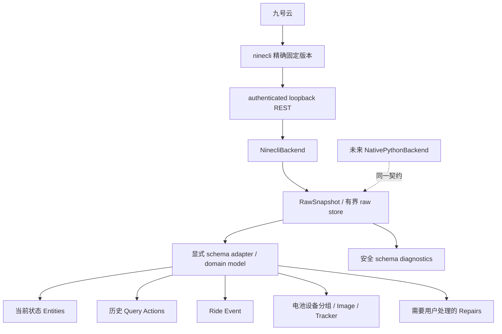

# ninecli 原始数据完整利用与后续逐级开发方案

> 调研日期：2026-10-04（Asia/Shanghai）。设计基线：`main`，`1bba9eb91b9c84e94de18cd1f38ba1a9daf1608c`，集成 `2.0.0b0`，最低 HA `2026.1.0`，精确依赖 `ninecli==0.1.7`。
>
> **本文是 v2.x 的后续设计依据，不是已实现功能清单。本轮仅阅读、离线测试、公开资料核实和只读检查生产 HA，没有修改运行代码、依赖、生产 HA 或执行车辆控制，也没有新增九号云请求。** 后续每一 Phase 都需独立实现、验证和审阅；不能把本文中的建议当成已完成的兼容保证。

阅读导航：第 1–4 节为证据和现状；第 5 节为逐字段映射；第 6–7 节为 backend/raw/Ride/轨迹模型；第 8–12 节为实体、查询、事件、电池和控制；第 13–18 节为调度、兼容、安全、身份、分发和测试；第 19 节为每阶段验收；第 20–22 节为未知问题、下次实施入口及来源。**开始下一阶段开发前，优先核对第 19、20、21 节。**

## 1. 文档定位、证据与结论

[完全重构与开发报告](完全重构与开发报告.md)、[ninecli 实现解读与依赖审计](ninecli实现解读与依赖审计.md)、[接口与实体逻辑对照](接口与实体逻辑对照开发文档.md)保留 2026-10-03 的历史研究；[实施记录](2.0-实施记录.md)、[迁移矩阵](2.0-实体迁移矩阵.md)、[预发布验收](2.0-预发布验收.md)描述 v2.0 的实际结果。本文在它们之后，专门决定 v2.x 如何扩展数据理解与 HA 表达，不能反向覆盖旧报告的时间基线。

### 1.1 证据标签

| 标签 | 含义及边界 |
|---|---|
| **已由源码确认 S** | 当前集成源码、固定版本 Core 源码、ninecli CLI 帮助/二进制实际调用，或 recon 固定提交；不等于已验证云端行为 |
| **已由官方文档确认 O** | PyPI、HA/HACS 官方文档和发布信息；动态网页按本次访问日期解释 |
| **已由 fixture 确认 F** | 仓库测试的合成输入/预期；不能冒充实车返回 |
| **已由真实只读请求确认 R** | 2026-10-03 审阅包中已保存的脱敏返回；**本轮未重发请求**，不能据此声称 10-04 的在线状态 |
| **推测 P** | 有解释依据但未形成字段契约；不能据此自动生成正式实体 |
| **待验证 V** | 字段存在性、单位、权限、时间或物理语义仍缺证据 |

附带[机器字段清单](evidence/v2x-field-inventory.json)只保存路径、类型、证据和设计分类，不保存车辆、账号、位置或会话值。它与第 5 节表格共同构成 inventory。真实来源是本地审阅包七条历史记录：一次 vehicles、两辆车各一次 status/battery/空月 travel。原始私有文件不进入 Git。当前 `tests/` 中没有独立 `fixtures/` 目录，测试主要使用代码内的合成数据；Phase 0 必须补可重放的脱敏契约样本。

清单统计为 **97 个已观察路径，86 个非容器字段，另 81 项已有别名或未验证候选**。不同 endpoint 的同名字段分别评估；81 项中包含建议 domain 字段和未来研究主题，绝不声称都已经出现在 ninecli 返回。新增 endpoint 的未知业务 schema 保留明确缺口，不能伪造“已枚举未查询接口所有字段”。

### 1.2 必须保留的方向

1. 保留受管理、随机 Bearer 保护的 loopback REST 和精确版本依赖；当前主 backend 继续 ninecli。
2. 优先补 raw/schema 观察层和行程 domain model，再考虑新实体。保留尚未理解的数据，同时限制内存与隐私出口。
3. 当前状态用 Entity；历史列表/详情用 action response；新行程用 EventEntity；图片已有 ImageEntity；轨迹不进入 state/recorder。
4. 不猜 `score`、`charging_power`、`ec`、`used_electricity` 的物理含义，不猜速度单位和坐标系。
5. 不重写稳定身份、会话事务、迁移、分组 freshness/backoff。兼容集中处理，保持 HA 2026.1.0。
6. 控制门禁与 engine 语义是安全优先的后续工作；目前上游权限为 `null`，不能当成允许。

## 2. 当前架构审计与实际基线

已通读集成全部模块、英语 strings/中英 translations、全部测试、docs 开发文档及脱敏证据、README/NOTICE、manifest/HACS/测试与静态检查配置，以及三个 GitHub Actions。没有 `services.yaml`、Event 平台、显式 backend Protocol、`compat.py`、完整 Ride/Track 模型或 raw snapshot 层。

| 文件/层 | 当前行为（S） | v2.x 处理 |
|---|---|---|
| `__init__.py`、`runtime.py` | typed `ConfigEntry.runtime_data`、首刷、平台转发、卸载、同 entry 会话事务和恢复、迁移 | 保留生命周期；以后在 `async_setup` 注册全局查询 actions，运行时仍按 entry 路由 |
| `client.py` | 本机子进程 serve、随机 token、密码 HTTP body、固定上游、隔离环境变量、超时/响应上限/请求串行化与取消清理 | 作为 transport；增加 detail 方法时复用相同边界，不绕回 argv 登录 |
| `coordinator.py` | 一账户协调器内 per-vehicle/per-group 调度；status/battery/travel/profile 独立成功时间、TTL、失败/backoff；手动 status 刷新、控制后回读、reauth | 不拆掉成熟调度；增加 demand graph、原始结果和 capability 输入 |
| `models.py` | 车辆 profile/status、BMS、TravelMonth、仅少数字段的 LastRide、Freshness | 增量扩展，Raw 与 normalized 分离；不得以空数据覆盖有效历史 |
| `adapters.py` | 原始 dict → snapshot，数值合法性/锁值解释/多电池身份、月行程及前一月 fallback | 保留验证规则；改为显式路径契约、语义证据与 parser issue，不吞未知字段 |
| `entity.py` | 稳定 unique_id、legacy aliases、冲突 Repair、动态添加、按所属 group 判 availability | 保留；给实体明确 context，device 分组不改 unique_id |
| `sensor.py`、`binary_sensor.py` | SOC/range/锁/充电/电源、BMS、月里程/最近距离、未确认量 raw、旧实体占位、估算实体 | 新行程时间/速度必须等待契约；不能以原始量替换不同语义的老 energy 历史 |
| `button.py`、`lock.py` | 手动刷新；bell/buck 按 controls+allowlist；Lock 调用 engine-start/stop | bell/buck 模型保留；Lock 映射缺实车语义证据，见第 12 节 |
| `image.py`、`device_tracker.py` | **ImageEntity 已实现**，image_url；tracker 双坐标验证、coordinates option、默认禁用、车型图片 | 完善缓存/URL/隐私与新版 Tracker 契约，不重复增加车型图片实体 |
| `storage.py` | 会话目录/文件权限、journal、候选验证、提交/回滚、恢复 | 继续保护 tokens；新事件 Store 与 debug cache 分离，不能混入会话 journal |
| `estimation.py`、`number.py` | 用户显式电池参数、模型 generation、SOC 变化估算、BMS freshness/身份守卫 | 保留独立模型身份；不把估算混成真实计量；纳入内部请求依赖 |
| `diagnostics.py` | 白名单诊断、版本、freshness/error、模型/电池概况，无完整原始 payload | 在安全结构上补 schema/capability/version/platform；不要直接 dump raw |
| `config_flow.py` | 登录/reauth/reconfigure/options、同账户校验、无持久化密码、旧 entry 迁移 | data 保留连接身份/session key，options 保留功能策略；新能力不直接要求重新录入密码 |
| `strings.json`、`translations/` | 现代命名和中英翻译 | 新 entity/action/exception/Repair 同步翻译；评估 icon translations |

### 2.1 安全与兼容的不可退化项

loopback 不是无鉴权信任区。ninecli serve 自身默认可以无 token，集成必须继续强制随机 Bearer，监听 loopback，移除用户环境中的 `NINEBOT_*` host override，不开放任意云 host。密码只在本机 request body 短时存在，不能写 ConfigEntry、日志、argv、fixture；现有 session directory/file 权限和候选会话验证继续执行。localhost HTTP 的信任边界是本机账户与进程，不能宣传为跨用户的绝对隔离。

目前单响应上限 1 MiB，超时 30 秒，队列/并发有界（S）。未来 detail 可能超限，先报告 typed oversized error/shape，不可为“完整”无限加大。会话 journal 的恢复测试不等于断电时所有文件系统 fsync 行为已经形式化证明；后续可补 fault injection，不为 raw feature 改写事务。

legacy identities/aliases、用户 entity_id/name/disabled 状态、旧估算 generation 必须保持。未知/缺失值使用 unavailable/unknown，不写零伪装成功。不得清理 production registry/recorder 或修改历史统计以完成迁移。

### 2.2 本轮实际测试与只读 HA 检查

| 核验 | 实际结果与限制 |
|---|---|
| pytest | **162 passed**，含分支的总覆盖 **97.58%**；当前实现基线通过，不证明未实现设计可用 |
| Ruff / format | 检查通过；33 个文件格式无须修改 |
| mypy | 22 个 integration 源文件通过；现配置并非完整 `strict = true`，不能称已达 Platinum strict typing |
| 当前提交的 GitHub CI | 已只读核实同 SHA 的 [Checks](https://github.com/Wuty-zju/ha_ninebot/actions/runs/37127668805)/[Hassfest](https://github.com/Wuty-zju/ha_ninebot/actions/runs/37127668813)/[HACS](https://github.com/Wuty-zju/ha_ninebot/actions/runs/37127668840) 成功；本轮没有重新触发远程校验，不冒称新跑结果 |
| ninecli 帮助核验 | 隔离临时配置环境执行各子命令 `--help`，无登录/云查询/控制；包括控制 help，仅研究契约 |
| recon 离线自测 | `ninebot_api.py --self-test` 通过签名向量、加密/解密回环、请求头构造；无账号与真实 HTTP |
| recon 缺陷复现 | mock 下过期 token 未调用 refresh；合成行程的 samples 覆盖 overall average/server max；数值转换接受 bool/Infinity，见第 4 节 |
| 本地生产 HA | 容器版本 `2026.10.0b0`，安装集成 `2.0.0b0`；27 个运行文件与 Git 基线逐字节一致（忽略 pycache）；1 个 ninebot entry、2 辆设备、80 registry entities，其中 35 启用；没有 child device |
| 本地日志/registry | 只读取 ninebot 相关结构/级别/数量；当前 log 无相关行，轮转 log 有两条 Warning，未据此臆造新 raw schema |

80 个 registry entities 按平台为 sensor 56、binary_sensor 6、tracker 2、button 6、lock 2、image 2、number 6，包含历史占位/禁用实体，不能等价为“80 个有效功能”。本轮未读取生产数据库、未修改 `.storage`/config/安装代码、未重启 HA；未取 HA 凭据或调用 runtime HTTP 来制造额外 polling。registry 是持久化登记，不能冒充实体当前 online state。生产 HA 自身可能持续更新文件，文件哈希也不能被用来宣称本轮绝对静止。

## 3. ninecli 版本、能力和 endpoint inventory

### 3.1 重新核实 PyPI 与升级策略

2026-10-04 实际访问 [PyPI JSON](https://pypi.org/pypi/ninecli/json)及[项目页](https://pypi.org/project/ninecli/)，最新仍为 **0.1.7**（O）。本轮不存在“高于 0.1.7 的新增 endpoint”，也没有逐个下载历史 wheel 比较；下表只表示发布时间，不杜撰各版本 changelog。PyPI metadata 没有公开源码 project URL，Go 函数线索不等于完整可审计源码。

| 版本 | 首个制品上传 UTC |
|---|---|
| 0.1.0 | 2026-06-21 05:50:44 |
| 0.1.1 | 2026-06-21 06:25:02 |
| 0.1.2 | 2026-06-21 23:51:31 |
| 0.1.3 | 2026-06-22 03:13:51 |
| 0.1.4 | 2026-06-23 11:34:24 |
| 0.1.5 | 2026-06-29 08:34:47 |
| 0.1.6 | 2026-06-29 14:59:07 |
| 0.1.7 | 2026-07-01 23:48:00 |

生产保持 `ninecli==0.1.7`。将来新版本先比较命令帮助、REST/MCP/envelope/error contract、raw schema、wheel 平台/哈希、会话刷新与取消语义，补 recorded fixtures 和负例，再测试决定是否修改精确 pin。不得 `>=` 或启动时下载 latest。0.1.7 为 native wheels，无 sdist；发布平台覆盖 Linux glibc/musl x86_64/aarch64、macOS x86_64/arm64、Windows amd64/arm64（O/S），不承诺 armv7。Python wheel 元数据最低版本不代表 HA 支持矩阵。

### 3.2 CLI / REST / MCP 的边界

CLI `--json` 返回解密后的业务 data，与 serve 的 `ok/data` envelope、MCP tools result 不是同一层。`travel --month YYYYMM --detail ID` 可查月/详情，但帮助里**没有 page/limit**。根命令没有独立 `refresh` 子命令；REST/MCP 有显式 refresh，查询内部自动刷新属于 backend 行为。SMS 请求验证码有外部副作用，本轮没有执行；未来若引入 SMS flow，需要用户主动发起和次数限制。

| 能力 | ninecli CLI | loopback REST | 集成现状 / 研究限制 |
|---|---|---|---|
| 本机存活 | `serve` | `GET /healthz` | 无 token 健康检查不能代替用户认证或云健康 |
| 密码登录 | `login -u/-p/-a` | `POST /auth/login`：account/password | 集成用 body，绝不能退回密码 argv |
| SMS 发送 | `login-code`（省略 code） | `POST /auth/login-code` | 未来可选；本轮禁止借调研发送短信 |
| SMS 消费 | `login-code --code` | `POST /auth/login-code/consume` | 未来单独认证设计，不混入普通 options |
| refresh | 内部 ensureFreshTokens | `POST /auth/refresh` | 保留现有自动刷新；不得独立循环刷新制造 storm |
| 用户信息 | `whoami` | `GET /whoami` | ninecli 支持，当前 client 无专用包装；PII/UID 不进入诊断 |
| 车辆列表 | `vehicles --json` | `GET /vehicles` | 当前使用；R 有两辆车历史返回 |
| 状态 | `status SN --json` | `GET /vehicles/{sn}/status` | 当前使用；R 有完整历史 schema |
| 电池 | `battery SN --json` | `GET /vehicles/{sn}/battery` | 当前使用；R 无 pack SN |
| 月行程 | `travel SN --month YYYYMM --json` | `GET /vehicles/{sn}/travel?month=YYYYMM` | 当前使用；R 月列表为空；服务器分页完整性 V |
| 行程详情 | `travel SN --detail ID --json` | `GET /vehicles/{sn}/travel/{detail_id}` | ninecli 支持，集成待包装；真实非空 JSON V |
| bell | `bell SN` | `POST /vehicles/{sn}/bell` | 现有 Button；仅 help/mock，未真控 |
| buck | `buck SN` | `POST /vehicles/{sn}/buck` | 现有 Button；仅 help/mock，未真控 |
| engine-start | `engine-start SN` | `POST /vehicles/{sn}/engine/start` | 不等同于已证实 unlock |
| engine-stop | `engine-stop SN` | `POST /vehicles/{sn}/engine/stop` | 不等同于已证实 lock |

MCP 支持 auth/login/send-code/consume-code/refresh、whoami、vehicles/status/battery/travel/detail 与控制工具（O）。既有 REST 足以满足 HA；不再引入第二个 MCP 控制通道。stdio 或 streamable HTTP 及其 token 选项只是研究对象，不等于集成要开放给外部 agent。客户端错误和服务端消息可能带标识符，公共日志只保留错误类别和安全 translation key。

### 3.3 九号云路径与历史文档修正

下面的云路径不同于 loopback endpoint；未来 backend abstraction 不应向 HA 平台泄漏 Passport/加密层。

| 功能 | 云路径 | 证据 |
|---|---|---|
| Passport 登录/刷新 | `/v6/user/login`、`/v3/user/refresh` | S：recon/API 与历史协议审计；完整真实会话仍见旧报告 |
| 车辆列表 | `/vehicle/binding/my-vehicle`（ebike/steeldust 业务） | R：历史请求记录；模型合并需去重 |
| status | `/vehicle/vehicle/desktop-component`，`sn_str` | R：历史 ebike 请求 |
| battery | `/v6/vehicle/battery-info`，`wnumber` | R：历史 ebike 请求；不能仅依 recon 报告把 host 改到 CBU |
| 月行程 | `/app-api/travel/v6/travel-list2`（CBU） | R/S |
| 行程详情 | **`/app-api/travel/v6/travel-info`** | S：0.1.7 ARM64 `(*Business).TravelDetail` 实际路径长度 30；未进行真实 detail 查询 |
| 控制 | `/devices/control/bell`、`/devices/control/open_buck`、`/devices/control/engine_start`、`/devices/control/engine_stop` | S：CLI help；禁止据此声称实车语义已验证 |

旧依赖审计 §6 和补充协议材料曾写 `travel-infostream`。本轮重新读取 `TravelDetail`：地址 `0x2937e8/0x2937ec` 装载路径，`0x2937f0` 将长度设为 `0x1e`，`0x293808` 调用 `PostWithExtras`。**30 字节仅为 `/app-api/travel/v6/travel-info`**；之后的 `stream error: ...` 是 Go rodata 邻接字串，旧脚本按 96 字节预览造成误读。本修正是静态调用核验，不是本轮抓包。相关最小证据收入机器摘要，不发布整段私有审阅材料。

同一 binary 的 `printTravelDetail` 实际引用 `start_time/end_time/duration/mileages/speed/ec/used_electricity/trail`，格式文字显示 km、km/h、Wh、%、CST，以及 `trail` 的 `lon,lat,speed,distFromPrev`（S）。这是 **CLI 作者的解释证据**，高于盲猜、低于当前车型 raw+App 交叉验证。`trail` 的真实类型/分隔符/时间点/坐标系依然 V；不能将格式文案直接升级成生产单位契约。

## 4. ninebot-recon：协议与数据理解参考

本轮只读克隆并固定在 [`a46124d6290179554e1688c01384a7f4116ac96a`](https://github.com/kxn/ninebot-recon/tree/a46124d6290179554e1688c01384a7f4116ac96a)，阅读 README、recon README、完整 `ninebot_api.py`/`ninebot_crypto.py`/`fetch_trips.py`、[完整逆向报告](https://github.com/kxn/ninebot-recon/blob/a46124d6290179554e1688c01384a7f4116ac96a/docs/reverse-engineering-full-report.md)及签名/派生/base64/wrapper 验证脚本。公开数据与验证主要为 demo、假服务器、GDB/机器码交叉验证；报告也明确真实云端端到端未完成。不能称这些行程为当前用户车型的真实 fixture。

### 4.1 可借鉴的内容

| 层 | 已有实现/证据 S | 未来用途与限制 |
|---|---|---|
| Passport | 参数排序、含路径/时间/clientKey 的 SHA256 Sign，password login、refresh | 未来 NativePythonBackend 的认证参考；不能复用其未验证的 session 生命周期 |
| 业务协议 | 有序业务 JSON、MD5 checkcode、Android Base64 的换行、AES-128-CBC/PKCS7、RSA-1024 wrapping | 用独立向量审计，保留原协议以兼容云端，不把旧 crypto 描述成现代端到端安全设计 |
| 响应 | 独立 kd1..4，经 ROL/XOR/位运算 DeriveKey、小端 4 个 word 得响应 AES key，再 decrypt/unwrap | 请求 AES key 与响应派生 key 不同；不可简化为同一个 key |
| API | business login、vehicles、travel-list、travel-info，travel-list 有 page 入参 | 目前没有成熟 status/BMS/控制 Python SDK；不能立即替代完整 ninecli |
| 行程理解 | 字段候选列表、列表与详情合并、distance/duration 平均、速度 samples、轨迹候选 | 作为 hypotheses inventory；仅按经过验证的 endpoint/schema contract 激活别名 |
| 逆向流程 | 假服务器、固定签名向量、Unicorn 验证、字符串长度/参数顺序核对 | 可降低真实测试次数；x86_64 的 hardcoded `/data/dl/` 工具不能直接在本机 ARM64 宣称复跑 |

实际代码比某些注释更可靠：`platform`/时间戳/JSON 排序注释有历史残留；应以构造函数和逆向向量核对。MIT 授权允许后续参考/复制，但复制实质代码须保留版权和许可说明；本轮仅分析，没有移植。

### 4.2 不能照抄的逻辑及离线复现

1. `ensure_login` 在过期 token 分支先 raise，后面的相同条件 refresh 分支不可达；mock 复现 refresh call count=0。未来认证必须独立状态机，复用当前 integration 的安全流程。
2. 合成行程 distance=10、duration=3600、server speed=90、samples=[10,20]：recon 将 overall average 从 10 改成 sample mean=15，并把 server max 改成 sample max=20。**两种平均速度应分开；服务端 max 保留原来源，sample max 只作校验或明确命名的独立量。**
3. `to_float` 排除 NaN 但接受 Infinity/bool。新 parser 要排除 bool、非有限值、负时长/非法坐标，并对字符串长度/集合大小设界。
4. `KEY_ID` 未包含 `detail_id`，`KEY_TRACK` 未包含 binary 实际引用的 `trail`。候选字典并非 schema 的真相，不能从一份通用抓取脚本推定全部车型。
5. normalize 后的 `raw` 会删去全部候选 key，包括未真正采用的字段；不满足“保留完整原始 JSON”。新 Raw layer 要保留 endpoint payload（经敏感认证边界处理），domain 只引用它。
6. 脚本只取月 page 1，从早月向后扫描且遇三空月提前停，可能丢后续历史；缓存无规模/隐私界限，文件名依赖外部 ID。HA 不能照搬这种批量抓取策略。
7. 同步 urllib、原始异常、tokens 文件、host override/密码 argv 与全局变量不适合直接进入 HA async event loop。底层 transport 移植放 Phase 10，需重新设计，不是给同步脚本套 executor 就称成熟 SDK。

## 5. Raw endpoint 与字段 → HA 完整评估表

以下表覆盖本轮已掌握的历史 raw schema 全部叶字段；数组/object 根及容器也在机器清单中记录（H/I），无遗漏地解释“结构”而不是为容器创建实体。字段表所列 **HA 表达为后续设计，当前是否实现以第 2/8 节为准**。

分类：A 正式 Entity；B 默认禁用 Entity；C Diagnostic Entity；D EventEntity 的小体积数据；E Action response；F Vehicle metadata；G 电池组件/独立电池 metadata；H 仅 runtime raw；I 仅 diagnostics schema；J 暂不使用并解释原因。多分类表示不同出口，但原始 JSON 不进入实体 attributes。C 默认禁用；表中 `—` 表示不适用/不声明；`M`=`measurement`。所有 R 行的值和单位语义仍可能 V，不因存在字段就确认含义。

### 5.1 表格约定

compatibility：C0 沿用现有身份/行为；C1 新模型/新独立身份；C2 旧 raw/text/估算身份不能改成不同单位或语义；C3 隐私/显式选项门禁；CG 电池稳定身份+集中 device compatibility。未确认字段当前保持 H/I/J，不能因表中有未来用途自动启用。

### 5.2 vehicles 已观察字段

| raw path | 类型 | 含义/理由 | 单位 | 证据 | HA 分类 | 默认 | device class | state class | category | compatibility |
|---|---|---|---|---|---|---|---|---|---|---|
| `$[].active_date` | str | 激活时间/枚举；格式/语义 V，不创建时间实体 | — | R；语义 V | H/I | — | — | — | — | C0 |
| `$[].active_uid` | str | 用户身份；无需 HA 状态表达，值从公开输出删除 | — | R；语义 V | J/I | — | — | — | — | C0 |
| `$[].actived` | int | 激活时间/枚举；格式/语义 V，不创建时间实体 | — | R；语义 V | H/I | — | — | — | — | C0 |
| `$[].and_mac` | str | 平台相关 MAC；个人设备标识，不导出或作为已验证连接 | — | R；语义 V | J/I | — | — | — | — | C0 |
| `$[].auth_date` | str | 授权时间；格式/有效期关系未确认 | — | R；语义 V | H/I | — | — | — | — | C0 |
| `$[].auth_email` | str | 个人资料；不用于 Entity/diagnostics/debug export | — | R；个人信息 | J/I | — | — | — | — | C0 |
| `$[].auth_nickname` | str | 个人资料；不用于 Entity/diagnostics/debug export | — | R；个人信息 | J/I | — | — | — | — | C0 |
| `$[].auth_phone` | str | 个人资料；不用于 Entity/diagnostics/debug export | — | R；个人信息 | J/I | — | — | — | — | C0 |
| `$[].auth_uid` | str | 用户身份；无需 HA 状态表达，值从公开输出删除 | — | R；语义 V | J/I | — | — | — | — | C0 |
| `$[].ble_name` | str | 蓝牙名称；非 connectivity 状态，不作为身份 | — | R；语义 V | H/I | — | — | — | — | C0 |
| `$[].blue_secret` | str | 蓝牙凭据；禁止保存到新 raw cache/diagnostics，保留已遮蔽形状 | — | R；敏感信息 | J/I | — | — | — | — | C0 |
| `$[].businessType` | int | 车型/业务枚举；路由和支持矩阵，不能转权限 | — | R；语义 V | F/H/I | — | — | — | — | C0 |
| `$[].color` | str | 颜色；稳定后可作 metadata，枚举含义待核 | — | R；语义 V | F/H | — | — | — | — | C0 |
| `$[].common_user_permissions` | null | 共享用户权限；真实值 null，未知必须 fail closed | — | R；语义 V | H/I | — | — | — | — | C0 |
| `$[].common_user_vehicle_index` | int | 共享列表索引；不能作稳定车辆 ID | — | R；语义 V | J/I | — | — | — | — | C0 |
| `$[].common_user_version` | null | 支持/版本候选；真实 null，禁止猜 bit mask | — | R；语义 V | H/I | — | — | — | — | C0 |
| `$[].device_name` | str | 用户车辆名；Device name，诊断名实体保持 | — | R/S | F/C | 否 | — | — | diagnostic | C0 |
| `$[].img_url` | str | 车型图片；沿用已实现 ImageEntity/实体图片 | — | R/S | B/F | 否 | — | — | — | C0 |
| `$[].ios_mac` | str | 平台相关 MAC；个人设备标识，不导出或作为已验证连接 | — | R；语义 V | J/I | — | — | — | — | C0 |
| `$[].is_common_user` | int | 共享用户标志；不是操作授权许可 | — | R；语义 V | H/I | — | — | — | — | C0 |
| `$[].is_img_special` | null | 图片标志；null 未确认 | — | R；语义 V | J/I | — | — | — | — | C0 |
| `$[].latest_support` | null | 支持/版本候选；真实 null，禁止猜 bit mask | — | R；语义 V | H/I | — | — | — | — | C0 |
| `$[].loc_delay_time` | null | 位置延迟候选；null，单位未知，不作 freshness | — | R；语义 V | H/I | — | — | — | — | C0 |
| `$[].owner_user_area_code` | str | 个人资料；不用于 Entity/diagnostics/debug export | — | R；个人信息 | J/I | — | — | — | — | C0 |
| `$[].owner_user_avatar` | str | 个人资料；不用于 Entity/diagnostics/debug export | — | R；个人信息 | J/I | — | — | — | — | C0 |
| `$[].owner_user_id` | str | 用户身份；无需 HA 状态表达，值从公开输出删除 | — | R；语义 V | J/I | — | — | — | — | C0 |
| `$[].owner_user_nickname` | str | 个人资料；不用于 Entity/diagnostics/debug export | — | R；个人信息 | J/I | — | — | — | — | C0 |
| `$[].owner_user_phone` | str | 个人资料；不用于 Entity/diagnostics/debug export | — | R；个人信息 | J/I | — | — | — | — | C0 |
| `$[].smart_service_surplus_days` | int | 智能服务剩余天数候选；确认后可禁用诊断，当前 runtime | 待验证（名称提示天） | R；语义 V | H/I | — | — | — | — | C0 |
| `$[].support` | null | 支持/版本候选；真实 null，禁止猜 bit mask | — | R；语义 V | H/I | — | — | — | — | C0 |
| `$[].total_mileage` | null | 总里程候选；真实 null，不冒充 odometer | 待验证 | R；语义 V | H/I | — | — | — | — | C0 |
| `$[].v6_dark_img_url` | str | 暗色车型图片；未来主题表达，URL 安全审查 | — | R；语义 V | H/I | — | — | — | — | C0 |
| `$[].v6_light_img_url` | str | 车型图片；沿用已实现 ImageEntity/实体图片 | — | R/S | B/F | 否 | — | — | — | C0 |
| `$[].vehicle_name` | str | 车型；当前 model 来源 | — | R/S | F | — | — | — | — | C0 |
| `$[].vehicle_name_en` | str | 车型语言版本；display fallback，非独立状态 | — | R；语义 V | F/H | — | — | — | — | C0 |
| `$[].vehicle_name_zh` | str | 车型语言版本；display fallback，非独立状态 | — | R；语义 V | F/H | — | — | — | — | C0 |
| `$[].vehicle_type` | int | 车型/业务枚举；路由和支持矩阵，不能转权限 | — | R；语义 V | F/H/I | — | — | — | — | C0 |
| `$[].vin` | str | 车辆 VIN；可评估敏感 metadata，当前未映射，不进入 diagnostics | — | R；用途 V | F/H | — | — | — | — | C0 |
| `$[].wnumber` | str | 车辆云身份；用于现有 unique_id/device identifier | — | R/S | F/H | — | — | — | — | C0 |

### 5.3 status 已观察字段

| raw path | 类型 | 含义/理由 | 单位 | 证据 | HA 分类 | 默认 | device class | state class | category | compatibility |
|---|---|---|---|---|---|---|---|---|---|---|
| `$.ai_estimate_mileage` | float/int | 普通/AI 续航，分别表达 | km | R/S；沿用 v2 契约 | B | 否 | distance | M | — | C0 |
| `$.barrel_lock_status` | int | 座桶锁候选；无值枚举/反馈契约，暂不造 Lock | — | R；语义 V | H/I | — | — | — | — | C0 |
| `$.battery_exist` | int | 电池存在枚举；确认后可诊断，不与 pack_count 等价 | — | R；语义 V | H/I | — | — | — | — | C0 |
| `$.ble_name` | str | 蓝牙名称；不能当蓝牙连接在线状态 | — | R；语义 V | H/I | — | — | — | — | C0 |
| `$.charging` | int | 充电状态；当前 binary_sensor | — | R/S | A | 是 | battery_charging | — | — | C0 |
| `$.dump_energy` | str | 车辆 SOC；当前 battery Entity | % | R/S；沿用 v2 契约 | A | 是 | battery | M | — | C0 |
| `$.estimate_mileage` | float | 普通/AI 续航，分别表达 | km | R/S；沿用 v2 契约 | B | 否 | distance | M | — | C0 |
| `$.is_common_user` | int | 共享账户标记；不能推出 owner 或控制权 | — | R；语义 V | H/I | — | — | — | — | C0 |
| `$.is_smart_service_expired` | int | 服务到期标志候选；需验证对 endpoint 权限影响 | — | R；语义 V | H/I | — | — | — | — | C0 |
| `$.left_mileage_user_choose` | int | App 续航显示偏好/阈值候选；未知语义 | — | R；语义 V | J/I | — | — | — | — | C0 |
| `$.loc.acc` | int | acc；可能 ignition 或定位属性，不能直接判精度/电源 | 待验证 | R；语义 V | H/I | — | — | — | — | C0 |
| `$.loc.lat` | str | 位置；双坐标有效+opt-in 后 tracker，详情 actions 另需隐私门禁 | degree；坐标系 V | R/S；坐标系 V | B/E | 否；opt-in | — | — | — | C3 |
| `$.loc.lock` | int | 当前 parser 1=locked/0=unlocked；legacy raw 反码为0=locked/1=unlocked；非 engine 指令契约 | — | R/S/F | A/C | 是/诊断否 | lock（binary） | — | — | C0 |
| `$.loc.lon` | str | 位置；双坐标有效+opt-in 后 tracker，详情 actions 另需隐私门禁 | degree；坐标系 V | R/S；坐标系 V | B/E | 否；opt-in | — | — | — | C3 |
| `$.permissions` | null | 操作权限；真实 null，不能判为允许 | — | R；语义 V | H/I | — | — | — | — | C0 |
| `$.precise_estimate_mileage` | float | 精确续航；沿用 endurance/remaining_range aliases | km | R/S；沿用 v2 契约 | A | 是 | distance | M | — | C0 |
| `$.precise_mileage_user_choose` | int | App 续航显示偏好/阈值候选；未知语义 | — | R；语义 V | J/I | — | — | — | — | C0 |
| `$.pwr` | int | 车辆电源状态；不是功率 | — | R/S | A | 是 | power | — | — | C0 |
| `$.remain_charge_time` | str | 服务器剩余充电文字；保留原实体，不能当秒 | — | R/S | B | 否 | — | — | — | C2 |
| `$.remain_charge_timestamp` | int | 剩余充电时间候选；duration 或 deadline 不明确 | 待验证 | R；语义 V | H/I | — | — | — | — | C0 |
| `$.sn` | str | 状态所属车辆校验；不新增重复序列号实体 | — | R/S | F/H | — | — | — | — | C0 |
| `$.v6_dark_img_url` | str | 车型图片备用来源；沿用 profile 图片策略，非独立新实体 | — | R；语义 V | F/H | — | — | — | — | C0 |
| `$.v6_light_img_url` | str | 车型图片备用来源；沿用 profile 图片策略，非独立新实体 | — | R；语义 V | F/H | — | — | — | — | C0 |

### 5.4 battery 已观察字段

| raw path | 类型 | 含义/理由 | 单位 | 证据 | HA 分类 | 默认 | device class | state class | category | compatibility |
|---|---|---|---|---|---|---|---|---|---|---|
| `$.battery_count` | str | 服务端 count；历史为字符串，曾与数组长度不符；只作 schema | — | R；不可信计数 | H/I | — | — | — | — | C0 |
| `$.battery_find_my_support` | bool | 寻电池支持标志；不是 bell/buck/engine 权限 | — | R；语义 V | H/I | — | — | — | — | C0 |
| `$.battery_list[].bat_temp` | str | BMS 温度；保持身份 | °C | R/S；沿用 v2 契约 | A | 是 | temperature | M | — | C0/CG |
| `$.battery_list[].bms_cycle` | str | 循环数；只有明确 support=true 才启用，false 的哨兵不使用 | 次 | R/S；样本 support=false | B | 否且 support gate | — | — | diagnostic | C0/CG |
| `$.battery_list[].bms_volt` | str | BMS 电压；显式合法数值，保持单/多包旧身份 | V | R/S；沿用 v2 契约 | A | 是 | voltage | M | — | C0/CG |
| `$.battery_list[].electricity` | str | 包 SOC 候选；范围/主包/缓存语义待核，与 status SOC 区分 | 待验证（可能 %） | R；语义 V | H/I | — | — | — | — | C0 |
| `$.battery_list[].score` | int | 评分原始量；不得直接命名 SOH | 未知 | R；语义 V | H/I | — | — | — | — | C0 |
| `$.battery_main.electricity` | str | 主电池量；与外层及车辆 SOC 数值不同，不自动归并 | 待验证 | R；语义 V | H/I | — | — | — | — | C0 |
| `$.battery_type` | str | 电池类型编码；核实枚举后 metadata | — | R；语义 V | G/H | — | — | — | — | CG |
| `$.charging` | int | BMS 充电标志；与 status 比较，当前 primary 继续 status | — | R；语义 V | H/I | — | — | — | — | C0 |
| `$.charging_power` | int | 原始充电量；charging_power_raw 保持无单位 | 未知 | R/S | C | 否 | — | — | diagnostic | C2 |
| `$.charging_protection.status` | int | 充电保护标志；枚举未知，不直接套 Problem class | — | R；语义 V | H/I | — | — | — | — | C0 |
| `$.charging_protection.url` | str | 充电保护相关 URL；功能/访问权限未知，禁止后台任意抓取 | — | R；语义 V | J/I | — | — | — | — | C0 |
| `$.electricity` | int | 电池外层量；与 status/main 分开，未知更新时间 | 待验证 | R；语义 V | H/I | — | — | — | — | C0 |
| `$.have_bms_cycle_support` | bool | 循环数 feature gate；必须 True，不从 cycle 数值猜能力 | — | R/S | H/I | — | — | — | — | C0 |
| `$.remain_charge_time` | str | BMS 充电文字；保留 raw，避免与 status 重复实体 | — | R/S | H/I | — | — | — | — | C0 |

### 5.5 travel 已观察字段

| raw path | 类型 | 含义/理由 | 单位 | 证据 | HA 分类 | 默认 | device class | state class | category | compatibility |
|---|---|---|---|---|---|---|---|---|---|---|
| `$.detail[]` | str | 月汇总字符串列表；不是 ride detail endpoint/轨迹 | — | R；str[] | H/I | — | — | — | — | C0 |
| `$.duration` | int | 月时长候选；不能当 last ride duration | 待验证 | R；语义 V | E/H | — | — | — | — | C0 |
| `$.ec` | int | 月能量原始值；禁止直接 Energy Dashboard | 未知 | R/S | C/E | 否 | — | — | diagnostic | C2 |
| `$.first_time` | int | 首行程/状态候选；样本零，不能推出 timestamp | 待验证 | R；语义 V | H/I | — | — | — | — | C0 |
| `$.list` | null | 真实样本 null；有历史 synthetic list，不宣称真实列表 schema 已确认 | — | R（null）/F（list） | E/H | — | — | — | — | C0 |
| `$.month` | str | 查询月份；必须与 requested month 一致，不能取当前日期覆盖 | YYYYMM | R/S | E/H | — | — | — | — | C0 |
| `$.times` | int | 月次数候选；分页/撤销/重复语义待验 | 待验证（次数） | R；语义 V | E/H | — | — | — | — | C0 |
| `$.total_mileages` | str | 月里程；现 month_mileage 无 state_class；单调性待验 | km（沿用 v2） | R/S；本样本月为零 | A/E | 是 | distance | — | — | C0 |

### 5.6 已有 parser 别名、非空行程及未来候选

下表按字段分别评估；candidate 没有真实样本，分类箭头表示验证后可能表达，**现在一律不自动创建 Entity**。时间/速度/轨迹的最终单位与类别见第 7–8 节；default=否，category=未定，state_class=无，compatibility 按列声明。

| endpoint / 来源 | raw path / 候选 | 含义与依据 | 单位 | 证据 | HA 表达 | compatibility |
|---|---|---|---|---|---|---|
| vehicles | `$[].sn` | 当前 adapter profile 身份备用路径 | — | S/F；真实 V | F/H | C0 |
| status | `$.lock_status` | 当前 lock fallback；不能让非法 loc.lock 阻断有效 fallback | 枚举 | S/F；真实 V | A/H | C0 |
| battery | `$.data` | 当前支持的 envelope wrapper；先解包再按 battery 路径解释 | — | S/F；真实 V | H/I | C0 |
| battery | `$.battery_list[].battery_sn` | 当前 adapter 的稳定包身份候选；真实记录不存在 | — | S/F；真实 V | G/H | CG |
| battery | `$.battery_list[].sn` | 当前 adapter 的稳定包身份候选；真实记录不存在 | — | S/F；真实 V | G/H | CG |
| battery | `$.battery_list[].have_bms_cycle_support` | 单包 support override；当前 source/fixture 规则 | bool | S/F；真实 V | H/I | C0/CG |
| travel | `$.list[]` | 当前 synthetic 行程条目容器；真实非空样本缺失 | — | S/F；真实 V | E/H | C1 |
| travel | `$.list[].id` | 当前 LastRide parser 字段；ID 区分、距离/能量依据需真实补齐 | 待验证 | S/F；真实 V | E/H | C1 |
| travel | `$.list[].detail_id` | 当前 LastRide parser 字段；ID 区分、距离/能量依据需真实补齐 | 待验证 | S/F；真实 V | E/H | C1 |
| travel | `$.list[].mileages` | 当前 LastRide parser 字段；ID 区分、距离/能量依据需真实补齐 | 待验证 | S/F；真实 V | E/H | C0/C2 |
| travel | `$.list[].ec` | 当前 LastRide parser 字段；ID 区分、距离/能量依据需真实补齐 | 待验证 | S/F；真实 V | E/H | C0/C2 |
| travel-list/detail candidate | `$.travel_id` | recon ID；不能默认等于 detail_id | 待验证 | S（候选源码/CLI解释）；真实/单位 V | J→E/D/B（验证后） | C1 |
| travel-list/detail candidate | `$.id` | 当前/recon ID；不同 endpoint 可能有不同身份 | 待验证 | S（候选源码/CLI解释）；真实/单位 V | J→E/D/B（验证后） | C1 |
| travel-list/detail candidate | `$.detail_id` | 当前 parser 可识别；详情查找关联待验 | 待验证 | S（候选源码/CLI解释）；真实/单位 V | J→E/D/B（验证后） | C1 |
| travel-list/detail candidate | `$.travelId` | recon 别名 | 待验证 | S（候选源码/CLI解释）；真实/单位 V | J→E/D/B（验证后） | C1 |
| travel-list/detail candidate | `$.start_time_format` | recon 时间格式；无时区可能 | 待验证 | S（候选源码/CLI解释）；真实/单位 V | J→E/D/B（验证后） | C1 |
| travel-list/detail candidate | `$.end_time_format` | recon 时间格式；无时区可能 | 待验证 | S（候选源码/CLI解释）；真实/单位 V | J→E/D/B（验证后） | C1 |
| travel-list/detail candidate | `$.start_time` | binary CLI/recon；Unix 单位及 CST 契约待交叉验证 | 待验证 | S（候选源码/CLI解释）；真实/单位 V | J→E/D/B（验证后） | C1 |
| travel-list/detail candidate | `$.end_time` | binary CLI/recon；Unix 单位及 CST 契约待交叉验证 | 待验证 | S（候选源码/CLI解释）；真实/单位 V | J→E/D/B（验证后） | C1 |
| travel-list/detail candidate | `$.mileages` | binary CLI/recon 距离 | 待验证 | S（候选源码/CLI解释）；真实/单位 V | J→E/D/B（验证后） | C1 |
| travel-list/detail candidate | `$.duration` | binary CLI/recon 时长 | 待验证 | S（候选源码/CLI解释）；真实/单位 V | J→E/D/B（验证后） | C1 |
| travel-list/detail candidate | `$.used_electricity` | binary CLI/recon；百分比/百分点与细节缩放待验 | 待验证 | S（候选源码/CLI解释）；真实/单位 V | J→E/D/B（验证后） | C1 |
| travel-list/detail candidate | `$.ec` | binary CLI 提示 Wh，但本车型未交叉验证 | 待验证 | S（候选源码/CLI解释）；真实/单位 V | J→E/D/B（验证后） | C1 |
| travel-list/detail candidate | `$.speed` | binary CLI max 显示/recon；标量和列表不可混同 | 待验证 | S（候选源码/CLI解释）；真实/单位 V | J→E/D/B（验证后） | C1 |
| travel-list/detail candidate | `$.speed_list` | recon samples 候选 | 待验证 | S（候选源码/CLI解释）；真实/单位 V | J→E/D/B（验证后） | C1 |
| travel-list/detail candidate | `$.speeds` | recon samples 候选 | 待验证 | S（候选源码/CLI解释）；真实/单位 V | J→E/D/B（验证后） | C1 |
| travel-list/detail candidate | `$.track` | recon 轨迹候选 | 待验证 | S（候选源码/CLI解释）；真实/单位 V | J→E/D/B（验证后） | C1 |
| travel-list/detail candidate | `$.trail` | binary CLI 实际引用；recon KEY_TRACK 未覆盖 | 待验证 | S（候选源码/CLI解释）；真实/单位 V | J→E/D/B（验证后） | C1 |
| travel-list/detail candidate | `$.points` | recon 候选 | 待验证 | S（候选源码/CLI解释）；真实/单位 V | J→E/D/B（验证后） | C1 |
| travel-list/detail candidate | `$.gps` | recon 候选 | 待验证 | S（候选源码/CLI解释）；真实/单位 V | J→E/D/B（验证后） | C1 |
| travel-list/detail candidate | `$.route` | recon 候选 | 待验证 | S（候选源码/CLI解释）；真实/单位 V | J→E/D/B（验证后） | C1 |
| travel-list/detail candidate | `$.track_points` | recon 候选 | 待验证 | S（候选源码/CLI解释）；真实/单位 V | J→E/D/B（验证后） | C1 |
| travel-list/detail candidate | `$.locations` | recon 候选 | 待验证 | S（候选源码/CLI解释）；真实/单位 V | J→E/D/B（验证后） | C1 |
| travel-list/detail candidate | `$.lat_lng` | recon 候选 | 待验证 | S（候选源码/CLI解释）；真实/单位 V | J→E/D/B（验证后） | C1 |
| travel-list/detail candidate | `$.startTime` | recon 候选别名；未在本轮真实 schema 出现，不能自动启用 | 待验证 | S（候选源码/CLI解释）；真实/单位 V | J→E/D/B（验证后） | C1 |
| travel-list/detail candidate | `$.begin_time` | recon 候选别名；未在本轮真实 schema 出现，不能自动启用 | 待验证 | S（候选源码/CLI解释）；真实/单位 V | J→E/D/B（验证后） | C1 |
| travel-list/detail candidate | `$.beginTime` | recon 候选别名；未在本轮真实 schema 出现，不能自动启用 | 待验证 | S（候选源码/CLI解释）；真实/单位 V | J→E/D/B（验证后） | C1 |
| travel-list/detail candidate | `$.time` | recon 候选别名；未在本轮真实 schema 出现，不能自动启用 | 待验证 | S（候选源码/CLI解释）；真实/单位 V | J→E/D/B（验证后） | C1 |
| travel-list/detail candidate | `$.endTime` | recon 候选别名；未在本轮真实 schema 出现，不能自动启用 | 待验证 | S（候选源码/CLI解释）；真实/单位 V | J→E/D/B（验证后） | C1 |
| travel-list/detail candidate | `$.finish_time` | recon 候选别名；未在本轮真实 schema 出现，不能自动启用 | 待验证 | S（候选源码/CLI解释）；真实/单位 V | J→E/D/B（验证后） | C1 |
| travel-list/detail candidate | `$.finishTime` | recon 候选别名；未在本轮真实 schema 出现，不能自动启用 | 待验证 | S（候选源码/CLI解释）；真实/单位 V | J→E/D/B（验证后） | C1 |
| travel-list/detail candidate | `$.mileage` | recon 候选别名；未在本轮真实 schema 出现，不能自动启用 | 待验证 | S（候选源码/CLI解释）；真实/单位 V | J→E/D/B（验证后） | C1 |
| travel-list/detail candidate | `$.distance` | recon 候选别名；未在本轮真实 schema 出现，不能自动启用 | 待验证 | S（候选源码/CLI解释）；真实/单位 V | J→E/D/B（验证后） | C1 |
| travel-list/detail candidate | `$.total_mileage` | recon 候选别名；未在本轮真实 schema 出现，不能自动启用 | 待验证 | S（候选源码/CLI解释）；真实/单位 V | J→E/D/B（验证后） | C1 |
| travel-list/detail candidate | `$.mileage_km` | recon 候选别名；未在本轮真实 schema 出现，不能自动启用 | 待验证 | S（候选源码/CLI解释）；真实/单位 V | J→E/D/B（验证后） | C1 |
| travel-list/detail candidate | `$.duration_s` | recon 候选别名；未在本轮真实 schema 出现，不能自动启用 | 待验证 | S（候选源码/CLI解释）；真实/单位 V | J→E/D/B（验证后） | C1 |
| travel-list/detail candidate | `$.ride_time` | recon 候选别名；未在本轮真实 schema 出现，不能自动启用 | 待验证 | S（候选源码/CLI解释）；真实/单位 V | J→E/D/B（验证后） | C1 |
| travel-list/detail candidate | `$.rideTime` | recon 候选别名；未在本轮真实 schema 出现，不能自动启用 | 待验证 | S（候选源码/CLI解释）；真实/单位 V | J→E/D/B（验证后） | C1 |
| travel-list/detail candidate | `$.total_seconds` | recon 候选别名；未在本轮真实 schema 出现，不能自动启用 | 待验证 | S（候选源码/CLI解释）；真实/单位 V | J→E/D/B（验证后） | C1 |
| travel-list/detail candidate | `$.seconds` | recon 候选别名；未在本轮真实 schema 出现，不能自动启用 | 待验证 | S（候选源码/CLI解释）；真实/单位 V | J→E/D/B（验证后） | C1 |
| travel-list/detail candidate | `$.time_span` | recon 候选别名；未在本轮真实 schema 出现，不能自动启用 | 待验证 | S（候选源码/CLI解释）；真实/单位 V | J→E/D/B（验证后） | C1 |
| travel-list/detail candidate | `$.electricity` | recon 候选别名；未在本轮真实 schema 出现，不能自动启用 | 待验证 | S（候选源码/CLI解释）；真实/单位 V | J→E/D/B（验证后） | C1 |
| travel-list/detail candidate | `$.power_used` | recon 候选别名；未在本轮真实 schema 出现，不能自动启用 | 待验证 | S（候选源码/CLI解释）；真实/单位 V | J→E/D/B（验证后） | C1 |
| travel-list/detail candidate | `$.battery_used` | recon 候选别名；未在本轮真实 schema 出现，不能自动启用 | 待验证 | S（候选源码/CLI解释）；真实/单位 V | J→E/D/B（验证后） | C1 |
| travel-list/detail candidate | `$.used_power` | recon 候选别名；未在本轮真实 schema 出现，不能自动启用 | 待验证 | S（候选源码/CLI解释）；真实/单位 V | J→E/D/B（验证后） | C1 |
| travel-list/detail candidate | `$.max_speed` | recon 候选别名；未在本轮真实 schema 出现，不能自动启用 | 待验证 | S（候选源码/CLI解释）；真实/单位 V | J→E/D/B（验证后） | C1 |
| travel-list/detail candidate | `$.maxSpeed` | recon 候选别名；未在本轮真实 schema 出现，不能自动启用 | 待验证 | S（候选源码/CLI解释）；真实/单位 V | J→E/D/B（验证后） | C1 |
| travel-list/detail candidate | `$.top_speed` | recon 候选别名；未在本轮真实 schema 出现，不能自动启用 | 待验证 | S（候选源码/CLI解释）；真实/单位 V | J→E/D/B（验证后） | C1 |
| travel-list/detail candidate | `$.topSpeed` | recon 候选别名；未在本轮真实 schema 出现，不能自动启用 | 待验证 | S（候选源码/CLI解释）；真实/单位 V | J→E/D/B（验证后） | C1 |
| travel-list/detail candidate | `$.highest_speed` | recon 候选别名；未在本轮真实 schema 出现，不能自动启用 | 待验证 | S（候选源码/CLI解释）；真实/单位 V | J→E/D/B（验证后） | C1 |
| travel-list/detail candidate | `$.speed_max` | recon 候选别名；未在本轮真实 schema 出现，不能自动启用 | 待验证 | S（候选源码/CLI解释）；真实/单位 V | J→E/D/B（验证后） | C1 |
| travel-list/detail candidate | `$.max` | recon 候选别名；未在本轮真实 schema 出现，不能自动启用 | 待验证 | S（候选源码/CLI解释）；真实/单位 V | J→E/D/B（验证后） | C1 |
| travel-list/detail candidate | `$.speed_samples` | recon 候选别名；未在本轮真实 schema 出现，不能自动启用 | 待验证 | S（候选源码/CLI解释）；真实/单位 V | J→E/D/B（验证后） | C1 |
| travel-list/detail candidate | `$.speedList` | recon 候选别名；未在本轮真实 schema 出现，不能自动启用 | 待验证 | S（候选源码/CLI解释）；真实/单位 V | J→E/D/B（验证后） | C1 |
| track domain candidate | `$.latitude` | 建议 domain 字段名，不声称同名 raw 字段存在 | 待验证 | 设计；raw path V | J→E/H（验证后） | C1 |
| track domain candidate | `$.longitude` | 建议 domain 字段名，不声称同名 raw 字段存在 | 待验证 | 设计；raw path V | J→E/H（验证后） | C1 |
| track domain candidate | `$.timestamp` | 建议 domain 字段名，不声称同名 raw 字段存在 | 待验证 | 设计；raw path V | J→E/H（验证后） | C1 |
| track domain candidate | `$.speed` | 建议 domain 字段名，不声称同名 raw 字段存在 | 待验证 | 设计；raw path V | J→E/H（验证后） | C1 |
| track domain candidate | `$.distance_delta` | 建议 domain 字段名，不声称同名 raw 字段存在 | 待验证 | 设计；raw path V | J→E/H（验证后） | C1 |
| track domain candidate | `$.heading` | 建议 domain 字段名，不声称同名 raw 字段存在 | 待验证 | 设计；raw path V | J→E/H（验证后） | C1 |
| track domain candidate | `$.altitude` | 建议 domain 字段名，不声称同名 raw 字段存在 | 待验证 | 设计；raw path V | J→E/H（验证后） | C1 |
| track domain candidate | `$.sequence` | 建议 domain 字段名，不声称同名 raw 字段存在 | 待验证 | 设计；raw path V | J→E/H（验证后） | C1 |
| track domain candidate | `$.raw_fields` | 建议 domain 字段名，不声称同名 raw 字段存在 | 待验证 | 设计；raw path V | J→E/H（验证后） | C1 |
| status future candidate | `$.capabilities` | 用户提出的研究主题；本轮真实 raw 未出现该路径，禁止自动造实体 | 待验证 | V；非已观察字段 | J/I | C1 |
| status future candidate | `$.ownership` | 用户提出的研究主题；本轮真实 raw 未出现该路径，禁止自动造实体 | 待验证 | V；非已观察字段 | J/I | C1 |
| status future candidate | `$.control_support` | 用户提出的研究主题；本轮真实 raw 未出现该路径，禁止自动造实体 | 待验证 | V；非已观察字段 | J/I | C1 |
| status future candidate | `$.connectivity` | 用户提出的研究主题；本轮真实 raw 未出现该路径，禁止自动造实体 | 待验证 | V；非已观察字段 | J/I | C1 |
| status future candidate | `$.report_timestamp` | 用户提出的研究主题；本轮真实 raw 未出现该路径，禁止自动造实体 | 待验证 | V；非已观察字段 | J/I | C1 |
| status future candidate | `$.gsm` | 用户提出的研究主题；本轮真实 raw 未出现该路径，禁止自动造实体 | 待验证 | V；非已观察字段 | J/I | C1 |
| status future candidate | `$.network` | 用户提出的研究主题；本轮真实 raw 未出现该路径，禁止自动造实体 | 待验证 | V；非已观察字段 | J/I | C1 |
| status future candidate | `$.device_status` | 用户提出的研究主题；本轮真实 raw 未出现该路径，禁止自动造实体 | 待验证 | V；非已观察字段 | J/I | C1 |

### 5.7 容器、认证与未知字段的处置

所有 `$`、车辆/电池数组条目、`loc`、`battery_list`、`battery_main`、`charging_protection`、`travel.detail` 容器为 H/I：schema 记录 object/list/null、元素类型及有限数量，不成为 Entity。`travel.list=null` 保留其缺失/空语义，不能偷偷替换为数百零值行程。认证的 account/password/access_token/refresh_token/business_uid/device_id、REST token 及 MCP result wrapper 属于认证/transport 边界 J/H：保持现有私有会话处理，绝不纳入公开 raw/diagnostics。REST `ok/data/error/code/message` 是 envelope，不是车辆业务字段；只保留安全 error kind 和 shape。控制返回未经真实执行确认，只留安全 schema（I），不将未知结果解释为实际锁/启动成功。whoami/SMS/refresh 返回没有本轮可公开原始 schema，因此明确列为 endpoint 已知、业务字段 V，不伪造全字段覆盖。

未来出现任何新字段，先进入 I/H/J 的结构清单并写出弃用理由，再评估 A–G；不能用 catch-all attr 将未评估内容送到 state。字段路径中若含动态 SN/手机号等，也要替换成占位符，不能以“只输出 key”绕过隐私审查。

## 6. Backend abstraction 与 Raw layer

### 6.1 模块职责与接口契约（设计）

未来 `backend.py` 定义 typed `NinebotBackend` Protocol，不要求当前一口气重命名所有模块。`NinecliBackend` 调用现有 `NinecliClient`，client 继续负责本机 transport/subprocess/session；backend 负责 endpoint support、版本信息和统一返回。coordinator 负责调度/freshness，不负责 Passport 签名；adapter 纯函数、不得查询；HA entity properties 仅读内存。

最小 backend 方法：`async_vehicles`、`async_status(vehicle)`、`async_battery(vehicle)`、`async_travel_month(vehicle, month)`、`async_trip_detail(vehicle, detail_id)`、`async_control(vehicle, action)`、`async_close`。认证生命周期仍受当前 runtime/session manager 控制，避免两个组件都刷新/关闭。返回 `BackendResult`：payload、endpoint、received_at、backend/ninecli version、query metadata、可选 device-reported_at 和 typed error/retry hint。业务 ID 是 opaque string，不拼接未编码路径、不用作本机文件名。

`EndpointSupport` 表示 backend 有无实现，`VehicleCapabilities` 表示车型/账户能否使用；它们不能混为一个 bool。没有 response 版本字段就 `endpoint_version=None`，不能编造“v6 schema version”。URI v6、ninecli version、集成 parser contract version 是三个维度。

### 6.2 RawSnapshot 的建议结构

| 类型/字段 | 含义与约束 |
|---|---|
| `RawEndpointRecord` | 一次 endpoint 解密后业务 payload；由 raw store 独占，禁止 entity 任意修改 |
| `source_endpoint / backend_version / parser_contract_version` | 可重放归一化的来源；endpoint 采用枚举或模板，不含 SN/账号 |
| `received_at / attempted_at` | aware UTC；received 表示成功拿到数据，失败只更新 attempt/error |
| `query_month / pagination_metadata` | 查询参数与完整性；服务端未给 total/page 就 unknown，不能以 array length 假称全部 |
| `reported_at` | 只有验证过的设备/服务器时间字段才填；不把本机 success timestamp 当车辆报告时间 |
| `shape / schema_fingerprint / field_availability` | 安全路径、类型、missing/null/invalid/valid 状态；指纹不含 raw value |
| `sensitive_paths_removed / truncation / size / parser_issues` | 明示敏感移除/容量限制/解析失败，禁止静默丢失后声称全保留 |
| `RawVehicleSnapshot` | latest profile/status/battery/travel-month 引用；ride-detail 是有界 LRU，不无界历史 dict |
| `NormalizedSnapshot` | 沿用当前 VehicleSnapshot 稳定字段，补明确 Ride/Capability；raw_ref 不参与 Entity serialization |

“完整利用”指保留结构、业务解释和复现机会，不要求把 token/蓝牙 secret/个人资料复制到新缓存。认证输出留在既有会话边界；profile 的 `blue_secret`、个人账户字段在 Raw layer 保存前替换成安全占位，保留 path/type/redaction reason。GPS 即使短时内存存在也属于敏感，只有授权的 runtime 路径可读取；diagnostics 导出永远不包含精确值。

建议初始容量政策（**设计值，不是性能测量结果**）：每 entry raw store 总预算 8 MiB，latest 各 endpoint 保留一版，ride detail 最多 8 条/TTL 15 分钟；HTTP 单响应先维持当前 1 MiB。预算不足则淘汰旧 detail，不截断当前 JSON 伪装完整。过大的单 detail 先返回可翻译错误；Phase 0 若实测需要扩大上限，单独 PR 比较响应/内存/取消压力，再设有限新上限。大型归一化解析需评估 executor/分批处理，不能阻塞 event loop。

默认不落盘 raw、不保存历史轨迹。可选 debug cache 后置：明确启用、短 TTL/数量/字节上限、0600/0700、原子写、启动清理、卸载释放；默认导出 schema-only，GPS/身份/凭据不得随 Git/备份/diagnostics 泄漏。Raw model 不支持被 HA 自动序列化进 state attrs。比较 snapshot 时排除每次变动的 raw receive timestamp，避免 `always_update=False` 被无意义时间变化击穿。

## 7. Ride、SpeedSample 与 RideTrackPoint

### 7.1 单次行程 domain model

| 字段 | 建议类型/内部单位 | 来源和原则 |
|---|---|---|
| `ride_id` | `str \| None` | travel_id/id 的已验证契约；允许合法整型 ID 显式转 string，禁止 bool/浮点精度损失 |
| `detail_id` | `str \| None` | 与 ride_id 分开；是否同一个 ID、是否跨月唯一 V |
| `vehicle_key / query_month` | 内部 opaque key / YYYYMM | 所属账户/车辆/月，防跨账户/跨车辆 detail 混用 |
| `started_at / ended_at` | aware UTC datetime 或 None | 保存原始表示/解析来源；不凭机器当前时区猜值 |
| `distance_m / duration_s` | 非负有限 float 或 None | 单位确认后归一化；server duration 与 end-start 可分别保留检查，不随意替代 |
| `energy_raw / used_electricity_raw` | 原始标量+路径+未知 unit | ec 与 used_electricity 分开，不默认为 kWh/% |
| `server_max_speed_m_s` | 有限非负值或 None | 只由明确标量及 verified unit 转换；同时保留 speed_raw 与来源 |
| `average_speed_m_s` | distance_m/duration_s | 总行程平均，duration>0；合法零距离结果为 0；未知单位/负值/零时长则 None |
| `sample_mean_speed_m_s / sample_max_speed_m_s` | 独立可选量 | 不覆盖 overall average/server max；不规则间隔 samples 的算术平均不是时间加权平均 |
| `speed_samples` | 有界 tuple[SpeedSample] | 每项可有时间/sequence，实际 schema V；无实证不从 trail 默认填时间 |
| `track_points` | 有界 tuple[RideTrackPoint] | 实际 raw path/parser version 决定格式；不能对所有数组泛化坐标猜测 |
| `start_location / end_location` | 可选坐标，带 coordinate_system | 仅从已验证点序列提取；无位置时 None；不是家庭地址 |
| `source / raw_ref / field_provenance / quality` | typed metadata | 保留 endpoint、优先级、invalid/partial/unverified，不往 entity 大 attributes 导出 |

列表和详情合并需要显式优先级：已确认 detail 的值补充 list，发生冲突则保留两者来源/差异；不把较新的请求时间当值一定更可信。`speed` 如果是 list 不能走 scalar max parser；`ec` 不作为 used electricity fallback。payload `{data:...}` 仅对确实存在 wrapper 的 endpoint/schema 解包，避免吞掉业务本身名叫 data 的字段。

### 7.2 时间、排序、最近行程

`start_time_format/end_time_format` 无时区时：先验证 App/业务时区；如证实九号中国业务 CST，再明确按 `Asia/Shanghai` 解析到 UTC，同时记录 timezone source。Unix 秒/毫秒靠契约与合理范围确认，不仅靠字符串长度。格式异常、超大日期、end<start、duration 不一致都产生安全 parser issue，不以当前时间填补。

当前 LastRide 用 `list[0]`，源码注释已承认排序未独立确认。未来按有效 end_time/start_time 排序，opaque ID 只作 tie-breaker，不能推断递增。没有可验证时间的列表不能声称“最近”，应保留 last-known 或明确 unavailable/unknown，而不是选择第一个模拟完成。删除/服务器修正不当成新物理事件。

月 rollover 以业务月份而非 HA 用户本地时区；当前月月里程不能被上月非零值覆盖。最近行程允许来自上月，但明确 `query_month`。空月 fallback 缓存已查结果，只有启用了 last-ride/event 需求才查上月，且不能无限从 2022 年扫描。两个空月仍无数据就维持未知，需要更早历史由用户 query action 请求。

### 7.3 轨迹 domain model 与 parser

| RideTrackPoint 字段 | 建议类型/限制 |
|---|---|
| `latitude / longitude` | finite float，范围 [-90,90]/[-180,180]，两者齐全；coordinate_system=unknown 直到验证 |
| `timestamp` | aware UTC 或 None；无每点时刻就不按平均间距补造真实时间 |
| `speed_m_s / speed_raw` | 验证单位后归一化；未知速度只 raw，不影响坐标有效性 |
| `distance_delta_m / distance_delta_raw` | 验证 `distFromPrev` 是否米/累计/增量，禁止自行认定 |
| `heading_deg / altitude_m` | 仅真实存在且单位/方向定义明确时填；候选不是承诺 |
| `sequence` | 保留原始顺序，使用真实 server sequence 或本地 index 并区分来源 |
| `raw_fields / raw_ref` | 有界的点字段引用，仅 runtime/授权 response；不进入 recorder |

支持的 parser 应是按 endpoint/version 注册的小函数，例如 confirmed dict points、confirmed tuple points、confirmed `trail` 字符串，而不是任意 list/string 都套经纬度 regex。当前 binary 文案提示 lon 在前，但 **真实 trail 结构尚未获得**，不能用这条提示直接解析所有字符串。

对超长字符串、嵌套深度、点数上限、非法分隔符、NaN/Inf、越界、反序、重复点、空路线分别测试。路线裁剪/分页需响应 `returned_points/total_points_known/truncated`，不能悄悄抽样造成里程误导。0,0 是合法地理坐标，也可能是服务端占位；没有协议证明不能统一剔除或认定真实位置。不要自动转换 GCJ02/WGS84，不由轨迹反推 home/路线地址。

## 8. Entity 设计、单位与长期统计

所有新增实体 `has_entity_name=True`、stable unique_id、translation_key、英语/中文名称；完整名称由 vehicle device name 与 translated entity name 组成。不得硬编码 `Ninebot F90 Battery`。下面是现有实体及计划集合，不将未验证量批量上线；49 类旧实体的逐项身份处置继续遵循[原迁移矩阵](2.0-实体迁移矩阵.md)。

| 实体/key 或功能 | 数据与逻辑 | HA 模型 / unit / state_class | 默认与兼容策略 |
|---|---|---|---|
| `battery` | status.dump_energy，合法 0..100 | Sensor BATTERY / % / MEASUREMENT | 现有启用，ID 不变 |
| `endurance` / legacy remaining_range | precise_estimate_mileage | DISTANCE / km / MEASUREMENT | 现有启用，alias 不变 |
| `range_estimated` | estimate_mileage | DISTANCE / km / MEASUREMENT | 现有禁用 |
| `range_ai` | ai_estimate_mileage | DISTANCE / km / MEASUREMENT | 现有禁用 |
| `remaining_charge_time` | server 文字 | 原 text Sensor，无数值 unit/class | 现有禁用，不能改同 ID 为 duration |
| 新 `remaining_charge_duration`（条件） | 验证 remain_charge_timestamp 是 duration 后 | DURATION / s，无 SC 或经语义评估 M | 默认禁用，新 ID；如果是 deadline 改用 TIMESTAMP，新命名 |
| `charging` | status.charging | BinarySensor BATTERY_CHARGING | 现有启用 |
| `power` / main_power | status.pwr，布尔 | BinarySensor POWER | 现有启用；不是 Power Sensor |
| `unlocked` / vehicle_lock | not normalized locked | BinarySensor LOCK，on=unlocked | 现有启用，不能反转历史 |
| `vehicle_lock_raw` | 0=locked/1=unlocked | Diagnostic Sensor，枚举，无统计 | 现有禁用 |
| `device_name`、`sn` | profile.name/sn | Diagnostic Sensor，无 SC | 现有禁用；新增设备 metadata 不复制新实体 |
| `bms_voltage` | 包 bms_volt | VOLTAGE / V / M | 现有 BMS 默认按 description；保持旧单包 ID |
| `batt_temp` | 包 bat_temp | TEMPERATURE / °C / M | 同上 |
| `bms_cycles` | cycle support 明确 True 且合法整型 | count Sensor，无 DC/SC | 现有条件创建且默认禁用，不能用 false 哨兵 100 |
| 新 pack SOC（条件） | battery_list.electricity，单位/主包语义确认 | BATTERY / % / M | 默认禁用；不替代 vehicle SOC |
| 新 score raw（有实际用途才做） | battery_list.score | Diagnostic Sensor，无 unit/DC/SC | 默认禁用；默认方案先 H/I，不起名 SOH |
| `charging_power_raw` | battery.charging_power | Diagnostic Sensor，无 unit/DC/SC | 现有禁用；验证 W 后另立 Power Entity、新 ID |
| `month_mileage` | query month.total_mileages | DISTANCE / km / 当前无 SC | 现有启用；未经单调/月归零/修正验证不改 TOTAL_INCREASING |
| `month_energy_raw` | 月 ec | Diagnostic Sensor，无 unit/DC/SC | 现有禁用；确认后新 Energy 实体，不沿旧 ID 变单位 |
| `last_mileage` | 最新已确认 Ride.distance | DISTANCE / km / 无 SC | 现有禁用；新 parser 改排序需 migration/行为说明 |
| `last_energy_raw` | 最新 Ride.energy_raw | Diagnostic Sensor，无 unit/DC/SC | 现有禁用，原单位不猜 |
| 新 `last_ride_duration` | verified duration_s | DURATION / s / 无 SC | 默认禁用；一次骑行快照无需当累计统计 |
| 新 `last_ride_start` | started_at UTC | TIMESTAMP，无 unit/SC | 默认禁用；datetime 不是普通字符串 |
| 新 `last_ride_end` | ended_at UTC | TIMESTAMP，无 unit/SC | 默认禁用 |
| 新 `last_ride_max_speed` | server max speed，验证后转 km/h | SPEED / km/h / 无 SC | 默认禁用；不被 sample max 覆盖 |
| 新 `last_ride_average_speed` | distance_m / duration_s × 3.6 | SPEED / km/h / 无 SC | 默认禁用；不是 samples 简单平均 |
| sample mean/max | 独立 samples 分析 | 先 E/H，不默认新增 Sensor | 如有需求则明确名字/数据覆盖率 |
| 新 `last_ride_battery_used`（条件） | verified used_electricity | 一次消耗百分比/百分点，不能套 remaining BATTERY class | 默认禁用；未验证前 raw/E，无 DC/SC |
| tracker `location` | opt-in + fresh status +双合法坐标 | GPS Tracker | 现有禁用，参与原生 Map/Zones，不生成轨迹实体 |
| `vehicle_image` | profile 图片 URL | ImageEntity | **已有**禁用实体，复用 ID |
| event `ride`（计划） | 首次可靠发现新 completed ride | EventEntity，类型 completed | 默认禁用/显式订阅，baseline 与 persistence 见第 10 节 |
| `refresh` / info | 合并手动刷新请求 | Diagnostic Button | 现有启用，默认只 status，扩展 groups 另作明确 action |
| `bell`、`bucket` | bell/buck 单次请求 | Button | 现有禁用；新门禁不改 key（bucket≠重命名成 buck） |
| `lock` / vehicle_lock_control | 现 engine/stop/start | 当前实验 Lock，后续按第 12 节收敛 | 现有禁用，ID/历史保留；不能继续宣称实际 unlock 契约已验证 |
| main_battery_voltage / battery_capacity / battery_max_range | 用户本地名义参数 | Number，CONFIG / V、Ah、km | 现有禁用；估算或 legacy 参数需求下创建，不采用瞬时 BMS 替代 |
| `estimated_nominal_v2_gN` | 用户名义电压 V ×容量 Ah /1000 | ENERGY/kWh，无 SC；model_version/generation/quality | 默认禁用，explicit estimator；与真实上游 ec 不共享身份 |
| `estimated_delta_v2_gN` | nominal × (new SOC-old SOC)/100，有符号 | ENERGY/kWh，无 SC | 默认禁用；增电为正、耗电为负；跳变/旧时刻/间隔过长不桥接 |
| `estimated_out_step_v2_gN` | 通过质量检查的 max(-delta,0) | ENERGY/kWh，无 SC | 默认禁用；不是瞬时电流/功率 |
| `estimated_in_step_v2_gN` | 通过质量检查的 max(delta,0) | ENERGY/kWh，无 SC | 默认禁用；不是真实充电器计量 |
| `estimated_out_daily_v2_gN` | 业务日累计 accepted out_step；新日归零 | ENERGY/kWh/TOTAL_INCREASING | 默认禁用，独立generation；不混用旧legacy daily |
| `estimated_in_daily_v2_gN` | 业务日累计 accepted in_step；新日归零 | ENERGY/kWh/TOTAL_INCREASING | 默认禁用，同上 |
| `estimated_out_monthly_v2_gN` | 业务月累计 accepted out_step；新月归零 | ENERGY/kWh/TOTAL_INCREASING | 默认禁用，明确非电表，SOC校准/换电可能偏差 |
| `estimated_in_monthly_v2_gN` | 业务月累计 accepted in_step；新月归零 | ENERGY/kWh/TOTAL_INCREASING | 默认禁用，同上 |
| `estimated_out_total_v2_gN` | 模型generation内累计 accepted out_step | ENERGY/kWh/TOTAL_INCREASING | 默认禁用，换参数/已识别来源改变使用新generation |
| `estimated_in_total_v2_gN` | 模型generation内累计 accepted in_step | ENERGY/kWh/TOTAL_INCREASING | 默认禁用，同上；不迁移旧估算总计 |
| 所有 legacy missing GSM/energy/location text 等 | 旧数据源无可靠替代或模型语义变化 | unavailable 兼容占位；diagnostic 原因 | 保留旧 ID/history，不造零值、不删 registry |

现有 profile.name 优先 device_name/ble_name，model 优先 vehicle_name_en/vehicle_name；字段表 metadata 用途不是随意改变该优先级。多包传感器单包旧 key 保持，已识别多包以稳定 key 的 SHA256 12 位前缀生成当前 identity；若引入新命名算法必须检测 hash collision 并保留既有映射，不能只为美观改 ID。

[Sensor 官方文档](https://developers.home-assistant.io/docs/core/entity/sensor/)明确 DC/单位/SC 是语义契约。月内累计距离/能量只有经验证才讨论 TOTAL_INCREASING（自然月归零可被视作 reset，但修正/分页错误会制造虚假增量）；最近行程快照不能设该 SC。单位后续从 raw 确认时新增实体或明确版本迁移，不直接改已录历史的 native unit。不要手工导入几百条 trip 到 statistics，也不写生产 Recorder。需要统计 metadata 调整时只用受支持 API，先隔离副本验历史连续性，当前没有这种迁移需求。

## 9. 历史查询 Actions 与 response data

使用[官方 integration service actions](https://developers.home-assistant.io/docs/dev_101_services/)和 `SupportsResponse.ONLY`。本轮直接核实 Core **2026.1.0 的 `core.py` 已有 ONLY**，所以本项目支持下限无需为 response data 提高；不为比 2026.1 更老的版本实现 entity attrs/event-bus 历史 fallback。未来 compat 若缺能力就明确不注册该高级 action/给 unsupported 错误，不能降级为污染 state。

官方当前设计设备动作使用必填 `device_id` 字段及 Device selector；服务注册在 integration `async_setup`，不在 entry setup（O）。因此正式接口用 `device_id`，不把通用 entity `target` 当查找车辆的必要条件。可以在 UI 描述为“选择车辆”，即使没有启用实体仍可查询。只允许本 integration 所属 vehicle device，不能让 caller 传任意 cloud SN、host、account 或 entry ID 绕过隔离。child device 输入要么明确拒绝提示选父车辆，要么经 compat 安全解析 parent，不能误把 battery identifier 发到车辆 endpoint。

### 9.1 `ninebot.get_trips`

| 输入 | 约束/默认 |
|---|---|
| `device_id` | 必填 Ninebot vehicle；加载中的正确 entry；明确授权上下文，account 不外露 |
| `month` | 必填 YYYYMM（后续可默认业务本月，但 contract 必须明确）；校验年月、范围、未来月政策 |
| `page / limit` | action 本地分页建议 page>=1，limit 默认20/最大100；**不是已确认上游分页** |
| `include_detail` | 默认 False；explicit True 时本地分页内最多5条详情，避免 N+1 风暴 |
| `include_track` | 默认 False，必须 coordinates/独立历史位置 opt-in 与用户主动请求；不是 detail=True 自动返回 GPS |

响应为 JSON-compatible dict：schema_version、query_month、received_at、source/backend version、month_mileage、month_energy_raw/unit_unknown、rides[]、pagination `{page,limit,returned,total_known,has_more,upstream_complete}`、部分解析 warnings；不返回密码/UID/SN/电话号码、原始 personal raw。

**九号云可能有 server pagination，ninecli 当前 REST/help 没有 page 参数证据**。action 只能对取得集合本地分页；total_known 未知为 null，upstream_complete=unknown，不将单页数量伪造成月全部。include_detail 的少量并发仍走既有 serial backend+限额，不为一页200行循环云请求。条目格式错误可标记 partial，整份获取失败抛出可翻译 `HomeAssistantError/ServiceValidationError`；不伪装成功返回 `{error:...}`。

### 9.2 `ninebot.get_trip_detail`

输入 device_id、ride_id（opaque/bounded）、可选 query_month、include_track=False、max_points（设计默认500、最大2000）。先在当前 entry 的已知月 index 验证 ride→detail 关联；不能默认 id==detail_id。cold lookup 若需要云请求，最多一次指定月份，不遍历历史猜 ID；映射不确定时清楚报错。九号接口若允许独立 detail ID，将来可显式新增 detail_id，仍校验所属车辆/响应关联，不能扩成任意 URL request。

响应 normalized ride、speed samples、可选 track、coordinate_system、field_provenance、安全 parser warnings、truncation/returned counts。原始 payload、用户信息、home address 不返回；未知能量/速度只明确 raw+unit_unknown。轨迹点可分页/上限返回，不靠隐藏后台下载所有点。action response 虽不自动成为 Entity，**automation trace、脚本 response variable 与日志仍可能持久化**；位置授权说明须覆盖这些出口，不能宣称“用了 response 就不会留下 GPS”。

缓存与轮询共享只读查询、单飞请求、过期策略；action 不改变月汇总 current state 的查询月份，也不更新 events 的 baseline。服务常驻可见，未加载/reauth/卸载中返回正确错误；跨 entry/多账户/非法设备/控制 action 混用都应拒绝。新增 `services.yaml` 和 actions translations 放 integration directory，HA 编码 datetimes 为 UTC ISO8601，禁止 NaN/Inf。

## 10. Ride Completed EventEntity

采用[EventEntity](https://developers.home-assistant.io/docs/core/entity/event/)表达物理骑行完成的被动发现，`event.<vehicle>_ride`（实际 entity_id 由 HA/user 决定），event_types=[completed]。不使用标准 button event class，骑行不是按键。小 attributes 仅 ride_id、start_time/end_time、distance、duration、verified max/overall average、source/late flag；不附 raw、points、samples、车辆/账号敏感信息。

### 10.1 状态机与持久化（设计）

1. 新 entry/首次启用/事件 Store 不可读：成功得到可靠最近窗口后**建立 baseline，不发历史最近行程**。未拿到数据时保持 uninitialized，不用空 baseline 制造下一轮历史事件。
2. Store 保存 event schema version、账户内部作用域、vehicle key、baseline time、last completed end、近期 seen ID 的有界集合（例如最多128个且按时间窗裁剪）和月窗口。位置与完整 Ride 不落盘。
3. 仅满足已验证 completion/end_time/身份的条目才候选；不能仅由新 ride ID 推断 completed。month+ID 组合的策略必须先验证 ID 跨月唯一性，跨月重复已知 ID 去重，月边界保留重叠窗口。
4. 同一窗口比较集合，不比较 `list[0]` 或 numeric ID 单调性；服务端重排、重查/手动刷新、detail 查询、retry 不制造事件。
5. baseline 之后且在允许延迟窗口内的新完成行程可补发，标记 late；更早的 backfill/恢复旧备份/全局离线长期缺口不按历史洪水补发。窗口值由真实上传延迟确认，初期默认保守。
6. 保存去重状态后再发 HA 事件，多个 entry/重复 entity listener 不得各发一遍。建议 event pipeline 按 entry 独立，enabled EventEntity 只订阅，handler 在 async_added_to_hass 建立/在 remove 注销。

HA Event state 与 Store 不是同一事务。durable-before-emit 倾向 at-most-once，崩溃可能丢一次通知；emit-before-save 则可能重发，**不能承诺 exactly-once**。最终事件规范应选择并文档化策略；automations 对外部不可逆操作仍需 ride_id 幂等。当前建议安全偏向 durable-before-emit，last ride sensors/query actions 仍可查回遗漏事件。RestoreEvent 的上次时间不是去重真相，恢复旧 backup 应重建基线以避免回放。

## 11. Battery modernization 与 Child Device

### 11.1 先解决身份，再决定设备类型

真实 BMS 样本一项 battery_list，**没有 battery_sn/sn**，外层 battery_count 与数组不一致；support=false 时 bms_cycle=100 不能使用。适配器对 pack SN 的支持来自 S/F，不代表这两辆车有这种能力。当前未识别多包不稳定实体策略应保持，不能用 array index、score、温度/电压拼接身份。

[Device Registry 官方定义](https://developers.home-assistant.io/docs/device_registry_index/)将 child 视为单个物理产品的逻辑部分，且仍警告 API 设计可能变化；本轮核实 2026.9.4/Core beta 的 ChildDeviceInfo/async_get_or_create_child 实现。

| 场景 | 合适的初始模型 | 门槛 |
|---|---|---|
| 单包无稳定 SN（当前真实证据） | 继续挂 vehicle；兼容旧 bms_voltage/batt_temp | 不伪造 pack identity，也不自动建 Child |
| 多包有稳定 SN，物理包可换装/移车 | **独立普通 Battery Device**，与 vehicle 关系经验证后使用 via_device_id | SN 唯一性/移动语义确认；新/旧 entity identity 作用域先评审 |
| 已验证固定逻辑电池通道/舱位，不可独立迁移 | HA 支持时 ChildDeviceInfo；旧 HA 仍挂 vehicle | 稳定组件 ID、组合语义正确、无独立硬件 metadata |
| 未知移动性/仅数组位置 | 不拆 device，runtime/schema inventory | 不能因 2026.9 有新 API 强行使用 |

因此“Battery Pack A/B 一律 child”不作为确定实现。Child API 没有独立 manufacturer/model/serial_number/firmware/connectivity 字段，不能把有真实硬件身份的可移动 pack 错塞进去；child 不支持直接换 parent/promote，换电场景会冲突。可移动 pack 的 via 仅在能准确表达车辆作为云数据连接路径时使用，不虚构物理拓扑。

### 11.2 集中 compatibility 与身份迁移

`compat.py` 提供 device registration/lookup/ownership/parent resolution 的集中函数；feature-detect `ChildDeviceInfo`、`async_get_or_create_child`、entity 平台是否接受 child、registry lookup 完整支持，不只看一个属性。parent 先注册，传 **parent.id**，不是 SN/identifiers；child 与 parent 相同 entry/subentry，不允许 child-child 链。

单包 legacy entity 的 unique_id 保留为当前 key，不自动改为带 pack hash 的新 ID。device assignment 可经 registry 正式 API 改，entity_id/history/user options 不动；仅当历史确实对应同一物理包才迁移归属。**旧单包实体可能代表“车辆当前电池”，不能在发现 SN 后未经证据把历史解释为该包一生。** 需保留旧语义并新增明确 pack 实体，或证明绑定连续性后迁移；不能造重复同身份实体。当前单包 getter fallback 与一包→多包→新单包路径需要专门 fixture review。

升级设备分组前后断言 registry entity unique_id/entity_id 数量不变、无重复、用户名称/禁用不丢；多包顺序颠倒、包更换、跨车辆移动分别测。设备 grouping 不等于 Recorder 迁移，不能 SQL 改历史。新 child registry 存储可能不被旧 Core 理解；**老版本 fallback 不等于 HA 自身支持无损降级新 registry**。上线 child 前必须有隔离 backup/restore 演练与禁用/回滚方案，不编辑生产 .storage 抹 child。

## 12. Capabilities 与控制安全

当前 controls gate（S）是用户 opt-in+vehicle allowlist；没有上游 capability/permission 明确检查。这一缺口应在未来实现中优先于新增控制功能修复，真实控制在本次研究和后续默认开发中禁止。

`CapabilityState` 建议为 supported/unsupported/unknown，权限为 allowed/denied/unknown，分别携带 source path、更新时间和 verified schema。决策是：

`用户明确启用 AND 车辆 allowlist AND 车辆仍 present AND backend 实现 AND capability=supported AND permission=allowed AND 决策数据 fresh`。

`permissions=null`、shared flag、BusinessType、latest_support=null 均不能转成 allowed；不因 controls 上次成功/按钮存在推定支持。没有真实权限契约时 future gate 必须 fail closed，UI 明确“上游能力尚未确认”。这会使某些目前可以 opt-in 的控制失效，需作为安全行为变更写 release note，保留 IDs 不意味着必须保留未经验证的危险操作。

bell/buck 保持 Button；engine-start/stop 优先 device action 或 disabled-by-default experimental Button。当前 Lock 已存在，因此不能简单删除：保留 observed lock BinarySensor 与老 Lock identity；后续在独立阶段取消未经证实的 Lock actuator 映射/给 translated unsupported error，解释兼容变更，等待用户未来逐动作实车授权才能讨论是否恢复 Lock API。HTTP ok 不等于车已执行，继续回读并显示 observed state，不 optimistic update。

控制禁止自动重试。timeout/cancellation 可能表示结果未知，不盲目再次操作；readback 是只读且有界，不因失败无限刷新。query actions 不能间接触发控制。MCP tools 或未来 Assist/LLM 不绕过 gate，也不把车辆启动默认暴露给语音模型。

## 13. Refresh / dependency graph / rate limit / freshness

当前 status 默认120秒（option 30..3600）、battery/travel 600秒、vehicles 3600秒；TTL 与 group 独立错误保留、指数退避+jitter、部分成功、manual coalescing 和控制后回读应保持。它们是当前策略，**不是九号官方公布的 rate limit**。

[DataUpdateCoordinator 官方资料](https://developers.home-assistant.io/docs/integration_fetching_data/)支持 contexts；实际 Core `async_contexts()` 只返回非 None context（S）。目前 base entity 与内部 dynamic-discovery listener 都不提供 context，所以现状不能通过“async_contexts 为空”判用户无需求。需要 typed context `{vehicle,group,feature}`，内部 listener 不冒充全量实体订阅。

| 消费者 | 必须依赖 | 可停止的请求 |
|---|---|---|
| SOC/range/power/charging/lock/tracker | status；tracker 另有 coordinates gate | tracker 禁用不等于 status 无需求 |
| BMS entities | battery+profile 身份 | 无启用 BMS 且无 estimator 可停止定期 battery |
| SOC estimator | status SOC+fresh battery identity/support+本地参数 | 即使 BMS 实体 disabled，内部依赖仍必须请求；不能只看 enabled entity |
| month sensors/last ride | travel-month；last ride 可能上月；profile | 无 travel需求且无 event 可停定期 travel |
| ride event | travel-month+baseline Store；detail 只在 completion 判断必要时 | disabled event 无周期依赖；禁止每条 ride 自动详情 fanout |
| query actions | 按需 month/detail+profile scope | 不需要为可能有人调用而持续 polling；不影响 event cursor |
| profile/image/device discovery | vehicles，低频最小基础订阅 | 图片 disabled 后仍要 discovery；无需每轮改变图片 state |
| control gate/readback | verified capabilities/permissions+status | controls disabled 不需专门控制探测；仍保留其它 status需求 |

需求是 entity contexts ∪ 内部功能依赖 ∪ event 需求 ∪ 当前在途 action 请求；有界 debounce 后改变调度。metadata/discovery 最小频率保留，不为了“没有实体 listener”失去动态新车发现；status 是否可全停取决于内部依赖，先明确需求再优化。初次 bootstrap 可各组一次以确定 capabilities/实体可发现性，后续禁止 disabled BMS 不存在便永远发现不了 BMS 的循环。实验 raw explorer 必须提供明确 group dependency，不能隐性要求所有 endpoint 常轮询。

保留每组 next_due/freshness/backoff，不使用一个全局 UpdateFailed 把健康车型/组拖 offline。如果 ninecli 未来可靠上送 Retry-After/rate-limit，只对适当账户/endpoint 作用域施加 cooldown；latest `UpdateFailed(retry_after=...)` 可作 coordinator 外层提示，仍保留细粒度策略。当前 error JSON 没有经过验证的 Retry-After，因此 V；不从 error message regex 猜秒数。避免第一轮 setup retry 与普通 scheduler 冲突，低频恢复探测、队列优先级/公平性与 cancel/unload 都需 fake-clock 测试。

freshness 应区分 transport_success、normalized_valid、device_reported_at；收到 HTTP200 但关键字段无效不得延长可信数据 TTL。服务器只是返回缓存时，只能证明 cloud 响应成功，不声称车在线。未来 last-seen/connection/problem实体需独立真实 report/connectivity 契约；`loc.acc` 不冒充 GPS accuracy，ble_name 不冒充蓝牙 online。

## 14. 最新 HA、compatibility 与新能力适用性

### 14.1 本轮重新核实的版本

官方 Core releases 当前 stable 为 **[2026.9.4](https://github.com/home-assistant/core/releases/tag/2026.9.4)**（2026-09-27 发布）、beta 为 **[2026.10.0b0](https://github.com/home-assistant/core/releases/tag/2026.10.0b0)**（2026-09-30 发布）。这是本轮 GitHub 发布接口与页面核实结果（O），不是从用户描述复制。最低 HA 继续 2026.1.0。官方[发布周期 FAQ](https://www.home-assistant.io/faq/release/)规定月首周三及约一周 beta；[2026.9 release](https://www.home-assistant.io/blog/2026/09/02/release-20269/)与[2026.10 beta notes](https://rc.home-assistant.io/blog/2026/09/30/release-202610/)已阅读。RC 页面带未来正式发布日期且说明 work in progress，不能把页面抬头 `2026.10.0` 当作 stable 已发布。

本轮直接比较 Core tag 的 device_registry、selector、core.py，补读 beta entity/service/update_coordinator/recorder statistics、Withings coordinator/lifecycle、Scrape config flow。Withings 的分领域查询/last-valid cursor 与 shared session 值得借鉴；Ninebot 没有已知 webhook，不能照搬关闭 polling/注册云回调。Scrape 的新 selectors/子配置只说明 API 用法，不能把任意 URL/raw sensor 功能照搬到本项目。

### 14.2 集中兼容矩阵（已确认存在性与未来策略分开）

| 能力 | 固定版本源码/官方核验 | Ninebot 使用决策 |
|---|---|---|
| `SupportsResponse.ONLY` | 2026.1.0、9.4、10b0 都存在（S） | Phase 4 直接可用，无需提高最低版本 |
| EventEntity、ImageEntity、GPS Tracker | 支持下限已有现有/公开 API；Image/Tracker 已在本项目测试 | Event 只在新 Ride completion 有证据后；旧 Tracker import 保持，现代 zone 属性统一适配 |
| ChildDeviceInfo/registry child creation | 9.4、10b0 已存在；官方说设计仍可能变化（S/O） | 仅合适的逻辑组件+稳定身份；2026.1 fallback vehicle，非全包自动迁移 |
| registry `config_entry_id/config_subentry_id`、scoped helpers、`via_device_id` | 最新 Core 已改；旧 `config_entries`、via tuple 等有 deprecation（S/O） | 在 compat 使用新 ownership/lookup，旧版本安全 fallback；不得遍历 `config_entries` 触发新警告 |
| `DeviceClassSelector` | **2026.9.4 已有**，2026.1 无（S） | 不必声称整个组合都从 2026.10 才可用；Phase 9 才有实际需求 |
| `StateClassSelector` | **2026.9.4 未找到，2026.10.0b0 已有**（S） | 与 DeviceClass 分开 feature detect，不因博客同文发布就假定同时可用 |
| `async_contexts()` | Core 现有，过滤 None（S） | typed entity context +内部依赖，Phase 1/2 后改调度 |
| `UpdateFailed(retry_after=...)` | 最新源码/文档已支持（S/O） | backend 确实暴露 rate-limit 后才用；旧 API feature/signature fallback，保留 per-group backoff |
| Probatio | 官方称 Core 2026.9 切换；custom `import voluptuous` 仍兼容（O） | 暂保持现有 vol import；不引入最低版不存在的 Probatio-only validators |
| migration exceptions/`async_retry_migration` | Developer Blog 9-17 已公布（O） | 现 migration 无云依赖继续本地安全迁移；以后按 feature detect 提供 translated errors/Repair retry |

依据：[selectors 公告](https://developers.home-assistant.io/blog/2026/09/04/device-and-state-class-selectors/)、[Probatio 公告](https://developers.home-assistant.io/blog/2026/09/30/probatio-validation-engine/)、[设备 Registry 变化](https://developers.home-assistant.io/blog/2026/08/24/device-registry-follow-up-changes/)、[migration 公告](https://developers.home-assistant.io/blog/2026/09/17/use-config-entry-exc-in-migration/)，并与固定 tag 源码交叉核对。兼容不是单纯比较字符串 HA_VERSION：优先 guarded import/feature+必要签名能力检测，只捕获预期 ImportError/AttributeError，不把真正执行错误吞成“旧版”。确需版本排序用 HA/packaging 版本工具，禁止字符串大小比较。

测试集中适配层的 old/new helper、普通/child/foreign device、缺 entry、不可 reparent、fallback 路径，另跑最低/稳定/beta真实 Core 环境；mock hasattr 测试不能单独证明最低版可运行。最新 mypy type 中旧 `via_device` 不存在时在 compat 处理 typed fallback，不各平台加 type-ignore/version if。

### 14.3 其它原生能力是否适合 Ninebot

| 能力 | 决策及原因 |
|---|---|
| 2026.10 Map/Zone UI | 保持标准 Tracker 原生集成即可受益；不用自建地图、下载瓦片或轨迹 state；坐标系未知仍需说明 |
| ImageEntity | 优先现有 image_url 与官方缓存；不要自建下载器；图片实际 URL 改变才更新 last_updated/失效缓存，避免每小时 profile 首刷触发无意义图像更新 |
| Device overview / translations | 当前 DeviceInfo 命名保留；子组件可用 device translation_key，不硬编码英文；用户自定义名优先 |
| WebSocket API | 普通历史查询已有 response action，暂不自建 websocket endpoint；若未来 route UI 真需要分页流，需 HA auth/设备权限/位置授权/容量测试，独立提案 |
| Config subentries | 账户是认证单位，车辆自动发现；当前没必要每车一个 subentry。未来 raw explorer 的用户自定义 sensor 配置可评估，但迁移/设备所有权成本高，先不引入 |
| Entity service/actions | 对车辆整体的查询/engine action 用 device_id；只有确实依赖特定 Entity 的功能才 entity service，不把车辆 SN 暴露为随便可填参数 |
| Device automations | Ride Event、充电/锁 BinarySensor 的标准 state trigger 足够；先提供实用 automation 示例，未必要额外维护 trigger/condition 平台 |
| Calendar | 历史骑行查询不是预约事件；不为行程强造 Calendar；如果未来用户希望日历展示，另评历史与隐私成本 |
| Repairs / Logbook | 仅可处理配置/身份/兼容问题；日常离线按 freshness/unavailable，不刷 Repair/事件风暴 |
| UpdateEntity | HACS 已管理版本；不实现第二套自动下载/自更新 native binary |
| Backup | tokens 属于私有运行会话，event cursor 只保存必要状态；debug raw 不应进通用导出。迁移/备份恢复需重建 baseline/可能 reauth，不接管 HA Backup API |
| Statistics metadata | 原生正确 class/unit 优先；未知能量不导入 statistics；不使用 SQL 修订 recorder；包迁移不改统计身份 |
| Assist/LLM/MCP | 查询默认不含位置/PII；车辆发动控制不默认暴露；此次阶段没有注册工具需求 |

2026.10 的原生 Map 更新与旧版 fallback 由 HA 处理（O）；本项目无须把最低版抬到 beta。新设备 registry 的约束比“有 child class”更重要，应统一 lookup/ownership。未来若最低版提高到 2026.9，收益是简化 child/scoped registry/Probatio 兼容，成本是阻止2026.1–8用户升级且仍不能消除 beta API 变化；目前高级功能均可有界 fallback，**没有充分理由改变下限**。未来只有兼容层显著增加维护成本且支持统计有依据时另提版本决策，不自行实施。

## 15. Diagnostics、Repairs、配置与隐私

### 15.1 诊断的主动安全结构

遵循[Integration diagnostics](https://developers.home-assistant.io/docs/core/integration/diagnostics/)，对允许的数据构造新 dict，再 `async_redact_data` 作额外防线。不能把 RawSnapshot 全部转 dict 后只删几个叫 token 的 key，因为 unknown fields/动态 key/URL/嵌套 route 都可能包含 PII。

允许：集成/HA/Python/ninecli 版本、OS/architecture/libc 与 wheel support（不用完整主机 path）、endpoint support、字段路径及类型/availability、仅数组条数、解析 contract/fingerprint、battery pack count（按实际数组合法条目）、support 的三态、capability/permission 的归一化三态、group freshness/attempt/success/error kind、query month、response shape/oversized 状态。也可记录 unknown-field count 和缺关键字段，而不是值。

禁止：密码/tokens/Bearer、account/phone/UID/SN/VIN/MAC/blue_secret、车辆自定义昵称/头像/邮箱、绝对私有目录、GPS/start-end location/完整 trail、home/address、含签名/个人标识的 URL、原始 exception body。普通月/行程数量也可能体现行为，应评估只导出计数与 query metadata 的必要性，默认不导出完整时间序列。用 fixture 中人为放置多层/动态 PII 和 URL query 检验结构 whitelist，确保不依赖仅字段名 redact。

### 15.2 Repair 决策表

| 情况 | 正确行为 |
|---|---|
| 已有 identity conflict/unmatched legacy | 保留现有 Repair；解释稳定身份，不删除旧 registry/history |
| 配置/模型存储损坏、pending recovery | 保留现有用户可处理 issue；不用 raw debug 实现绕过 |
| wheel/platform 不支持 | setup 给 translated actionable error +必要 Repair/文档；不自行下载未知 binary |
| installed ninecli 与 pin/已验证 schema 不兼容 | 可处理的 Repair，说明升级/回退；未知可选字段不当成整体 incompatible |
| auth 需要人工重新登录 | 走 reauth；避免同时生成一个无意义永久 auth Repair；只有 reauth 无法解决才另说明 |
| deprecated config/不可自动身份迁移 | translated Repair，选择显式 reconfigure/用户步骤；修复后清除 issue |
| 网络 timeout、cloud 5xx、临时 429 | backoff/freshness/恢复日志；**不创建 Repair** |
| 单个可选字段偶尔缺失 | field unavailable+安全 schema diagnostics，不反复制造 Repair |

官方[Repairs](https://developers.home-assistant.io/docs/core/platform/repairs/)要求 issue 生命周期由集成管理。用稳定、不含原始SN的 issue key；issue placeholders 不能出现用户账号/raw错误；不用 CRITICAL 作普通故障提示。没有真正自动 fix flow 的 issue 要 is_fixable=False，不能让 UI 给出无效修复按钮。

### 15.3 Config flow / options / migration

认证所需 account/session_key/business_uid/identity_scheme 留 ConfigEntry.data；用户偏好如 polling、coordinates、controls/allowlist、estimation、实验实体、历史轨迹请求策略进入 options。密码仅提交登录时短时使用，不长存 ConfigEntry。token 文件权限与 runtime boundary 保持；要保护这些文件的备份，不让 ConfigEntry 的无密码假象误导为“整个集成没有凭据存储”。

已有 user/reauth/reconfigure/options/migration 用例全部继续通过；增加 options 的默认值不能自动打开坐标、controls 或实验 sensor。新 data schema version 与 event/raw store version 分开，migration 幂等，不发云查询补身份、不在迁移中控制。只在有足够证据时使用新版 config migration retry；旧版继续 current safe fallback。

## 16. Entity ID、设备身份与回滚设计

保留当前 identity resolution：本 entry/platform 内优先查既有 `ninebot_{sn}_{key}` 的小写形式及 `{sn}_{key}`，包括 aliases；只有无对应时才用当前 canonical。有多个候选保留冲突 Repair，不抢占另一个 entity_id。device identifiers 仍 `(ninebot, sn)`；现代 registry 按 entry scope 查，跨账户 SN 相同不能借另一 entry 的状态。实体 scope 与旧 unique_id 都要在独立测试明确，不为了跨账户新规范回写旧所有身份。

增加新语义使用新 key：remaining_charge_duration 与文字旧 key 分开；Power/Energy 新实体不占 raw ID；server/raw/max/sample mean 不复用；估算 v2 generation 不变成真实上游数值。device 重分组沿用 entity registry identity，不能通过删实体再建来“保留名字”。用户命名/disabled/area 与历史 Recorder 归属都在 isolated replay 测试核对。

可回滚的是某 Phase 的 Git 实现和相应 options；新持久化 schema 需 backward-readable minor 变更或清晰版本存储、升级/恢复测试。不要承诺旧代码一定读得懂任意未来 Store/child registry。release 前验证集成回退+HA版本保持、HA降级+完整backup恢复两种不同路径；不改生产文件进行演练。变更记录必须写清用户影响，而非“全兼容”笼统承诺。

## 17. HACS 分发与 Quality Scale 差距审查

### 17.1 HACS 当前状态

按[HACS integration publishing requirements](https://hacs.xyz/docs/publish/integration/)重新检查（O）：当前只有 `custom_components/ninebot` 一个 integration；运行 Python/manifest/strings/translations/brand 位于该目录；manifest 有 domain/name/version/documentation/issue_tracker/codeowners、config_flow、cloud_polling；hacs.json content_in_root=False、homeassistant=2026.1.0；存在 `custom_components/ninebot/brand/icon.png`、LICENSE/NOTICE 与 GitHub prerelease（S）。

client 使用安装 dependency wheel 自带 binary，不依赖 repo-root 脚本/docs/research 文件，不从源码 checkout 动态启动外部脚本；未来 `services.yaml`、compat/backend/runtime parser 必须进 integration directory。fixture/docs/scripts 可以在外部。当前同 SHA Hassfest/HACS 成功只是分发校验，**不表示已进入 HACS 默认商店**；实际提交仍需 general requirements/brands/维护信息和官方审核。新增品牌/图片资源遵守授权，不把用户私有头像当 brand。

每 Phase 都保留固定 dependency、版本更新与 release zip/HACS 安装包完整性检验；不为试验另塞第二个 integration 目录到同一仓库。native 平台限制与安装失败要在 supported platforms/troubleshooting 公告中明确。

### 17.2 以 Gold 为目标，不能冒称已获评级

依据[Quality Scale checklist](https://developers.home-assistant.io/docs/core/integration-quality-scale/checklist/)，逐条适用/缺口归组如下。custom integration 无正式 Core certification；总覆盖通过不等于所有模块都超过95，也不等于 full config flow 分支已全覆盖。

| 规则/方面 | 当前证据 | 后续验收缺口 |
|---|---|---|
| Bronze config-flow/test-before-configure/test-before-setup/unique-config-entry/runtime-data | UI 登录、首刷、同 uid 与 typed runtime，测试存在 | 新 options/schema 路径全测；保持 entry unloading/reauth |
| Bronze entity-unique-id/has-entity-name/entity-event-setup/common-modules | 当前统一 entity layer、内存 properties、动态 listener 清理 | Event 订阅/卸载、集中 backend/compat、新身份 negative cases |
| Bronze action-setup/docs-actions/triggers/conditions | 目前无自定义 service actions，查询方案未实现 | Phase 4 async_setup 常驻注册、必填 device_id、服务描述/中英/自动化例子 |
| Bronze appropriate-polling/brands/dependency-transparency | 分组轮询、icon、pin、依赖 NOTICE 与审计 | enabled contexts 减请求、native support matrix、升级制品核验 |
| Bronze docs high-level/install/removal | README 中英与历史报告已有 | 新功能安装/隐私/禁用/恢复/卸载注意同步，不能只靠设计文档 |
| Silver unload/entity-unavailable/reauth/integration-owner | 生命周期/freshness/reauth/codeowners 已有 | 新 raw/action/event cancellation 与全部 group 数据无效情况 |
| Silver action-exceptions/parallel-updates/log-when-unavailable | 已有 translated control错误、client串行化 | 补显式 PARALLEL_UPDATES 决策；状态转换时一次故障/恢复日志；无字段值泄漏 |
| Silver test-coverage/config-flow coverage | 总97.58%，config_flow combined约97%，**adapters combined约93%** | 不能宣称逐模块>95；补有价值 parser负例/分支覆盖，完整flow paths；非镜像实现测试 |
| Gold devices/dynamic-devices/entity-category/device-class/disabled-by-default | 已有动态车辆/BMS、分类/默认禁用 | 新 Ride 与 battery身份/更换，类型单位 gate；不要全字段实体化 |
| Gold diagnostics/repair-issues/reconfiguration-flow | 白名单/identity issues/reconfigure 已有 | schema diagnostics、actionable Repair lifecycle、真实错误翻译全面 |
| Gold discovery/discovery-update-info | cloud账户车辆发现；不是本地 zeroconf/DHCP | 将不适用本地 discovery 的理由注明，保持账户动态发现；不为合规虚构广播能力 |
| Gold stale-devices | present/freshness 能变 unavailable，**没有自动移除策略** | cloud空/失败不能删设备；设计 grace+用户可移除明确解绑设备，保留 registry/history意愿，独立测试 |
| Gold entity/exception/icon-translations | 中英 entity已有、部分exception有translation key；**无 icons.json**；部分 auth 仍简短字符串 | 补英文/中文/异常/icon翻译 parity，不能把 enum ErrorKind 当已翻译全部消息 |
| Gold docs-data-update/examples/use-cases/supported-devices/functions/known-limitations/troubleshooting | 现README与验收说明存在 | 每新增Phase补用户文档及例子，车型/单位未验证明确列限制，而非“所有Ninebot支持” |
| Platinum async-dependency/inject-websession/strict-typing | async subprocess+aiohttp transport；mypy现配置通过 | 不称原生binary为可注入async SDK；NativeBackend未来真正async/session injection；循序加强strict类型 |

Gold 不应通过删除历史/用户改名实体来强行满足 stale device 一项。discovery、triggers 等不适用内容有理由即可，不为 checklist 增加无意义功能。测试要验证业务与兼容边界，不能只为百分比写覆盖 return 行的测试。

## 18. 三层测试与真实测试最小化

### 18.1 Tier A：纯单元与模型测试

adapters/raw retention/schema/redaction、missing/null/invalid、bool/NaN/Infinity、field aliases 冲突、时间秒/毫秒/时区、distance/duration（包括合法零距离）、reported max 与 samples 不相互覆盖、轨迹结构与上限、ride sorting/未知排序、月 rollover、parser错误信息、stable ID、legacy migration、multi-battery reorder/replacement、child/普通 device compat、capability三态、请求 dependency graph、event去重/故障点全部离线。

properties 不得发 I/O；fake clock 驱动 freshness/backoff/jitter/reauth/manual/cancel；事件持久化 fault injection 检查重启与备份旧 cursor；action输入的非法device/cross-account/unknownride/pagination/oversize/partial/fanout用 boundary 用例验证。必要时用有界 fuzz/property tests 探测嵌套/类型/排序，不以无脑随机云数据为真实fixture。

### 18.2 Tier B：Recorded fixture replay（主要集成开发方式）

建立 `tests/fixtures/ninecli/0.1.7/`，vehicles/status/battery/travel/detail 与对应 metadata 分开；metadata 标记 synthetic 或 real_recorded、capture date、endpoint template、schema/parser版本、单位证据、sanitizer版本。当前实际私有 raw 不直接复制；先生成稳定替换账户/vehicle/pack/ride ID的样本、删除 secret/个人字段、对位置用专门合成坐标替代、保留 shape/type/null/跨endpoint关系。必须人工审查后才进入Git。

当前字段 inventory 没有payload值，**不能当 replay fixture**。Phase 0 需把已留存公开合成 fixture规范化，并对历史真实记录做安全转换；无非空 travel/detail就明确缺项，不用demo冒充真实。Fake serve 可重放 REST envelope/错误/延迟/401/429/5xx/ oversized /partial，native process仅健康/本机鉴权/lifecycle测试；模拟控制不能发真实网络。

Tier B 覆盖 HA2026.1、最新stable、beta（支持的各自Python/测试plugin精确版本），并核对 recorder-sensitive attrs/registry identity/event/action响应。当前 CI Python3.13/3.14与插件pin已有，但这不等价于未来所有三版Core端到端replay自动完成；矩阵要明确每个env的实际Core版本。

### 18.3 Tier C：少量真实只读 smoke

仅新 endpoint/schema无法从资料确定/发布候选需要时使用；允许 vehicles/status/battery/travel/detail/whoami；**不含短信发送/login-code 试验或任何 bell/buck/engine 控制**。若已有token可安全复制，使用开发独立私有session，不让试验serve写生产tokens；账号密码通过已批准的安全body认证，绝不留在脚本/日志/文档。

先写“本次必须解决的问题→已有证据不足→最小查询计划→停止条件”，同 endpoint/vehicle一轮原则一次。对非空月份先用保存的 ride ID/月定位，最多一次目标month与一次目标detail；不要为了找样本轮询status或扫多年历史。无需本轮拿真实坐标来设计模型，因此此次**新云请求0**。缓存脱敏shape/fixture后全部离线迭代。同轮 query 不成功就保存error kind退出，不自动指数刷到成功。生产HA只作只读来源，不启新调试日志/不重启来逼出payload。

未来具体 engine/bell/buck 实车验证要由用户明确授权**一个动作、一个车辆、一次测试**，它不属于以上读取授权。本方案不包含任何实车控制任务。

## 19. 逐级路线与每阶段验收

建议顺序：**Phase 0 → 1 → 2 → 3/4 → 5 → 6 → 8**；能力与控制安全的 Phase 7 应拆出“fail-closed门禁/旧Lock收敛”优先小阶段，与 Phase 1 后并行于规划顺序实施，但不得在权限语义未确认时扩大控制。Phase 9 值得做才启动；Phase 10 长期独立。编号用于稳定引用，不强迫为了编号把安全修复拖到最后。此句描述原设计任务边界；后续已授权实施，实际进展见[v2.x实施与验收记录](v2x-实施与验收记录.md)。

### 19.1 所有实现 Phase 的共同门槛

独立 branch/小 PR，基于当前 main，保留用户未提交修改；不force-push/reset-hard/删已有branch。每阶段包含对应源码、必要tests/translations/docs，执行 Ruff check、format、mypy、pytest（当前总覆盖门槛95%并增加逐模块/关键分支质量目标）、Hassfest、HACS校验。完整suite在每阶段通过再继续；不堆十阶段修改最后一次测试。只读cloudsmoke有必要才做，不作为每次CI条件。

每个PR写清实体/服务改变、request budget、identity/回退/存储影响；合并/发布按未来任务明确授权执行，**原设计任务不创建发布或部署；后续阶段发布按新授权执行，生产部署仍不在授权范围**。revert不能依赖手改production数据库；跨Store schema变更有 isolated restore演练。所有控制测试用fake backend，CI禁止生产凭据及cloud网络误接。

| Phase | 独立交付 / 涉及层 | Acceptance criteria | 风险/回滚及不包含 |
|---|---|---|---|
| **0 审计与 schema inventory** | 版本核验、全部字段A–J、脱敏recorded fixtures、known schema/候选分离；沿用本文与机器清单 | 97已观察路径/86叶字段有处置；candidate不能混入confirmed；metadata可重放；非空month/detail缺证据明确；privacy扫描通过；现有162基线不退化 | 不改实体行为/依赖/轮询；缺真实detail只标blocked feature不伪造完成 |
| **1 Raw layer** | RawRecord/RawVehicleSnapshot、有界runtime store、safe schema diagnostics、薄backend契约（若最小成本） | unknown业务字段保留，secret移除有标记；8MiB/TTL/LRU/1MiB上限有压力和cancel测试；无raw state attrs/GPS诊断；现有normalized与identity不变 | 不开启默认落盘debug cache，不急着抽空client；回滚释放memory无storage迁移 |
| **2 Travel domain** | Ride/SpeedSample/TrackPoint、显式parser contracts、list/detail合并、正确排序/时区/单位/质量，补detail backend | 总平均与samplemean不同；servermax不被覆盖；非法/零/排序/跨月测试；verified schema alias才启用；unknown坐标系保留；rawref可追溯；细节请求on-demand | 没真实轨迹证据时只交模型+保守parser，不能声称完整路线支持；禁止全历史自动拉取 |
| **3 Last Ride entities** | 新duration/start/end/max/average，复用旧lastdistance/raw；strings/translations/userdocs | 每个单位与completion/time来源已验证；默认禁用低噪声新实体；DC/unit/SC合法；alias/history/userdisabled不变；attributes小；unknown值不伪造 | 每个无法验证量留raw/不创建；不做Energy Dashboard或批量历史entities |
| **4 Historical actions** | async_setup注册get_trips/get_trip_detail、services.yaml、response schema、安全设备路由、cache/分页/上限 | ONLY在HA2026.1/stable/beta测；无loadedentry可见但可解释错误；device_id必填；cross-entry拒绝；无GPS默认；include_detail≤设计上限；分页声明upstream completeness；JSON合法；卸载cancel | 不自建WebSocket、不拼entitytarget workaround、不提升最低HA；revert不改recorder |
| **5 Ride event** | EventEntity、baseline/Store版本、去重/晚到窗口/月边界、订阅生命周期 | 重启/首次启用不发历史；reorder/doublequery/cancel/rollover不重复；completion明确；disabled无extra polling；故障/备份旧cursor覆盖；写明at-most-once边界；无GPSattributes | 不承诺exactlyonce；不回放200条历史；revert保留有版本cursor供未来恢复 |
| **6 Battery modernization** | 全BMS字段评估、stableidentity与slot/physicalmodel决策、集中compat、符合语义才child/普通device | 真实identity证据；sample count不误用；supportfalse不出cycle；single→multi→single/reorder/移车历史检查；9.4+兼容与1.0fallback；无重复；child downgrade备份演练 | 无packSN时仍vehicle；score/charge power未知不物理化；不删registry |
| **7 Capabilities** | 三态支持/权限模型、fresh gating、UI提示、旧engine Lock语义收敛；可提前安全小PR | enable+allowlist+present+verifiedsupport+permission+fresh全满足；unknown/denied拒绝；serverresponse不optimistic；各control使用mock；reauth/cancel不重发；release note说明旧控制行为限制 | 没实证权限就failclosed；不做实车动作；后续具体授权验证另立任务 |
| **8 Images/GPS/原生UX** | 完善已存在Image缓存、profilelastupdated、tracker新API/zone自然工作、translations/icon | 同URL无重复download；URL允许来源/敏感query审查；双坐标+optin；不推测acc准确度/坐标系；Map/Zones旧新版本测试；ID不变 | 不重复ImageEntity，不自绘地图，不提高beta下限，不把GPS长期复制state属性 |
| **9 Experimental raw explorer（条件）** | 默认关闭，有限scalar path选择、device/stateclass/unit/category，typed配置与compatselector | 只能可用非敏感路径；无eval/Jinja任意代码/host；官方selectors有则用，旧Select合理fallback；unit/DC/SC校验；array/raw禁止；stable ID；poll依赖显式；用户能删除禁用 | 不自动全字段实体；未知单位不进入statistics；若成本收益差可完全跳过 |
| **10 NativePythonBackend（长期）** | 独立asyncSDK/协议向量/transport/auth安全设计，先vehicles/travel，再status/BMS，controls最后 | 同raw/domain契约parity；固定vectors与nativebin交叉；MIT归属；sessionrefresh可达/atomic/private；asyncsession injection/noeventloopblock；失败/安全审计；少量readonlysmoke达标后才用户optin | 默认仍NinecliBackend；不盲复制recon；没有status/BMS/controls实现就不宣传完整替代 |

Phase 2 的 dependency scheduling 可以再拆小PR：先typedcontexts/内部需求图与零行为变化观测，再真正停无需求请求。修改 freshness和解析不可一次顺便重写全调度。Phase 3/4的先后可由真实单位证据决定：单位不足时先发布安全raw-aware query能力，正式物理实体后置。

## 20. 风险、未确认语义与未来实机门槛

| 风险/问题 | 当前证据 | 开发措施 / 还需什么 |
|---|---|---|
| 九号云非公开协议变更/API关闭 | 历史OpenAPI失败，ninecli路线当前历史可用；此次未在线验证 | exactpin+schema监测+partialfailure；404不直接推断“官方永久关闭”，需要endpoint/host/认证分辨 |
| 非空list与detail真实性 | 仅空月R；合成/演示与CLI静态字段S | Phase0保存目标非空month+detail一次readonly；未取得前新parser标未验证 |
| `ec` 单位 | CLI详情文案Wh，但status/month/车型语义未交叉 | raw保持；App对应同一行程/单位/缩放与累计修正验证后才Energy实体 |
| `charging_power` | real字段存在，无W证明 | 当前*_raw；校验App/来源/不同充电阶段，禁止依数值范围猜W |
| `score` | real值存在，含义V | 不起SOH，若无有用语义保留schema/runtime |
| `used_electricity` | binary/recon候选解释%，真实值/缩放V | 比较App同ride/起止SOC/充电与百分比单位；不能由其它electricity直接套 |
| `speed`/samples | CLI把scalar显示max km/h；真实samples结构未确认 | 确认max字段/单位/异常过滤；samplemax只校验；不从字段名猜 |
| duration/start/end | CLI提示秒/CST，实际ride来源/时区V | 同ride raw+App交叉，区分Unixms/format；暂停时间/总时长语义确认 |
| ID映射与排序/分页 | 当前list[0]，reconpage1；跨月ID语义V | explicitcontracts，unknowncomplete，set去重；不批量扫月靠ID排序 |
| `trail`与坐标系 | binary引用trail/文字lon-first；真实结构和WGS84/GCJ02 V | 一次授权readonlydetail采形状；坐标体系可与已知地点私有比对，公开fixture合成；不自动转换 |
| status `permissions` | real null；support/capability样本缺 | nullfailclosed；需要不同权限/共享账户公开契约或真实readonly证据；不能通过试控制探权限 |
| `loc.acc`/barrel_lock_status/report/connectivity | real字段acc/barrel有值但枚举V；其它未出现 | 先rawschema；不创建offline/GSM/accuracy/lock实体，等待真正字段证据 |
| 电池身份/数组 count | 无SN；count与数组不符 | 单包旧模型保持；多包需稳定身份，物理packvs逻辑channel评审 |
| ChildDevice 可移动包不适配 | 官方composition定义、不能换parent | 若可换装用普通Device或保持vehicle；API变化compat封装，切勿强行child |
| raw/schema隐私与内存 | 未知key/large detail可能含PII | 主动whitelist诊断、认证秘密先遮蔽、runtime预算、fixtures审查、response轨迹explicitoptin |
| disabled entities 与内部估算 | 当前组一直poll，优化可能缺BMS身份 | dependencygraph、内部消费者引用计数、cancel/激活恢复测试 |
| event重启/晚到/备份/崩溃 | 未实现；无法双系统事务exactlyonce | baseline+boundedseen+时间窗口，atmostonce说明，自动化幂等 |
| 旧Lock actuator语义 | engine-start/stop当前映射，实车未验证 | 收敛为experimentalaction/button，旧ID保留并明确错误；需要未来逐动作用户授权 |
| native closed-source供应链 | PyPI无完整Go源码链接 | 审计固定wheel/hash/platform，NOTICE；NativeSDK长期循序，不假称审计证明绝对安全 |
| 最低版/最新registry变化 | source已不同，child还可能变化 | 三版Core测试+featuredetect；升级兼容不等于HA自身registry降级兼容 |
| 覆盖/类型质量 | 总97.58%但adapters约93% combined | parser边界用有价值fixture提升；加强stricttyping，不“刷”覆盖率 |

未来需要实机但**不属于此次授权执行清单**的，仅为控制物理语义（bell/buck/engine各自具体动作），必须另行明确授权；readonly字段/单位验证可在TierC最低请求方案执行，但仍优先App已知显示/历史样本，不能为了架构完整重复查询。部分问题可能通过官方资料即可解决，不必一律请求实车。

## 21. 下一次实施前的准备与决策记录

此次文档与现有代码不存在“立即要求推倒”的冲突：新层可在client结果到adapter之间增量引入；身份、安全会话、profile/status/BMS分组不变；ImageEntity无需重做；查询response已有最低版本支持。确实存在需单独说明的行为冲突：未知权限failclosed与现有控制optin不同、旧Lock映射语义未证实、raw/detail缓存可能超现响应上限、当前list[0]不是可靠最近行程、可移动pack不应自动child。这些不得隐藏在“内部重构”里。

建议下一次先只实施 **Phase0 fixture与schema契约补齐，再Phase1有界Raw layer/安全诊断**，风险最低且能为所有后续阶段提供证据。不要先冲上maxspeed、child、EnergyDashboard或NativePythonBackend。每个新字段决策记录至少包含：source/version/path/type、真实或synthetic、单位/语义依据、A–J表达、privacy、identity、default、poll dependency、tests、未确认项。新增phase完成后更新本文状态和用户文档，保留历史研究日期，不把计划改写成事后仿佛早已证实。

## 22. 可复核来源与阅读范围

公开链接均为本轮实际访问/读取的主要来源；固定tag/commit优先于漂移的main。私有审阅包只提供历史shape证据，不作为公开链接，不包含任何本轮账号密码。

| 类别 | 主要来源 |
|---|---|
| 项目基线 | [ha_ninebot 固定提交](https://github.com/Wuty-zju/ha_ninebot/tree/1bba9eb91b9c84e94de18cd1f38ba1a9daf1608c)，全部22 Python模块/27运行文件、10个tests文件、docs与root/CI配置；历史对比仓库结论见既有文档 |
| ninecli | [PyPI项目](https://pypi.org/project/ninecli/)、[PyPI machine metadata](https://pypi.org/pypi/ninecli/json)、本机固定0.1.7各命令help与旧协议审阅包ARM64机器码（此次补TravelDetail字符串长度/CLI字段解释） |
| recon | [固定repo](https://github.com/kxn/ninebot-recon/tree/a46124d6290179554e1688c01384a7f4116ac96a)，ninebot_api/crypto/fetch_trips、recon README/验证脚本/fake_server4、full report/api-recon/crypto-vs-disasm/security-audit；上游安全结论仅作为其研究声明，不等于本项目绝对保证 |
| Core版本与notes | [2026.9.4](https://github.com/home-assistant/core/releases/tag/2026.9.4)、[2026.10.0b0](https://github.com/home-assistant/core/releases/tag/2026.10.0b0)、[稳定版notes](https://www.home-assistant.io/blog/2026/09/02/release-20269/)、[beta notes](https://rc.home-assistant.io/blog/2026/09/30/release-202610/)、[发布周期](https://www.home-assistant.io/faq/release/) |
| Core API source | [2026.1 core.py](https://github.com/home-assistant/core/blob/2026.1.0/homeassistant/core.py)、[2026.9.4 registry](https://github.com/home-assistant/core/blob/2026.9.4/homeassistant/helpers/device_registry.py)、[9.4 selectors](https://github.com/home-assistant/core/blob/2026.9.4/homeassistant/helpers/selector.py)、[beta selectors](https://github.com/home-assistant/core/blob/2026.10.0b0/homeassistant/helpers/selector.py)、[beta coordinator](https://github.com/home-assistant/core/blob/2026.10.0b0/homeassistant/helpers/update_coordinator.py)；另读beta entity/service/registry/statistics对应实现 |
| Core参考integration | [Withings coordinator](https://github.com/home-assistant/core/blob/2026.10.0b0/homeassistant/components/withings/coordinator.py)、[Withings lifecycle](https://github.com/home-assistant/core/blob/2026.10.0b0/homeassistant/components/withings/__init__.py)、[Scrape config flow](https://github.com/home-assistant/core/blob/2026.10.0b0/homeassistant/components/scrape/config_flow.py) |
| Device/child | [Device registry](https://developers.home-assistant.io/docs/device_registry_index/)、[registry API change](https://developers.home-assistant.io/blog/2026/08/24/device-registry-follow-up-changes/)、[Developer Blog](https://developers.home-assistant.io/blog/) |
| Data/actions/entities | [Fetching data](https://developers.home-assistant.io/docs/integration_fetching_data/)、[Service actions/response](https://developers.home-assistant.io/docs/dev_101_services/)、[Event](https://developers.home-assistant.io/docs/core/entity/event/)、[Image](https://developers.home-assistant.io/docs/core/entity/image/)、[Tracker](https://developers.home-assistant.io/docs/core/entity/device-tracker/)、[Sensor](https://developers.home-assistant.io/docs/core/entity/sensor/) |
| 生命周期/质量 | [Config flow](https://developers.home-assistant.io/docs/core/integration/config_flow/)、[Diagnostics](https://developers.home-assistant.io/docs/core/integration/diagnostics/)、[Repairs](https://developers.home-assistant.io/docs/core/platform/repairs/)、[Quality checklist](https://developers.home-assistant.io/docs/core/integration-quality-scale/checklist/)、[HACS requirements](https://hacs.xyz/docs/publish/integration/) |

版本与endpoint能力未来会变；后续实施/发布必须重新核实最新stable/beta/ninecli，不能把本次日期报告当永久事实。复核首先使用现有脱敏fixtures/源码，不借“重新核实”重复打九号云。此次交付仅新增本设计与无值机器清单、更新docs入口；运行实现仍为原2.0.0b0。
