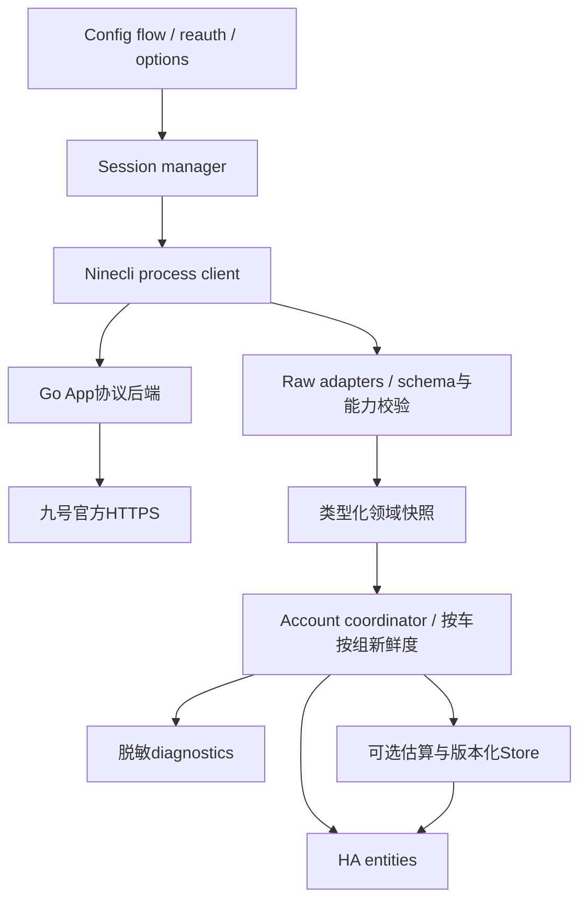

# ha_ninebot 完全重构与开发报告

> 本文为固定基线的审阅材料。本文保留历史审阅事实与候选设计；2.0最终实现差异见[实施记录](2.0-实施记录.md)，
> 要求核验、真实新版查询和支持限制见[预发布验收](2.0-预发布验收.md)。

版本：审阅方案 v1；日期：2026-10-03；交付性质：**整体开发设计与验证报告，尚未实现或部署重构**。

## 1. 建议采用的重构方向

以 `ninecli` 的 App 会话与查询协议替换默认 OpenClaw 请求链，保留 `ninebot` domain 和既有设备身份；重写传输包装、会话事务、数据模型、调度、实体能力和迁移逻辑。复用 fork 已验证的查询路径和字段知识，不照搬其已复现的生命周期/统计缺陷。旧 OpenClaw 不在启动时反复重试，不拿未核验的内测 api_key 做默认配置。

优先展示官方返回的车辆电量、各类续航、BMS电压/温度、位置和行程数据；把估算、标称参数、实际测量与历史行程严格分开。**已有真实 SOC 可替代续航比值作为电量主来源；但行程 ec 不等于全车总放电，BMS瞬时电压不等于标称电压，charging_power 不等于充入电量。** 不存在对应原始数据的实体应明确弃用或成为可选估算，不能填0、沿用过期值或改个名字假装已完成替代。

本报告是重构的决策主文档；[接口与实体逻辑对照](接口与实体逻辑对照开发文档.md)保留49类现有实体的详细公式、属性和源码行为；[ninecli实现解读](ninecli实现解读与依赖审计.md)解释已读源码、Go关键调用链、协议和依赖边界；[审计摘要](evidence/reconstruction-audit.json)提供可核验结果。

## 2. 当前事实与不确定性

### 2.1 固定基线和实际安装

| 对象 | 基线 / 实测 |
|---|---|
| 自研仓库 | `Wuty-zju/ha_ninebot`，`c6caabee0b58c0f7a3fb19b7fb47285e0a47fd9a`，manifest 1.2.0 |
| fork仓库 | `Wuty-zju/ninebot`，`e4004cba1da8c27c896f6062ba98abb9f6586e70`，manifest 0.2.0b0 |
| 远端状态 | 本轮 git ls-remote 确认两仓库 HEAD 仍为上述 commit；没有修改远端或拉取覆盖本地代码 |
| HA | Colima 的 homeassistant，2026.9.4，Linux aarch64/musl，Python3.14.6；当前安装 Python 文件与 fork 全部相同 |
| 设备与实体 | FMIX、MzMIX；sensor18、binary_sensor6、tracker2、button4、lock2，共32实例；poll_interval=30秒 |
| 实体定义 | A自研33类（含调试按钮）、B fork16类，清单已逐项核对 |
| CLI | ninecli0.1.7；官方PyPI musllinux arm64 wheel中的程序与本机副本完全一致 |

### 2.2 接口故障的结论边界

A 的旧登录 `/v3/openClaw/user/login` 本次先前隔离实测是 **HTTP200 / resultCode90051 / "sign is null"**，没有 access_token；没有复现404。不能据此写成“已经证明旧API永久关闭”，也没有验证新内测 api_key API 的完整规范。应在产品故障提示中展示明确错误类别，避免推断官方动机。

B 使用 App Passport `/v6/user/login`、App业务身份和加密业务请求；先前以现有会话副本成功查询列表、两车状态、电池和行程。本次报告复核材料并新增无网络测试，没有重新向官方发送真实密码或车辆控制。**已有会话查询成功，不等于本次验证了新账号首次登录、短信验证、token刷新或全部设备控制。** 首次登录与刷新是正式开发验收的独立缺口。

### 2.3 已确认的阻断缺陷

| 问题 | 证据 | 重构要求 |
|---|---|---|
| 锁编码相反 | A status0锁/1开；App loc.lock1锁/0开 | 中立 locked bool；适配/实体统一语义 |
| 上月污染本月统计 | 实测MzMIX当月0，却被上月303.9km/7210ec覆盖 | 月合计与最后行程分别合并 |
| unsupported BMS数值 | 两车cycle_support=false，仍输出cycle100/score0 | 能力与有效性 gating，不虚报循环/健康度 |
| 主动刷新 mutex 缺失 | 真实coordinator+假状态客户端离线 AttributeError | 创建锁并与普通更新共同使用，避免控制成功后刷新报错 |
| 取消未清理子进程 | 假process离线测试：CancelledError路径不调用kill | timeout/cancel/unload统一进程清理 |
| 验证过早替换正式会话 | 临时文件测试：_async_validate_credentials覆盖旧目录；查重在其后 | 验证和提交分离，会话事务化 |
| 错误认证分类 | `server code=503`误归AuthError | 精确类型/码；网络故障不要求改密码 |
| 缓存可用性 | A失败容忍难以真正失效；B单车超时使全账号失败 | 按车、数据组TTL；保留成功车的更新 |
| 月份时区 | UTC202609与上海202610同一时刻 | 显式业务时区，默认中国业务Asia/Shanghai |
| 非有限浮点 | normalize接受字符串NaN | finite/range/schema检查 |
| 估算污染 | 改最大里程产生0.36kWh虚假放电、86400W峰值 | 默认不用续航变化记能量；参数/来源变更重置基线 |
| 实体域/统计元数据 | fork设置ninebot.*实体域；ENERGY+MEASUREMENT已有告警 | 正确platform域、精确统计语义 |
| 注册表清理 | A启动无条件删除不在预期映射内的条目 | 禁止删除重建替代迁移；用户身份/历史优先 |

## 3. 以物理量和数据契约决定实体

每个实体先回答四个问题：它测量/描述什么、来自哪个接口、何时有效、是否与旧历史同一口径。字段可解析不代表物理量已可靠；数据未返回不代表0。设备的“支持能力”、一次响应“有无值”和数据“是否新鲜”是三件事。

| 类别 | 原始量 | 可以代替什么 | 不能代替什么 |
|---|---|---|---|
| 真实车辆SOC | status.dump_energy | 默认电量和估算模型的SOC输入；弱化旧battery_calculated | 不直接推出电池标称容量、充电效率或真实Wh |
| 云端续航 | precise/estimate/ai三字段 | 各自的续航实体 | 不能认为三值相等，不能作为精密能量计量 |
| BMS电压/温度 | battery_list[].bms_volt/bat_temp | 增加实测sensor | 不代替标称电压number，不自动估Ah |
| 循环次数/score | bms_cycle/score | 支持标志和契约成立后才作为诊断指标 | support=false时不当真实循环；score0不当健康0% |
| 充电功率 | 顶层charging_power | 单位和来源确认后新增功率sensor | 当前不知采样契约，不能直接替代窗口充入功率或充入总量 |
| 云端行程ec | travel.ec / ride.ec | 单位确认后新增本月/最后行程耗电 | 不代替原有累计放电、充入、日统计；不知是否含静置损耗 |
| 定位 | loc.lat/lon | GPS tracker | 不等于地址、车上报时间或已确认WGS84；还需验证坐标系 |
| 本地标称参数 | 用户设定V、Ah、满电续航 | 可选模型配置 | 不称官方测量，不能用BMS电压持续覆盖 |

## 4. 自研33类实体的最终处置建议

“保留”表示保留功能与可兼容的身份，不照抄类实现；“旧保留”表示只对已有registry留下兼容实体，新安装不创建。弃用实体不删除历史、不用0伪造新值。可选估算默认关闭；旧用户启用也要先修复模型与迁移口径。

| ID / 旧platform:key | 重构决定 | 新来源 / 处理及默认策略 |
|---|---|---|
| A01 `sensor:battery` | 保留，直接值 | dump_energy→0..100有限数值；默认启用；主SOC |
| A02 `sensor:battery_calculated` | 弃用为主SOC | 已有直接SOC，无需R/M反推；旧保留为unknown并提示弃用；若用户确需续航比值，另建明确“续航比例估算”新ID，禁止作能耗输入 |
| A03 `sensor:device_name` | 诊断兼容 | profile.name已在DeviceInfo；已有保留，新安装默认不启用重复文本sensor |
| A04 `sensor:sn` | 诊断兼容 | 绑定SN；已有保留，新安装默认不启用；公开诊断脱敏 |
| A05 `sensor:vehicle_lock_raw` | 诊断兼容 | 保持旧0锁/1开编码，属性说明normalized/app来源；App原始lock另为白名单诊断，不混为旧raw |
| A06 `sensor:gsm_csq` | 无来源，弃用 | 当前App无CSQ；旧保留unknown，新安装不创建；未来有实测字段再按能力恢复 |
| A07 `sensor:gsm_rssi` | 无输入，弃用 | 无CSQ不能算RSSI；不从HTTP延迟推信号 |
| A08 `sensor:remaining_range` | 保留，明确来源变更 | 默认precise续航；保留ID并在升级说明标明原口径变化；普通/AI值另建可选实体，不静默相互fallback |
| A09 `sensor:remaining_charge_time` | 保留，可适配 | remain_charge_time文本非空时有效，空→unknown；未确认格式前不当秒数；retain旧ID |
| A10 `sensor:gsm_report_timestamp` | 无来源，弃用 | App本次无设备报告时间；请求时间另作diagnostics，不顶替 |
| A11 `sensor:gsm_report_time` | 无来源，弃用 | 同上；不由“刚查询”伪造“刚上报” |
| A12 `sensor:location` | 地址无来源，旧保留 | 原为文本地址；新tracker提供坐标；不跨platform改ID；逆地理编码不纳入首版 |
| A13 `sensor:battery_nominal_energy` | 可选估算配置结果 | V_nominal×Ah/1000；不是实测储能；估算模块启用时提供，新安装默认关闭 |
| A14 `sensor:battery_energy_delta` | 可选估算，重写 | 有效相邻真实SOC与固定电池模型；来源/参数改变重基线；默认关闭 |
| A15 `sensor:battery_outflow_energy_step` | 可选估算，重写 | 接受负ΔSOC的模型能量；非云端ride.ec；默认关闭 |
| A16 `sensor:battery_inflow_energy_step` | 可选估算，重写 | 接受正ΔSOC的模型能量；无真实充入Wh替代；默认关闭 |
| A17 `sensor:battery_outflow_power` | 旧保留，默认不生成估算功率 | SOC量化和长周期不足以推出瞬时功率；高级模型需独立名称/样本质量，不沿用86400W尖峰逻辑 |
| A18 `sensor:battery_inflow_power` | 旧保留，与实测功率分开 | charging_power若证实W，另建实测sensor；不沿用旧历史/ID冒充同口径 |
| A19 `sensor:battery_outflow_energy_daily` | 可选估算，重写 | 本地SOC模型日桶；缺样/跨边界不虚构分摊；默认关闭 |
| A20 `sensor:battery_outflow_energy_monthly` | 可选估算，重写 | 本地模型月桶；独立于官方month_energy；默认关闭 |
| A21 `sensor:battery_outflow_energy_total` | 可选估算，保留旧历史 | 旧累计归档、切新模型记录新generation并基线；不得用云端月ec覆盖；默认关闭 |
| A22 `sensor:battery_inflow_energy_daily` | 可选估算，重写 | 没有直接充入日Wh来源；日桶规则明确；默认关闭 |
| A23 `sensor:battery_inflow_energy_monthly` | 可选估算，重写 | 同上，模型月桶；默认关闭 |
| A24 `sensor:battery_inflow_energy_total` | 可选估算，保留旧历史 | 与新实测来源分开；不接ride.ec；默认关闭 |
| A25 `binary_sensor:charging` | 保留 | charging严格0/1→bool；默认启用；未知不当False |
| A26 `binary_sensor:main_power` | 保留 | pwr严格0/1；表达主电源状态，不能单凭它称“正在骑行” |
| A27 `binary_sensor:vehicle_lock` | 保留 | locked取反作为DC lock的on=解锁；默认启用 |
| A28 `lock:vehicle_lock_control` | 既有只读兼容；控制后置 | 既有ID读取locked；未开启/验证控制时动作给明确HA异常；新安装先用binary，控制验证完成后可启用lock |
| A29 `image:vehicle_image` | 保留，可选展示 | profile的light/img URL；旧ID保留；新安装可默认关闭，因为tracker已有entity_picture |
| A30 `number:main_battery_voltage` | 本地模型配置 | 标称电压；只在估算启用时提供，新安装默认无模型；既有配置保留，不填实测BMS值 |
| A31 `number:battery_capacity` | 本地模型配置 | Ah手动值；无直接字段替代；配置约束/版本化，不宣称默认20Ah符合两车 |
| A32 `number:battery_max_range` | 不再作为能量必需参数 | 旧保留；可选续航模型才用；不从当前云端续航一次反推“真实满电续航” |
| A33 `button:info` | 改为按车刷新/诊断兼容 | 既有key不变；不输出raw大字典；强制该车status更新而非只调scheduler；新用户可用单独refresh按钮，避免重复 |

旧total若改变数学含义，不能只加offset就声称历史同质。推荐保留旧估算实体为旧模型、停更新并说明；新的SOC模型用新unique_id/generation。用户明确选择延续显示时可迁移累计offset，但必须在诊断/发布说明标注模型变更，历史依然不是同口径实测。计划不能通过直接修改recorder SQL抹平旧数据。

## 5. fork16类的迁入决定与新增能力

| ID / forkplatform:key | 目标 | 实施条件 |
|---|---|---|
| B01 `sensor:battery` | 对应A01 | int/float/字符串规范，range0..100；B旧身份也迁移 |
| B02 `sensor:endurance` | 对应A08 precise口径 | 不改B已有单位；A历史说明来源差异 |
| B03 `sensor:month_mileage` | 新增官方本月里程 | query_month强绑定；不能上月回退；月初正确时区 |
| B04 `sensor:last_mileage` | 新增最后行程里程 | 验证排序/分页，保留ride_id/time/month；不把全部last_ride作为属性 |
| B05 `sensor:month_energy` | 新增官方本月行程耗电 | ec单位未独立确认；新建统计sensor前完成契约核验，否则只作无单位诊断raw |
| B06 `sensor:last_energy` | 新增最后行程耗电 | 独立历史事件量，不用MEASUREMENT；单位确认后ENERGY+无state_class，默认不入累计统计 |
| B07 `sensor:bms_voltage` | 新增BMS实测电压 | 每块电池identity；首版两车单块可靠，支持列表多块但不只默取第0块 |
| B08 `sensor:batt_temp` | 新增温度 | finite、量纲、范围；每块电池数据组TTL |
| B09 `sensor:bms_cycles` | 条件诊断，默认不启用 | 两车support=false，本次不能启用真实计量；真实supported设备和重置契约核验后启用 |
| B10 `binary_sensor:charging` | 对应A25 | strict enum；charging_power与状态周期不同，不混成一个测量时间 |
| B11 `binary_sensor:power` | 对应A26 | strict enum；不将任意异常int当False |
| B12 `binary_sensor:unlocked` | 对应A27 | locked bool统一；bool/int分支也一致 |
| B13 `device_tracker:location` | 新增GPS tracker | 有限lat/lon、范围、坐标系验证；无坐标unavailable；精确位置不入公开诊断 |
| B14 `lock:lock` | 兼容B已有状态、后续可选控制 | engine-start/stop实际动作、权限和车辆回读待实机验证；先修mutex、延迟任务和取消 |
| B15 `button:bell` | 后续可选控制 | 设备支持/权限、回执、超时；默认不因CLI命令存在而开放 |
| B16 `button:bucket` | 后续可选控制 | 同上；不自动重试开桶命令 |

另可提供普通续航/AI续航（明确云端算法，默认关闭）、经单位核验的充电功率、少量last_success/source状态诊断，以及刷新按钮。原始battery_main.electricity、各块electricity、battery_count/type、充电保护和smart-service字段先记录契约与支持能力，不能未经验证直接生成几十个实体。新增entity以功能和用户需求为依据，而非JSON每个key都映射。

B04“最后行程里程”是历史单次量，新版建议无state_class，避免把它当当前measurement或total_increasing；B03/B05仅在月内单调/重置契约确认后使用TOTAL_INCREASING。周期能量和测量类选择需依官方[sensor语义](https://developers.home-assistant.io/docs/core/entity/sensor/)；没有完整累计口径的last_energy不要通过选TOTAL_INCREASING勉强加入Energy Dashboard。B旧错误统计不在本次HA内修写，后续发布需给出修复说明。

## 6. 目标架构：协议、领域和HA适配分层



建议首版保持一个账户coordinator与少量清晰模块，不为每字段建立任务/抽象类。每车status、battery、travel有独立Freshness；列表由账户管理。真实外部I/O只有client/session边界，adapter纯函数，实体property只读内存，不执行网络、磁盘或估算副作用。

| 文件/模块 | 单一职责 | 禁止混入 |
|---|---|---|
| `__init__.py` | setup/unload、entry迁移、runtime装配 | 大块协议解析、注册表无条件清理 |
| `client.py` | 命令构造、subprocess、超时取消、输出解析、错误分类 | HA实体逻辑/本地能量公式 |
| `session.py` | 隔离登录、unique账户验证、原子会话提交/回滚、目录清理 | 在“validate”内覆盖正式会话 |
| `models.py` | dataclass/enum、值域、能力、Freshness | 原始JSON当作标准state遍地传递 |
| `adapters.py` | 原始profile/status/BMS/travel→领域模型 | 网络、当前时间隐式读取、HA registry |
| `coordinator.py` | 轮询、公平队列、合并、按车状态、通知 | 再次实现底层token签名协议 |
| `entity.py`及平台 | 统一identity、名称翻译、值/属性/available | 直接访问client私有方法和raw dict |
| `migration.py` | entry/storage/entity身份映射、幂等检查 | 删除重建、后台永久改名 |
| `estimation.py`/`storage.py` | 可选模型及local参数/基线/累计版本 | 云端ec替代所有能量或全raw缓存 |
| `diagnostics.py` | 白名单脱敏快照/依赖版本/错误类别 | 完整token、SN、位置、蓝牙密钥、argv/stderr |

模型至少包括 VehicleProfile、VehicleStatus、BatteryInfo（电池列表）、TravelMonth、LastRide、Capabilities 和 Freshness。模型使用 None 表示未知；true/false/unknown支持态分别表示已证实支持、已证实不支持、未知。finite Float/Decimal与数值范围在adapter完成，状态不能依赖enum“其他全部False”。

Freshness 保存 `last_attempt_at,last_success_at,source_reported_at,error_category,stale`；查询成功时间不等于车辆上报时间。未知report_time不赋值。快照不可变或copy-on-write，实体回调不能修改共享state。

外部client接口建议：`async_login`, `async_list_vehicles`, `async_get_status`, `async_get_battery`, `async_get_travel(sn,month)`, `async_close`；控制接口独立capability gate。为将来官方公开API保留窄接口即可，不提前堆叠尚未存在的Open/APIkey实现。

## 7. 会话、配置和生命周期

ConfigEntry使用稳定business uid去重；配置流程支持user、reauth、reconfigure和options；重认证只允许同账户，换账户是新entry。账户/区号/地区用data，轮询/可选功能用options。密码只在必要的首次验证或reauth中接收；优先验证CLI是否无需保存密码也能通过refresh token维持会话，做到后默认不长期存原密码。失败不清空旧可用会话。官方[Config flow](https://developers.home-assistant.io/docs/core/integration/config_flow/)定义了身份去重、配置版本和不同流程的职责；[reauth规则](https://developers.home-assistant.io/docs/core/integration-quality-scale/rules/reauthentication-flow/)要求失效会话可通过UI恢复。

会话事务建议：

```text
私有临时目录 → 登录两阶段 → 只读列表验证/账户ID
  → 已有entry和账户一致性检查
  → per-entry session锁
  → 备份旧会话 / 同文件系统原子提交候选
  → 更新ConfigEntry / reload
  → 成功清理；失败回滚；取消finally清理临时目录
```

临时目录与rename需同文件系统；跨目录原子提交前检查权限和空间。CLI完整会话以私有目录保存（dir0700/file0600，受平台能力约束），不在integration代码目录内保存，以免HACS升级覆盖。HA Store只保存集成自有local参数和迁移journal，不把CLI tokens.json强行改为Store envelope。`entry_id`稳定目录定位优于直接把外部uid当路径片段；迁移旧B会话时严格识别原路径，阻止路径穿越。

runtime采用类型化 `ConfigEntry[RuntimeData]` 和 entry.runtime_data，RuntimeData持client/coordinator/session等；constructor显式向DataUpdateCoordinator传config_entry，而非依赖ContextVar。[runtime_data规范](https://developers.home-assistant.io/docs/core/integration-quality-scale/rules/runtime-data/)可用于减少全局hass.data和类型断言。最低HA版本必须覆盖所用helper签名，不能只从本机运行推断兼容2024.4。

setup先准备会话/验证依赖，再first_refresh，再平台；暂时网络/服务失败按ConfigEntryNotReady重试，明确认证失败才ConfigEntryAuthFailed；首次服务可达但无车辆可创建账户entry并动态等增车，不凭旧缓存伪装新登录成功。[setup故障处理](https://developers.home-assistant.io/docs/integration_setup_failures/)区分了自动重试和重新认证。

unload按顺序停止新任务、取消轮询/延迟刷新、清理所有子进程、移除监听和定时器、关闭client，并卸载平台。将取消传播到上层，不吞CancelledError。不用裸except Exception遮蔽认证/迁移失败；异常从领域类型明确映射为HA异常和翻译。

## 8. 查询调度与可用性

首版建议默认status120秒（可选30..3600秒）、battery600秒、travel600秒、列表3600秒；驾驶/解锁可选择30秒，恢复默认3秒高频会增加CLI成本，不作为发布默认。上述为工程初始参数，不是九号官方限额；须凭延迟、错误和设备实际更新频率调整。

两车120秒状态周期，每10分钟约10条status命令+4条详情命令；30秒约40+4条。CLI列表会查询多个业务host，命令数不能当HTTP总请求数。所有命令的执行耗时与排队成本都要计入预算。

- 每个会话串行执行CLI，账户内按车公平排队；状态优先于详情，但详情不能永久饿死。
- 不在前一轮未结束时堆积补跑；coalesce同车同组刷新，设queue长度上限和deadline。
- 单车/组失败只更新其error/freshness，其他成功结果仍通知；仅账户级明确认证失败上抛reauth。
- 失败指数退避加jitter；不要把“查询失败仍记10分钟成功间隔”带入新架构。
- status TTL初始建议max(3×当前周期,180秒)，battery/travel为3×详情周期；这是产品策略，可配置并在文档注明。月初旧月份travel立即stale，不等30分钟再判断。
- 数据组成功但某字段缺失：不能沿用没有期限的旧字段；保留历史last_good用于diagnostics，当前值None。若接口明确采用稀疏差分协议，必须单独验证后再merge。
- available由账号认证+该车该组freshness决定；数值缺失可unknown，支持明确false不创建新实体；tracker无有效双坐标unavailable。
- 手动刷新强制指定车status，受去重/限流约束但不受“尚未到期”忽略；不强制每次刷新全账户BMS/行程。

[Fetching data](https://developers.home-assistant.io/docs/integration_fetching_data/)提供Coordinator与实体订阅模式。部分故障快照设计要避免CoordinatorEntity账号级available盖过按车available；为日期边界/TTL设置轻量本地通知，不为每实体建立轮询。

云端travel的当月聚合与last_ride独立：用中国业务时区确定query_month，当月0必须保留，最多一次上月补last_*，返回query_month与last_ride_month两字段。检查API分页和排序；未验证全历史前不承诺“终身累计”或循环补几十个月。

## 9. 估算模块如何专业地保留

基础产品可以没有本地能量估算：status/BMS/travel已经提供有用信息，缺少真实电流/连续功率时，应承认无法提供精准全车计量。第一性原理是保留物理含义，不是为旧界面保留每一个数字。

可选SOC能量模型：`E_nominal=V_nominal×C_Ah/1000`，接受样本时 `ΔE_est=E_nominal×ΔSOC/100`。命名明确“估算”，不测量充电器输入、不含效率校准，不能把SOC算法重估计/换电当充放电。异常阈值要与轮询间隔、SOC分辨率和车辆能力相关，有上限保护与quality_reason；单靠80%/40%固定阈值不够。

必须持久化模型generation、电池identity/配置hash、基线SOC/time、累计和bucket。真实SOC来源、电池/容量/标称电压变化、新后端、长失联恢复均只重建基线，不累计该跳变。同一cloud采样不可重复累计；云端无report time时用接收样本/内容哈希去重并记录限制。

不能从两个SOC点唯一恢复瞬时功率。若保留平均功率，要用明确取样间隔与样本质量；不要把采样时累积的一整段能量压进15秒窗口命名“瞬时”。charging_power只有物理W和更新时间确认后才能成为实测功率；积分需要充足时序和缺口策略，不能只用10分钟一帧就称真实充电kWh。

日/月桶在本地边界通知显示；跨边界样本无法准确分摊时明确估算策略/记录区间，不把整段当精确当日实测。ENERGY的日/月可使用TOTAL配合明确last_reset，或在单调重置契约成立时TOTAL_INCREASING；由测试证明统计行为。数值主源和单位改变需新统计身份或明确官方迁移途径，不能只改unit label。

## 10. 双来源迁移与回滚

两仓库当前都使用同一个domain/path；实际安装只有fork，不能通过同时加载两个ninebot做AB测试。版本号同为ConfigFlow1也不能区分来源，必须根据data字段、unique_id格式、options和存储schema识别。

| 来源 | 识别依据 | 迁移策略 |
|---|---|---|
| A旧用户 | unique_id `ninebot_<sn>_<key>`小写，Open缓存与runtime store、A options | 保留entry/DeviceInfo与同义实体ID，会话需App登录或明确导入验证；旧不可用实体兼容，不自动删除 |
| B旧用户（本机） | business_uid、CLI会话目录、unique_id `<SN>_<key>`、B平台 | 导入会话到新版私有目录；保存name/id/disabled/customization；不要新建第二个账户entry |
| 同义条目冲突 | 同SN同功能存在两种unique_id或多个registry entity | 生成冲突diagnostics/Repair，不删除任何条目抢ID；保持已有entity_id，等待明确选择 |
| 新安装 | 无旧registry/schema | 按capability建立少量主实体，使用稳定规范unique_id；稀有/诊断/估算默认关闭 |

建议ConfigFlow升主版本（例如2），Store单独schema版本；这只是候选，正式编号需看最终字段变化。migration幂等、分阶段记录journal，禁止网络登录埋进纯registry迁移；旧Open凭据用reauth建立新会话，成功之前不删除旧存储。切換backend失败可停在migration_pending并显示Repair，不能无限后台密码重试。

同platform、同物理量可保留现有unique_id而用显式identity resolver兼容A/B两格式，减少无必要registry写入。新标准ID只用于新实体；也可显式update旧unique_id，但不得随意改entity_id。DeviceInfo继续 `(ninebot,SN)`，姓名/型号变更走正规更新，避免缓存构造时快照。

App的wnumber与旧Open的sn在本次未取得两侧成功包共同校验，不能预设所有旧用户的字符串一定相同。应依据可信旧存储/新profile核对identity；无法确证时保守提示Repair，不凭车辆昵称/型号模糊合并，也不因简单lowercase制造SN碰撞。

地址sensor→tracker跨platform不能原地改ID；配置number→实测sensor也不能。云端行程ec与旧估算能耗不是同量，必须新ID。B erroneous ENERGY+MEASUREMENT移除后不直接改写SQL历史；给用户提供HA正规修复指导。已有实体的enabled_default变化不会自动改变用户手动设置，不能用全局清理“归一化”用户配置。

未来部署回滚需代码release、HA完整备份、迁移journal与存储备份一起准备；新Store/entry版本回降并不天然可读，明确支持的rollback版本和还原流程。迁移验证必须用合成registry与克隆配置，不运行在用户当前HA。本轮只交付方案，没有迁移或部署。

## 11. 控制功能的第二阶段

设计范围包含fork的锁/解锁、鸣笛、开座桶，但本次授权边界仍是只读，不验证真实动作。首阶段发布恢复查询，后续逐车型/权限确认控制，和整个重构作为可审阅的独立改动。

控制成立需要capability/权限、用户开启选项、可执行状态、动作请求及确认回读。CLI的engine-start/stop help称电源/解锁相关操作，不能据此假设只改变一把逻辑锁且无物理副作用。

失败分三类：确定没发送、已发送而拒绝、可能执行但回读失败；timeout/断连不自动重试控制。后者给出HA友好异常与待确认状态，不把“刷新AttributeError”当“动作没执行”。每车pending action串行、回读有deadline、延迟任务可取消，不能简单把optimistic locked设成True。

lock提供HA标准actions；button命名按用户行为，异常可翻译。`supported_features=0`并不能单独保证所有基础lock动作被禁止；legacy只读实体需在action路径显式阻断并给明确异常。生产不保留`--yes`作为全局配置，仅为已经授权且受控的动作构造参数。

## 12. HA/HACS规范与仓库整改

以下是本轮检索官方文档的结果，发布前还需再运行验证，不能把静态阅读写成CI已通过。

### 12.1 HACS默认收录与品牌

HACS集成目录应只有一个 `custom_components/ninebot`，运行需要的集成文件都在其中；外部库通过manifest requirements声明。提供brand/icon.png；两仓库已有该文件，仍须通过品牌校验。见[HACS集成要求](https://hacs.xyz/docs/publish/integration/)。

默认收录还要求公开GitHub、拥有者/主要贡献者提交、HACS Action无错误无ignore、Hassfest通过，随后创建**完整GitHub release，不仅tag**，再向hacs/default对应integration列表按顺序提交；同时核对description/topics/issues与目标国家限制。见[默认收录](https://hacs.xyz/docs/publish/include/)。这不保证一定被接收或限定审阅时间。

### 12.2 manifest与兼容基线

manifest保留domain、config_flow、cloud_polling，codeowners/documentation/issue_tracker指向用户仓库；requirements固定被测试ninecli版本；loggers按实际Python库/模块定义，不伪造Go logger名称。账户多设备可考虑integration_type=hub，若仍用device要说明模型；依[manifest规范](https://developers.home-assistant.io/docs/creating_integration_manifest/)验证最终选择。

建议先将最低HA候选定为2026.1.0并做CI证明，若所用2026.9 helper在该版不存在，应兼容实现或提高最低版本；不能继续宣称2024.4仅因旧hacs.json写了这个值。Python标准由最低HA环境决定，pyproject target需一致。hacs.json支持name/homeassistant/country等字段，[当前schema](https://hacs.xyz/docs/publish/start/)已不列render_readme，fork的该旧字段不照搬；中国业务范围核验后用country="CN"。

### 12.3 质量与用户体验

Quality Scale是HA的质量框架；HACS默认收录不等于拿到HA核心Gold/Platinum。项目建议以Bronze/Silver规则为工程基线，针对诊断、动态设备、翻译、控制错误等采用Gold中的适用规则；binary subprocess库不应自称满足“可注入websession的原生async SDK”。见[Quality Scale](https://developers.home-assistant.io/docs/core/integration-quality-scale/)及[检查表](https://developers.home-assistant.io/docs/core/integration-quality-scale/checklist/)。正式`quality_scale.yaml`不得标记尚未实现的规则完成。

| 要求/目标 | 当前差距 | 交付 |
|---|---|---|
| Config flow可配置、唯一账户、test-before-setup | A缺App流程，B验证提交混在一起，B无完整reauth | 流程完整测试、重复/取消/失效处理 |
| unload和恢复 | 子进程取消缺失、延迟刷新生命周期错误 | reload不泄漏进程/监听；暂时失败自动恢复 |
| 运行时与异步 | A全局hass.data，B部分同步temp/path操作 | 类型化runtime_data；磁盘工作在executor，网络/等待异步 |
| 实体命名/元数据 | B域错误，last_energy状态类错误，支持判断缺失 | platform正常生成ID、translations、device/state class核验 |
| 数据可靠性 | 无按组TTL、单车故障全局失效、行程错月 | 独立Freshness、明确缺失/陈旧/unsupported |
| 诊断/隐私 | raw debug attrs可能写入recorder | 标准diagnostics+白名单脱敏，有限大小 |
| 依赖透明性 | 只有二进制、未取得完整Go源码 | 源码边界/版本/平台/许可/升级审计明确 |
| 用户文档 | 安装说明有，支持矩阵/弃用/迁移/故障说明不全 | README中英、升级说明、隐私和已知限制 |

官方[异步阻塞说明](https://developers.home-assistant.io/docs/asyncio_blocking_operations/)要求把读写文件等阻塞操作移出事件循环；`async`命名不会自动使Path.read_text或shutil异步。官方[diagnostics](https://developers.home-assistant.io/docs/core/integration/diagnostics/)要求不泄露密码/token/位置/个人信息；使用async_redact_data并结合字段白名单与递归测试，不仅匹配名为password的key。

## 13. 可维护性、测试和发布

### 13.1 推荐仓库布局

```text
custom_components/ninebot/
  __init__.py  config_flow.py  const.py  manifest.json
  client.py  session.py  models.py  adapters.py
  coordinator.py  entity.py  migration.py
  sensor.py  binary_sensor.py  device_tracker.py
  image.py  lock.py  button.py  number.py
  estimation.py  storage.py  diagnostics.py
  strings.json  translations/{en,zh-Hans}.json  brand/icon.png
tests/
  fixtures/ (合成、无凭据，无真实坐标/身份)
  test_client.py  test_session.py  test_adapters.py
  test_coordinator.py  test_config_flow.py  test_migration.py
  test_entities.py  test_estimation.py  test_diagnostics.py
.github/workflows/{checks,hacs,hassfest}.yaml
pyproject.toml  hacs.json  LICENSE  NOTICE  README.md  README_zh.md
docs/ (设计、实体矩阵、依赖审计、迁移、发布说明)
```

按功能边界拆分，不盲目把所有表驱动函数分成一文件一类；公共逻辑不经 `_client` 私有属性穿透。领域层完整类型、明确错误enum、适量注释解释物理口径/事务原因。选用Ruff+格式器+静态类型检查，禁止从fork复制“大范围ignore ALL”的lint策略；类型宽松JSON仅限client/adapter边界。

### 13.2 必要验收矩阵

| 层级 | 必测场景 | 验收结果 |
|---|---|---|
| CLI边界 | 缺binary/错误平台、启动失败、超时、取消、输出爆量、空输出、坏JSON、server503/真实auth | 子进程全部reap；无秘密输出；错误不混淆 |
| 会话 | 两阶段登录、重复账户、换账户、失败/取消、原子提交回滚、路径/权限、刷新过期 | 正式旧会话不受验证失败影响；reauth同账户 |
| adapter | 本文两车脱敏派生合成样本、null/0/空字串、NaN/Infinity、超范围、反向lock、多电池、不支持flag | unknown/unsupported与有效0严格区分 |
| 行程 | 空当月/有上月、跨年、UTC/local边界、错误月份、排序/分页、服务器修正值 | 月总不串月；last有独立来源/identity |
| coordinator | 一车失败、一组失败、全部断网、session auth、队列积压、移除/新增、TTL边界 | 有效车/组继续更新；无无限旧值或过量轮询 |
| 实体 | 49类旧处置及新增能力、platform域、on=解锁、精度/unit/state_class、available、名字更新 | 没有metadata告警；不同量不混ID |
| 迁移 | A/B两来源、用户改名/禁用、冲突、重复迁移、迁移中断、新版本回滚 | 身份/历史/用户选择保留；无自动删除 |
| 估算 | SOC阶跃/重复/长失联、换电、容量参数变化、模型版本、跨日/月 | 不累计配置/来源跳变，不生成假精密功率 |
| 控制 | 模拟超时/拒绝/已执行但回读失败、任务取消、动作互斥 | 不自动重发，状态可确认或明确不确定 |
| 诊断 | 嵌套敏感key、错误文本/URL、位置、MAC/蓝牙秘密/argv、输出上限 | 无真实秘密或轨迹入诊断/日志/fixtures |
| HA集成 | 最低候选HA与当前稳定、安装依赖、setup/reauth/options/unload/reload | 同一套代码在声明范围内通过 |
| 平台 | Linux musl/glibc×arm64/x86_64；armv7缺wheel | 支持平台安装运行；不支持平台清晰报错，非密码错误 |

工程目标：config flow分支完整覆盖，迁移/安全/取消/数据口径关键分支全部覆盖，总体至少95%分支/行覆盖作为项目门槛（不是声称当前已达标）。真实网络smoke opt-in，不在PR CI使用用户凭据；控制CI全fake，实机验证须独立授权。

工作流包含Ruff/格式/typing、pytest、HA版本矩阵、HACS Action与Hassfest。行动依赖优先固定审阅SHA并设更新机制；hacs/action类别integration，不能设置ignore逃避收录检查。[HACS Action](https://github.com/hacs/action)和[HA Hassfest Action](https://github.com/home-assistant/actions)提供官方运行方式；最终YAML随重构代码一并建立并真实执行，本轮未运行云端CI。

### 13.3 分阶段交付与退出条件

| 阶段 | 可审阅交付 | 退出条件 |
|---|---|---|
| P0：契约/依赖 | 领域模型、合成fixtures、CLI平台/许可/源码边界、identity映射 | ec单位、循环支持、坐标系、密码输入通道、首次登录等缺口有实证或明确限制 |
| P1：只读核心 | 新client/session/config flow/coordinator+SOC/续航/开关/定位/BMS | fake全流程及隔离只读实测通过；无进程泄漏、错锁、错误auth |
| P2：实体/迁移 | A33/B16处置、行程、metadata/图片/诊断、双来源migration | 不破坏registry/历史；月统计正确、unsupported不虚报 |
| P3：可选估算 | SOC模型、local参数、基线版本、弃用兼容 | 数据源/参数变更不计量；清晰标注估算；不作为默认恢复依赖 |
| P4：可选控制 | lock/bell/bucket能力路径、状态回读、取消 | mock关键分支通过；在明确授权的设备上验证真实动作与权限 |
| P5：发布收录 | 支持矩阵、release notes、LICENSE/NOTICE、CI与HACS提交材料 | 两Action无ignore通过，依赖安装/升级/回滚成功，完整release，最后才提交默认收录 |

重构适合2.x破坏性升级而非静默1.2.x修补：接口、实体默认集合、估算和迁移均变化。可先预发布只读版；稳定release说明哪些旧实体变unknown、哪些新值是云端估计、哪些功能仍未验证。生产部署与HACS提交是后续任务，本次不修改本机运行环境。

## 14. 本轮实做与仍需验证的事项

本轮只读复核运行中HA的安装文件、registry计数和CLI元数据；新增公共wheel审计、CLI无网络help执行、5项补充离线行为测试，并重新运行此前8项回归。另已完成49类实体原始data回放与主动刷新mutex复现；校验报告表格覆盖所有源码key。环境为本机既有HA image `sha256:3e6710a7ab2a61311d9d899b719f6c3657791c63e8f4942cec4ebc42401d6b76`，容器network none/read-only，只给临时测试目录tmpfs；没有往运行中HA发送控制或修改配置。

本轮HA关键文件前后SHA比较另存本地证据包：配置条目、实体注册表与三份CLI会话文件共5项未变；设备注册表hash发生变化，同期只读观察到一条非九号智能插座设备的modified_at更新，未见九号设备在该时间窗更新。本轮工具未写入HA，不能仅凭hash推断写入者，也不能声称所有运行时文件未变。recorder/日志正常自写不在此核验范围。公开审计摘要不含凭据、真实SN、精确坐标或业务uid。

待验证：新密码/短信登录与验证码路径、刷新失败恢复、完整Go源码和构建改动、授权/许可证文本、其他Linux架构真实运行、ec与charging_power单位、坐标系、多电池稳定identity与循环语义、分页/行程排序、全部真实控制，以及实际重构代码的HA/HACS CI。报告明确这些缺口并给出实施门槛，不为“完备”编造已知结论。

首次开发改动建议聚焦 **类型化App只读后端+事务化会话+严格锁/SOC适配+取消清理+保留身份**。在其可验证后再迁入行程、可选估算和控制；每一阶段有独立测试与迁移证据，整个方案仍覆盖完全重构的最终范围。
